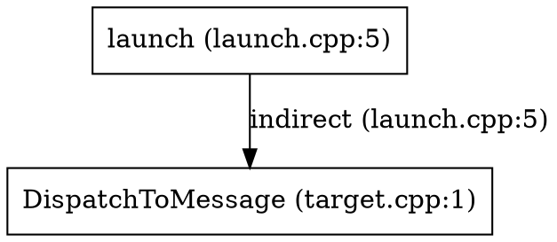
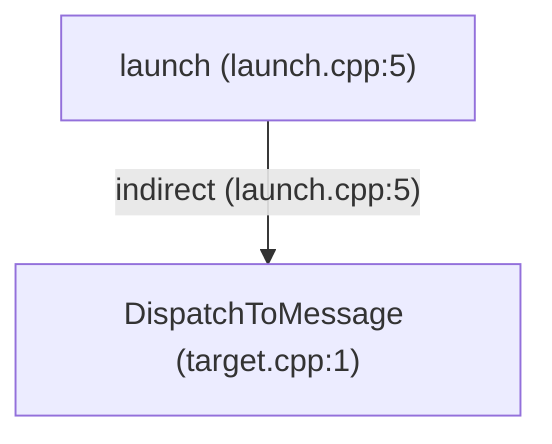

# trace

**trace** is a static analysis tool for C and C++ codebases. It runs a custom preprocessor, parses translation units with [tree-sitter](https://tree-sitter.github.io/), performs Andersen-style field-sensitive pointer analysis, and exports call graphs and interprocedural argument-flow facts to SQLite.

Typical uses:

- Find **direct and indirect** call targets (function pointers, vtables, struct op tables).
- Trace **argument flow** from call-site actuals to callee formals.
- Query results with **`trace inspect`**, ad-hoc SQL, or programmatic C API (**`trace-capi`**).

## Build

```bash
# Build CLI binary
cargo build --release
# binary: target/release/trace

# Or build CLI binary with mimalloc allocator for ~20% faster indexing on large workloads
# (source-builds opt-in feature; prebuilt release artifacts use the system allocator;
# measured with mimalloc 0.1 / upstream mimalloc v3):
cargo build -p trace-cli --release --features mimalloc
# binary: target/release/trace

# Or build C API library (staticlib and cdylib)
cargo build -p trace-capi --release
# library: target/release/libtrace_capi.{so,dylib,dll,a}
```

Run the workspace test suite:

```bash
cargo test --workspace
```

## Quick start

```bash
trace analyze ./tests/fixtures/direct_call -o /tmp/trace.db
trace inspect /tmp/trace.db calls
trace inspect /tmp/trace.db calls --from main
trace inspect /tmp/trace.db calls --from caller --to helper
```

Analyze a large tree (parallel indexing, minimal SQLite export):

```bash
trace analyze /path/to/project -o /tmp/project.db --jobs 8
```

## CLI reference

### Conditional coverage and GN define evidence

```bash
cargo run -p trace-cli --release --example conditional_coverage -- /path/to/project > coverage.tsv
```

The reporting example records conditional branches and scans `BUILD.gn`,
`*.gni` and `*.gn` for direct string entries in `defines = [...]` and `defines += [...]`.
`GN_DEFINE` TSV rows retain the macro name, whether a value was supplied, the
value, file, entry line, confidence, and enclosing GN conditions. No inferred
define is applied. See [GN evidence](docs/GN_DEFINES.md) for ranking and limits;
`scripts/gen_conditional_coverage_report.py` renders these candidates alongside
the [conditional coverage report](docs/CONDITIONAL_COVERAGE.md).

### `trace analyze`

Analyze every C/C++ file (`.c`, `.cpp`, `.cc`, `.cxx`) under `TARGET` and write results to SQLite.

```text
trace analyze [OPTIONS] <TARGET>
```

| Option | Description |
|--------|-------------|
| `<TARGET>` | Root directory to scan recursively for `*.c` / `*.cpp` / `*.cc` / `*.cxx` files. |
| `-o`, `--output <PATH>` | Output database path. Default: `trace.db`. |
| `--include <PATH>` | Add a preprocessor `#include` search path. Repeatable. |
| `-D <NAME>` | Define preprocessor macro `NAME=1`. Repeatable. |
| `-D <NAME=VALUE>` | Define macro with explicit value. Repeatable. Overrides the language predefines (`__cplusplus`, `__STDC_VERSION__`, `__STDC__`) when the name matches. |
| `--compile-commands <PATH>` | Compilation database to read. Default: auto-discovery at the target root, then `build/`. |
| `--link-commands <PATH>` | Link commands database to read, establishing which sources each program links. Default: auto-discovery (`link_commands.json` at the target root or `build/`, link entries in the compilation database, or a CMake File API reply). Enables per-program weak-symbol resolution; see [link targets and weak symbols](docs/ANALYSIS.md#link-targets-and-weak-symbols). |
| `--jobs <N>` | Parallel jobs for indexing (parse + lower). Default: logical CPU count. |
| `--timeout-secs <N>` | Watchdog: abort the process after N seconds (exit 124). Useful when probing hang-prone trees. |
| `--full-export` | Export full IR detail: all types, all variables, PAG `locations`. Slower and produces a larger database. |
| `--debug-points-to` | Retain points-to sets during analysis and export the `points_to` debug table (requires PAG in memory). Implies keeping location data needed for export. |
| `--models <FILE>` | Load a TOML function-model file (interprocedural summaries for bodyless callees, e.g. `memcpy_s`). Repeatable; later files override earlier entries and built-ins. See `docs/ANALYSIS.md`. |
| `--dep <PATH>` | Treat a directory as a dependency root: a tree the target builds against but that is not under analysis (repeatable). Its headers contribute declarations — types, class definitions, inheritance, prototypes, declared return types — while its sources are never translation units. Function bodies and variable initializers are skipped during lowering, so they contribute no call sites or value flow. See the note below. |
| `--explore` | Enable bounded conditional-variant exploration. Discovers candidate macro definitions from project GN files (`BUILD.gn`, `*.gni`), evaluates semantic feasibility of excluded `#if`/`#ifdef`/`#elif` arms, preprocesses and lowers feasible variants independently, and unions their facts into the merged program (preserving body and call facts plus struct fields across configurations; conditional signatures retain the base arity, see [limits](docs/ANALYSIS.md#limits-of---explore)). Off by default. |
| `--explore-budget <N>` | Maximum additional configurations per translation unit (default: 4). Budget diagnostics count omitted candidate activation goals, not proven reachable configurations. |
| `--no-ipc` | Disable IPC proxy→stub bridge edge detection (enabled by default). Bridge edges are synthetic (`resolution = 'ipc'`, `call_site_id = NULL`) and connect a `*Proxy*` method to its `*Stub*` handler across the opaque Binder boundary. See `docs/IPC_ROADMAP.md`. |

**Progress output** (stderr):

```text
discover: 618 TUs, 200 headers under /path
include-graph: 818 files, 1200 include edges
warm: 1/90 /path/foo.h
parse: 0 orphan headers, 618 TUs (jobs=8)
index: 24.2s (618 files, 11442 functions, 48406 flow)
analyze: 0.3s (25478 edges, 3468 indirect)
export: 0.1s
analysis complete: 11442 functions, 25478 call edges, 25803 arg-flow edges -> trace.db
```

SQLite export builds secondary indexes after loading rows, before committing
and publishing the database, to reduce bulk insertion work.

Normal indexing spills large preprocessed source text and LineMaps to temporary
files and loads them as parsing needs them. Parsing workers run at most two
units per worker (between 4 and 32 in total) ahead of the ordered merge, which
limits queued IR without making a batch wait for its slowest unit. Temporary files are cleaned
automatically; cached header expansions and the final merged program remain in
memory. Type tables share immutable descriptors across cached headers and TUs
while retaining local IDs and layouts. On Linux/glibc, indexing returns freed
heap pages at phase boundaries. See [memory measurements](docs/MEMORY_PROFILE.md).

**Examples**

```bash
# HDF-style tree with extra include roots
trace analyze ~/drivers_hdf_core -o /tmp/hdf.db \
  --include ~/drivers_hdf_core/framework/core/common/include \
  -D __LITEOS__ -D CONFIG_XXX=1

# Debug pointer analysis
trace analyze ./my_app -o /tmp/debug.db --debug-points-to --full-export

# Use a compilation database outside the source tree
trace analyze ./my_app --compile-commands ./out/compile_commands.json -o /tmp/app.db
```

**Notes**

- **`.c` and `.cpp`-family files** are indexed as translation units. Headers are pulled in via `#include` during preprocessing, not analyzed as standalone TUs. A C++ unit is preprocessed with `__cplusplus` (`201703L`) and `__STDC__` predefined, a C unit with `__STDC__` and `__STDC_VERSION__` (`201710L`), so `#ifdef __cplusplus` takes the C++ arm in `.cpp` units and the C arm in `.c` units, headers included. C++ support is a pragmatic first step — see [docs/ANALYSIS.md](docs/ANALYSIS.md) for scope and imprecision.
- Line numbers in the database refer to **original** files on disk (resolved through the preprocessor's `LineMap`); call sites inside macro expansions attribute to the expansion site.
- **Compilation database** — automatically reads `compile_commands.json` at the target root, then `build/compile_commands.json`, or an explicit `--compile-commands PATH`. Each entry supplies its working directory, ordered `-I`/`-iquote`/`-isystem` paths, ordered `-D`/`-U`, `-include`, and `-x`/`-std`. MSVC `cl`/`clang-cl` preprocessing switches (`/I`, `/D`, `/U`, `/FI`, `/TC`, `/TP`, `/Tc`, `/Tp`, `/std:`) are also supported. All applicable commands for a source contribute facts, even without `--explore`; link-object membership restricts them to their target. CLI `--include` paths precede database `-I` paths and CLI `-D` values override database macros. Files without a usable entry retain inferred configuration; a database is never required. See [compilation database support](docs/ANALYSIS.md#compilation-databases-62).
- **Link targets and weak symbols** — `--link-commands PATH`, auto-discovered `link_commands.json`, mixed compilation/link databases, and CMake File API replies establish target scopes. Strong definitions override weak fallbacks only in targets that contain them; shared sources retain separate bindings per target. See [resolution rules and limitations](docs/ANALYSIS.md#link-targets-and-weak-symbols).
- **`static` functions** (internal linkage) and **file-scope `static` variables** are resolved within the defining translation unit. **`static` locals** inside functions are tracked as `fn_static` storage.
- **Dependency roots (`--dep <PATH>`)** separate what the target *uses* from what it *is*. A dependency's headers are reached and merged for their declarations — smart-pointer wrappers such as `sptr<T>`, base classes, external interfaces — so a wrapper-typed receiver resolves on the wrapped class rather than producing an edge on the wrapper. Its sources are never translation units, its unreached headers are never indexed as standalone units, and a body written in a dependency header merges as a declaration (`is_defined = 0`) with no call sites, locals, value flow or return flow. Files and functions from a dependency root export with `is_dep = 1`; `trace inspect calls --exclude-deps` drops the edges that touch them. A dependency root nested inside the analysis root is fine; one that contains or equals it is rejected at startup, since every source would become a dependency and nothing would be left to analyze.

## `static` storage support

| Context | IR / export | Call / flow resolution |
|---------|-------------|------------------------|
| File-scope `static` function | `linkage = internal` | Direct calls and `CallReturn` via scope-aware name lookup (`file` + name) |
| File-scope `static` variable | `kind = file_static` | Persistent PAG location; name lookup scoped to its file and the files including it |
| Function-local `static` variable | `kind = fn_static` | Persistent PAG location within enclosing function |
| External (non-`static`) symbols | `linkage = external` | Global `fn_by_name` / `global_by_name` tables |

Same identifier in different `.c` files (each `static`) gets distinct IR ids; resolution uses the call site's file.

### `trace inspect`

Query an existing analysis database.

```text
trace inspect <DB> calls [--from FN] [--to FN] [--file SUBSTR] [--exclude-deps]

Edges print as `caller (file:line) -> callee [deffile] (resolution)` — the
`[deffile]` bracket distinguishes same-name (e.g. `static`) functions defined
in different files; `--file` filters ordinary edges by call-site or callee
file. A synthetic edge has no call site, so its caller definition file is used
instead.
```

| Option | Description |
|--------|-------------|
| `<DB>` | Path to SQLite file produced by `trace analyze`. |
| `--from <FN>` | Filter edges where the **caller** name equals `FN` or ends with `::FN` (C++ qualified methods). `_` and `%` in `FN` are literal, not `LIKE` wildcards. |
| `--to <FN>` | Filter edges where the **callee** name equals `FN` or ends with `::FN`. Same escaping as `--from`. |
| `--file <SUBSTR>` | Filter ordinary edges by call-site or callee file; synthetic edges by caller or callee definition file. |
| `--callgraph-filter <FILE>` | JSON file listing regex patterns over function names; edges whose caller and callee both fail to match are hidden. |
| `--exclude-deps` | Hide call edges whose caller or callee comes from a dependency root (`is_dep = 1`). Requires a v4 or later database. |

Both filters may be combined. Output format:

```text
CallerFn -> CalleeFn (direct|indirect|ambiguous) at line N
```

Only **`call_edges`** are listed. Unresolved indirect call sites appear in `call_sites` but produce no line here unless an edge exists.

**Examples**

```bash
trace inspect /tmp/hdf.db calls --from NetIfSetAddr
trace inspect /tmp/hdf.db calls --from HdfSbufReadBuffer
trace inspect /tmp/hdf.db calls --to LiteNetSetIpAddr
```

When the full call graph is too large but you only care about a handful of
functions (e.g. memory-related ones), pass a filter config and only edges whose
caller or callee matches are printed. The database and analysis stay untouched;
the filter is purely a display adapter.

```json
{ "functions": ["malloc", "free", "calloc", "realloc", "memcpy", "memset"] }
```

```bash
trace inspect /tmp/hdf.db calls --callgraph-filter mem.json
```

For unresolved indirect calls, query SQL directly (see below).

### `trace inspect callgraph`

Print the transitive callees or callers of the function containing a line.

```text
trace inspect <DB> callgraph --file SUBSTR --line N [--depth N] [--direction down|up]
```

| Option | Description |
|--------|-------------|
| `--file <SUBSTR>` | File path substring to disambiguate same-name functions. |
| `--line <N>` | A line inside the function of interest. |
| `--depth <N>` | Maximum BFS depth (default 3). |
| `--direction` | `down` = callees (default), `up` = callers. |
| `--format` | Output format: `text` (default), `json`, `graphviz`, or `mermaid`. |
| `--callgraph-filter <FILE>` | JSON file listing regex patterns over function names; edges whose caller and callee both fail to match are hidden, nodes left without any surviving edge are pruned. The start function (the root) is always kept even when it does not match, so the query anchor stays visible. |

The start function is chosen among definitions whose `[line_start, line_end]`
contains `--line`. Edges are labeled with their resolution (`direct`,
`indirect`, `external`, `ambiguous`) and call-site locations; repeated
callees print `(see above; also file:line)`.

**Examples**

```bash
trace inspect /tmp/hdf.db callgraph --file devsvc_manager.c --line 120 --depth 2
trace inspect /tmp/hdf.db callgraph --file hdf_service_record.c --line 20 --direction up
trace inspect /tmp/hdf.db callgraph --file allocator.c --line 44 --callgraph-filter mem.json
```

### `trace inspect callchain`

Find all simple call paths (chains) between two functions no longer than `--depth`.

```text
trace inspect <DB> callchain [--from FN|FILE:LINE] [--to FN|FILE:LINE] [--depth N] [--limit N]
```

| Option | Description |
|--------|-------------|
| `--from <FN>` | Start function name, C++ qualified suffix, or `FILE:LINE` (e.g. `main` or `main.c:10`). |
| `--to <FN>` | Target function name, C++ qualified suffix, or `FILE:LINE` (e.g. `target` or `worker.c:25`). |
| `--from-file <SUBSTR>`, `--from-line <N>` | File and line locating the start function. |
| `--to-file <SUBSTR>`, `--to-line <N>` | File and line locating the target function. |
| `--depth <N>` | Maximum path length in call hops (default 5). |
| `--direction` | `down` = callers -> callees (default), `up` = callees -> callers. |
| `--limit <N>` | Maximum number of chains to return (default 100, 0 for unlimited). |
| `--format` | Output format: `text` (default), `json`, `graphviz`, or `mermaid`. |
| `--callgraph-filter` | Path to JSON filter config file (`{"functions": ["regex", ...]}`). |

**Examples**

```bash
trace inspect /tmp/trace.db callchain --from main --to target --depth 3
trace inspect /tmp/trace.db callchain --from main.c:10 --to target.c:20
trace inspect /tmp/trace.db callchain --from caller --to helper --format mermaid
```

### `trace inspect dataflow`

Walk the PAG value-flow graph from a variable declaration.

```text
trace inspect <DB> dataflow --file SUBSTR --line N --col C [--depth N] [--direction down|up]
```

| Option | Description |
|--------|-------------|
| `--file <SUBSTR>` | File path substring. |
| `--line <N>`, `--col <C>` | Position near a variable **declaration** (use sites are not recorded). |
| `--depth <N>` | Maximum BFS depth (default 3). |
| `--direction` | `down` = where the value flows (default), `up` = where it came from. |
| `--format` | Output format: `text` (default), `json`, `graphviz`, or `mermaid`. |

Edges show how values move: `copy`, `addr_of`, `load`, `store`, `gep`,
`points_to` (variable → storage), and `call_arg` (argument passing into a
callee formal). Function-pointer values appear as `fn:<name>` nodes.

The same C parameter may exist as several IR variables (one per TU that sees
its declaration). If nothing flows through the queried copy, the traversal
automatically widens to same-name parameters of the same function record
(after merge all copies share one function entry).

**Examples**

```bash
trace inspect /tmp/hdf.db dataflow --file can_test.c --line 33 --col 31
trace inspect /tmp/hdf.db dataflow --file usb_raw_io.c --line 331 --col 23 --depth 4
```

### Graph output formats

Both `callgraph` and `dataflow` accept `--format text|json|graphviz|mermaid`
(`text` is the default). `text` is the indented view shown above; the other
formats emit machine-readable graphs of the same traversal — same nodes,
same edges, same depth limit and truncation semantics. `trace inspect dataflow`
prints its candidate/fallback `note:` hints on stderr in every format.

All examples below run the same query on `/tmp/hpp.db`
(`tests/fixtures/hpp_designated_dispatch`):

```bash
trace inspect /tmp/hpp.db callgraph --file hpp_designated_dispatch/launch.cpp --line 5 --depth 3
```

**`--format text`** (default)

```text
callgraph from launch (launch.cpp:5-5) (callees, depth 3):
* launch (launch.cpp:5)
  -indirect-> DispatchToMessage (target.cpp:1) (launch.cpp:5)
2 functions, 1 edges
```

**`--format json`** — a single JSON document with `title`, `direction`,
`depth`, `truncated`, `summary`, `nodes`, and `edges`:

```json
{
  "title": "callgraph from launch (launch.cpp:5-5) (callees, depth 3):",
  "direction": "callees",
  "depth": 3,
  "truncated": false,
  "summary": "2 functions, 1 edges",
  "nodes": [
    {
      "id": 0,
      "depth": 0,
      "label": "launch (launch.cpp:5)",
      "detail": "launch.cpp:5"
    },
    {
      "id": 1,
      "depth": 1,
      "label": "DispatchToMessage (target.cpp:1)",
      "detail": "target.cpp:1"
    }
  ],
  "edges": [
    {
      "from": 0,
      "to": 1,
      "label": "indirect",
      "site": "launch.cpp:5"
    }
  ]
}
```

**`--format graphviz`** — a DOT `digraph` renderable with `dot`:

```bash
trace inspect /tmp/hpp.db callgraph --file hpp_designated_dispatch/launch.cpp --line 5 --depth 3 --format graphviz > call.dot
dot -Tsvg call.dot -o call.svg
```



**`--format mermaid`** — a Mermaid `flowchart` for GitHub/Markdown or
`mmdc`:

````markdown

````

The same flag applies to `dataflow`:

```text
trace inspect /tmp/hpp.db dataflow --file hpp_designated_dispatch/launch.cpp --line 5 --col 12 --format mermaid
```

Every format escapes special characters (quote/backslash for DOT, HTML
entities for Mermaid, JSON via `serde_json`), so arbitrary C++ names and
file paths stay valid input.

## Analysis pipeline

```
discover .c/.cpp → preprocess → parse → lower IR → build PAG → solve → export SQLite
```

| Stage | What happens |
|-------|----------------|
| **Index** | Discover `.c` / `.cpp` files, preprocess TUs (custom preprocessor), parse with tree-sitter (C or C++ grammar per TU), lower to IR (functions, variables, flow constraints, call sites). |
| **Analyze** | Build pointer assignment graph (PAG), run Andersen-style solver, resolve direct calls by name (including file-local `static` functions), indirect calls via points-to to function locations. |
| **Export** | Write SQLite (minimal by default). |

Analysis is **may-analysis** (sound over-approximation): if a call target is possible, it may appear as an edge.

Header-function identity and visibility follow the
[shared header function rules](docs/ANALYSIS.md#shared-header-functions).
Measured changes are recorded in the [evaluation report](docs/EVAL_REPORT.md).

## Export modes

| Mode | Flags | Database contents |
|------|-------|-------------------|
| **Minimal** (default) | *(none)* | `analysis_run`, `files`, `functions`, filtered `call_sites`, `call_edges`, `arg_flow_edges`, PAG-referenced variables, flow graph (`flow_nodes` / `flow_edges`), `diagnostics`. |
| **Full IR** | `--full-export` | Minimal plus all `types`, all `variables`, PAG `locations`. |
| **Points-to debug** | `--debug-points-to` | Adds `points_to` table (and retains PAG during analysis). Use with `--full-export` for complete debug dumps. |

The flow-graph tables are always exported because `trace inspect dataflow`
queries them directly.

### Call site export filter

`call_sites` rows are written when any of the following holds:

- The site has at least one **`call_edge`**.
- The site has at least one **`arg_flow_edge`**.
- The site is an **indirect** call (`is_direct = 0`), including unresolved function-pointer calls.

So unresolved indirect sites (e.g. `sbuf->impl->readBuffer` before a fix) still appear in `call_sites` even with zero `call_edges`.

## SQLite database schema

Schema version: **v5**. Foreign keys are declared in DDL; exports temporarily disable FK enforcement for bulk load speed.

### Entity relationship (overview)

```text
analysis_run
link_targets ─┬─ target_sources → files
              └─ target_dependencies → link_targets
files ─┬─ functions ─┬─ call_sites ─ arg_flow_edges → variables
       │             │  (target_id → link_targets)
       │             └─ call_edges → functions (caller and callee)
       └─ variables ─ flow_nodes ─ flow_edges → flow_nodes
                    (fn_id → functions, type_id → types,
                     target_id → link_targets)
types
locations (full export / debug)
points_to (debug only)
diagnostics
```

### Table reference

Every table, column and index is documented once, in
[docs/SQLITE_SCHEMA.md](docs/SQLITE_SCHEMA.md) — including which tables each
export mode writes, and the `is_weak` / `target_id` columns and `link_targets`
tables added in v5. It is the canonical description; this file keeps only the
overview above so the two cannot drift.


## Example SQL queries

### Callees of a function

```sql
SELECT callee.name, ce.resolution, cs.line, cs.callee_text
FROM call_edges ce
LEFT JOIN call_sites cs ON cs.id = ce.call_site_id
JOIN functions caller ON caller.id = ce.caller_fn_id
JOIN functions callee ON callee.id = ce.callee_fn_id
WHERE caller.name = 'HdfSbufReadBuffer';
```

### Unresolved indirect call sites

```sql
SELECT caller.name, cs.line, cs.callee_text
FROM call_sites cs
JOIN functions caller ON caller.id = cs.caller_fn_id
LEFT JOIN call_edges ce ON ce.call_site_id = cs.id
WHERE cs.is_direct = 0 AND ce.id IS NULL
ORDER BY caller.name, cs.line;
```

### All indirect resolutions for a call expression pattern

```sql
SELECT caller.name, callee.name, cs.line
FROM call_edges ce
JOIN call_sites cs ON cs.id = ce.call_site_id
JOIN functions caller ON caller.id = ce.caller_fn_id
JOIN functions callee ON callee.id = ce.callee_fn_id
WHERE ce.resolution = 'indirect'
  AND cs.callee_text LIKE '%readBuffer%';
```

### Callers of a function

```sql
SELECT caller.name, ce.resolution, cs.line
FROM call_edges ce
LEFT JOIN call_sites cs ON cs.id = ce.call_site_id
JOIN functions caller ON caller.id = ce.caller_fn_id
JOIN functions callee ON callee.id = ce.callee_fn_id
WHERE callee.name = 'LiteNetSetIpAddr';
```

### Argument flow at a call site (variable actuals)

```sql
SELECT cs.line, af.arg_index, av.name AS actual, fv.name AS formal
FROM arg_flow_edges af
JOIN call_sites cs ON cs.id = af.call_site_id
JOIN variables av ON av.id = af.actual_var_id
JOIN variables fv ON fv.id = af.formal_var_id
WHERE af.actual_var_id IS NOT NULL;
```

### Argument flow (function-pointer actuals)

```sql
SELECT cs.line, af.arg_index, f.name AS actual_fn, fv.name AS formal
FROM arg_flow_edges af
JOIN call_sites cs ON cs.id = af.call_site_id
JOIN functions f ON f.id = af.actual_fn_id
JOIN variables fv ON fv.id = af.formal_var_id
WHERE af.actual_fn_id IS NOT NULL;
```

## Project layout

```
crates/
  trace-preproc/   Custom C preprocessor (#include, #define, conditionals)
  trace-parse/     tree-sitter parsing, IR lowering, TU merge
  trace-ir/        Shared IR (types, symbols, flow constraints)
  trace-analysis/  PAG construction, Andersen solver, call graph
  trace-db/        SQLite schema and export
  trace-cli/       `trace` binary (`analyze`, `inspect`)
docs/              Design docs (architecture, analysis, preprocessor, schema)
tests/fixtures/    Integration test C corpora
```

## Limitations

- **C++ first step** — namespaces, overloads (arity), classes/virtual dispatch (including virtual bases), `final` class/method devirtualization, ctors/dtors, implicit `this->method()`, smart-pointer unwrap through a declared `operator->` (`shared_ptr`, and OHOS `sptr`/`RefPtr` or HDI `AutoPtr` alike, the wrapper keeping its own members for `.`) or, for a wrapper whose body is not in the tree, through its single class argument, `auto` locals typed from declared return types and smart-pointer factories, and callables (`std::function`, lambdas, `operator()`) are modeled; type-based overload ranking and templates beyond name-stripping are not (see [docs/ANALYSIS.md](docs/ANALYSIS.md)). Next slices from hiview: [docs/CPP_ROADMAP.md](docs/CPP_ROADMAP.md).
- **May-analysis** — indirect calls can list multiple targets; absence of an edge does not prove unreachability.
- **No path sensitivity** — all branches and paths are merged.
- **Preprocessor subset** — not gcc/clang compatible for all extensions, and no compiler is impersonated (`__GNUC__` / `__clang__` stay undefined; only the language's own `__cplusplus` / `__STDC__` / `__STDC_VERSION__` are predefined); see [docs/PREPROCESSOR.md](docs/PREPROCESSOR.md).
- **Build environment** — compilation databases locate existing files; they do not supply missing SDK, standard-library or generated headers. Supply additional roots with `--dep` / `--include` as needed. Compiler-specific target builtins and response files are not modeled.
- **Configuration coverage** — without database entries or `--explore`, indexing uses one inferred configuration. A name no `-D` or reached `#define` binds resolves to `0` in `#if`; the default exclusions are measured in [docs/CONDITIONAL_COVERAGE.md](docs/CONDITIONAL_COVERAGE.md). Explicit database commands are all merged; exploratory configurations remain bounded by `--explore-budget`.
- **Original line attribution** — entities attribute to original source files on disk via the preprocessor's `LineMap` (call sites inside macro expansions attribute to the expansion site's origin; headers are deduplicated across translation units).

## Further reading

- [Architecture](docs/ARCHITECTURE.md)
- [Analysis algorithm](docs/ANALYSIS.md)
- [Preprocessor spec](docs/PREPROCESSOR.md)
- [C API (`trace-capi`)](docs/CAPI.md)
- [Conditional-compilation coverage (eval corpora)](docs/CONDITIONAL_COVERAGE.md)
- [SQLite schema (detailed)](docs/SQLITE_SCHEMA.md)
- [Roadmap](docs/ROADMAP.md)
- [C++ next slices (hiview)](docs/CPP_ROADMAP.md)
- [Contributing](CONTRIBUTING.md)
- [Code of Conduct](CODE_OF_CONDUCT.md)
- [Agent guide](AGENTS.md)
- [License](LICENSE)

## Contributing

See [CONTRIBUTING.md](CONTRIBUTING.md) for development setup, testing, and pull-request guidelines, and [CODE_OF_CONDUCT.md](CODE_OF_CONDUCT.md) for our community standards.

## License

This project is licensed under the [MIT License](LICENSE).
