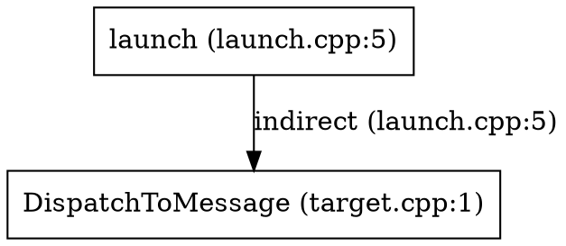
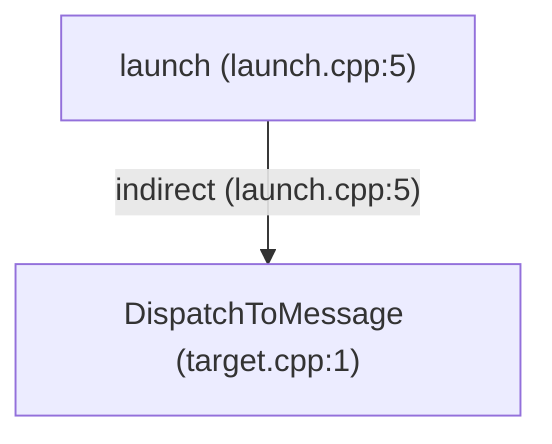

# trace — static analysis CLI for C/C++

`trace` analyzes C/C++ source trees with a may-analysis (Andersen-style
intraprocedural + interprocedural points-to analysis) and writes a SQLite
database that you query with `trace inspect` or raw SQL. Use it whenever the
question is about **who could be called** or **where a value flows** — it does
not do taint tracking, path-sensitivity, or runtime behavior.

Build the tool before use: `cargo build --release` (binary at
`target/release/trace`). Always use the release binary, not the debug one, for
measured runs.

## Pipeline (fixed order)

```
discover .c/.cpp/.h → IncludeGraph → preprocess (cache) → parse/lower per TU → merge → build PAG → solve → export SQLite
```

- `.c` and `.cpp`/`.cc`/`.cxx` files are indexed as translation units; headers
  enter only via `#include` in preprocessed source.
- Analysis is **may-analysis** (sound over-approximation): if a target is
  *possible*, it may appear as an edge. `static` functions/variables resolve by
  file scope; default-export is minimal (call graph + arg-flow + flow graph).

## When to use which command

| Question | Command |
|----------|---------|
| "Who calls X, what does X call?" (whole function set) | `inspect calls` |
| "Transitively, from a function at FILE:LINE, which callees/callers?" | `inspect callgraph` |
| "Does this indirect call resolve to the right target(s)?" | `inspect callgraph` (read the `-indirect->` edges) |
| "Where does the value stored in variable X come from / go to?" | `inspect dataflow` |
| "Build me the same graph as a machine-readable artifact" | add `--format json\|graphviz\|mermaid` |
| "Which indirect call sites never resolved?" | raw SQL on `call_sites` (see SQL escape hatch) |
| "Dump back the raw analysis" | `inspect` has no raw mode; query the DB (schema below) — or analyze with `--full-export`/`--debug-points-to` |

Line numbers in every output refer to **original files on disk** (the
preprocessor's LineMap): a call site inside a macro expansion is reported at
the expansion site's origin file/line/col.

## 1. `trace analyze` — build a database

```text
trace analyze [OPTIONS] <TARGET>
```

| Option | Meaning |
|--------|---------|
| `<TARGET>` | Root directory to scan recursively for `*.c/.cpp/.cc/.cxx`. |
| `-o, --output <PATH>` | Output SQLite path. Default `trace.db`. |
| `--include <PATH>` | Add an `#include` search path. Repeatable. |
| `-D <NAME>` / `-D <NAME=VALUE>` | Define a preprocessor macro. Repeatable. |
| `--jobs <N>` | Parallel parse/lower jobs. Default: logical CPUs. |
| `--timeout-secs <N>` | Watchdog; abort with exit 124 if analysis hangs. |
| `--full-export` | Export full IR: all types, all variables, PAG locations. |
| `--debug-points-to` | Retain + export the `points_to` table. |
| `--models <FILE>` | TOML function-model file (interprocedural summaries for bodyless callees, e.g. `memcpy_s`). Later files override earlier ones and built-ins. |

```bash
# Single fixture
cargo run -p trace-cli --release -- analyze tests/fixtures/fn_ptr_vtable -o /tmp/fix.db

# Big real-world tree with extra include roots
trace analyze ~/project -o /tmp/proj.db --jobs 8 \
  --include ~/project/framework/include -D __LITEOS__ -D CONFIG_XXX=1

# Debug dump
trace analyze ./my_app -o /tmp/debug.db --debug-points-to --full-export
```

stderr progress is informational (`discover -> parse -> index -> analyze ->
export -> analysis complete: N functions, M call edges, ...`). Pass include
paths matching the real build; there is no `compile_commands.json` integration.

## 2. `trace inspect <DB> calls` — flat edge list

```text
trace inspect <DB> calls [--from FN] [--to FN] [--file SUBSTR]
```

- `--from`/`--to` match **exactly** or by C++ qualified suffix
  (`--from OnEventProxy` matches `ns::Plugin::OnEventProxy`). `_` and `%` are
  literal, not LIKE wildcards.
- `--file` keeps ordinary edges whose call-site or callee file path contains
  the substring. Synthetic edges have no call site, so their caller definition
  file is used instead.

Line format:

```
main (main.c:8) -> helper [main.c] (direct)
```

The `[main.c]` bracket is the callee's *defining* file. Resolution is
`direct|indirect|ambiguous` (+ `external` appears in some exports). Only
`call_edges` are listed; unresolved indirect call sites live in `call_sites`
and produce no row here — query SQL for those.

```bash
trace inspect /tmp/proj.db calls --from NetIfSetAddr
trace inspect /tmp/proj.db calls --to  LiteNetSetIpAddr
trace inspect /tmp/fix.db  calls --file main.c --from dispatch
```

## 3. `trace inspect <DB> callgraph` — tree around one function

```text
trace inspect <DB> callgraph --file SUBSTR --line N [--depth N] [--direction up|down] [--format FORMAT]
```

- `--file` is a **path substring** (basename or full path).
- `--line N` must lie inside a function body (`start <= line <= end`); the
  start node prints `name (file.c:S-E)`.
- `--direction` `down` = callees (default), `up` = callers. BFS, depth default 3.
- Repeated reaches dedup as `(see above; also file:line)` when re-visited at a
  different call site.
- Live frontier at the depth limit prints
  `(truncated at --depth N; increase to see more)` and exits 0.

```bash
# Callees of dispatch_table in tests/fixtures/fn_ptr_table
trace analyze tests/fixtures/fn_ptr_table -o /tmp/fix.db
trace inspect /tmp/fix.db callgraph --file main.c --line 7 --depth 2
```

```
callgraph from dispatch_table (main.c:7-10) (callees, depth 2):
* dispatch_table (main.c:7)
  -indirect-> row0 (main.c:1) (main.c:9)
  -indirect-> row1 (main.c:4) (main.c:9)
3 functions, 2 edges
```

`table[0]()` resolves to both `row0` and `row1` because the array-subscript
summary keeps every initializer element (documented over-approximation; constant
indices are not tracked). `-indirect->` targets come from the points-to
solver; `-external->` marks external/bodyless callees.

Reading the tree is the fastest way to sanity-check an indirect call: expected
target appears, unexpected ones don't, and **unexpected extra targets usually
reflect documented over-approximation** (instance-insensitive field summaries,
whole-class CHA for virtuals, array/`dlsym` summaries) — see "Limitations".

## 4. `trace inspect <DB> dataflow` — value flow from one variable

```text
trace inspect <DB> dataflow --file SUBSTR --line N --col C [--depth N] [--direction up|down] [--format FORMAT]
```

- Lookup matches **declarations** (use sites are not recorded), so `--line/--col`
  must hit a declaration. `--col` disambiguates symbols on the same line; with
  several candidates covering the col, the nearest wins and the fallback is
  reported as a stderr `note:` (not an error).
- `down` = where the value flows (default), `up` = where it came from.
- Edge kinds rendered: `copy`, `addr_of`, `load`, `store`, `gep`, `points_to`,
  `call_arg`, `dlsym`, `terminates`. Function-pointer values appear as
  `fn:<name>` nodes; `loc:`/`terminator:`/`target:...->field (call @N)` nodes are
  storage cells and call site summaries.

```bash
# arg_flow fixture: argument hand-off through two levels
trace inspect /tmp/arg_flow.db dataflow --file main.c --line 8 --col 9
```

```
dataflow for value (local) in entry main.c:8:9 (flows-to, depth 3):
* value (local @8 in entry)
  -call_arg-> q (param @3 in provider)
    -call_arg-> p (param @1 in consume)
3 flow nodes, 2 flow edges
```

The fn-ptr load chain that reaches a real call target ends in a
`target:` node — e.g. from `tests/fixtures/fn_ptr_cross_struct` up the `a`
chain: `a -> gep -> _gep5 -> load -> _load6 -> copy -> target:a->callback (call @14)`.
Up-traces confirm where a value originated; a `dlsym` edge
(`f -> dlsym -> n -> addr_of -> loc:string:target`) means the target name came
from the literal argument of `dlsym(handle, "target")`.

Widening: a C++ parameter may exist as several IR copies (one per TU seeing the
declaration). If the queried copy is a dead-end, the tool widens to same-name
parameters of the same function and says so:
`note: 2 candidates on this line; using a (others: b)`. It never widens into a
*different* function's same-named parameter.

## 5. Graph output formats (callgraph & dataflow)

`--format text|json|graphviz|mermaid` (default `text`). Same traversal, same
depth/truncation semantics in every format; `dataflow` fallback `note:` hints
always go to stderr. Samples below come from
`tests/fixtures/hpp_designated_dispatch` (one indirect `launch ->
DispatchToMessage` edge, two nodes).

```json
{
  "title": "callgraph from launch (launch.cpp:5-5) (callees, depth 3):",
  "direction": "callees",
  "depth": 3,
  "truncated": false,
  "summary": "2 functions, 1 edges",
  "nodes": [
    {
      "id": 0,
      "depth": 0,
      "label": "launch (launch.cpp:5)",
      "detail": "launch.cpp:5"
    },
    {
      "id": 1,
      "depth": 1,
      "label": "DispatchToMessage (target.cpp:1)",
      "detail": "target.cpp:1"
    }
  ],
  "edges": [
    {
      "from": 0,
      "to": 1,
      "label": "indirect",
      "site": "launch.cpp:5"
    }
  ]
}
```

`graphviz` emits a DOT `digraph` (pipe to `dot -Tsvg`):



`mermaid` emits a `flowchart TD` (paste into any Mermaid renderer):



Every format escapes special characters (quotes/backslash for DOT, HTML
entities for Mermaid), so arbitrary C++ names and paths stay valid.

## 6. Conventions, rendering, exit codes

- **Headers/counts** are the last line: `N functions, M edges` /
  `N flow nodes, M flow edges`.
- **Dedup markers**: `(see above; also file:line)` when a node was already
  printed; ambiguous candidates print `note: 3 candidates on this line; using
  pa (others: pb, x)` with `(+N more)` for long lists.
- **Errors exit 1**, e.g.
  `Error: depth must be >= 1`,
  `Error: invalid direction `sideways` (expected `up` or `down`)`,
  `Error: no function contains <file>:<line>; nearby definitions: ...`,
  `Error: no variable declared near <file>:<line>:<col>`.
- **C++ overload display**: exported `functions` dedups overloads by name (one
  `add` record); the callgraph tree restores precision by showing the defining
  **line**; the plain `calls` listing cannot distinguish equal-display-name
  overloads. Underlying edges are arity-correct.
- **Same-arity C++ overloads** are type-ranked at call sites (static arg
  `TypeDesc` from `CallArgs.arg_desc`; unique exact match wins, ties fall back
  to the whole arity set) and survive TU merge via `Function::param_type_ids`.
  Scalar kinds: `Int`, `Short`, `Long`, `LongLong`, `Bool`, `Float`, `Double`,
  `Char`, `SizeT` (coarse: `unsigned`→`Int`, `long double`→`Double`).
- **Template member calls** (`obj.GetNumber<int>()`) resolve to the primary
  name; in-class template methods register and lower. 0-arg member overload
  calls resolve through the primary-name entry only (one edge).
- C++ prototype + definition across TUs collapse to one record (merged by name
  + arity). Fixing an inspect bug, this fixed the duplicate
  `hpp_designated_dispatch` edge trailing along.

## 7. SQL escape hatch (schema essentials)

`trace inspect` covers the common 80%. For "which indirect sites never
resolved", "which stores feed a location", or big cross-check queries, query
the DB directly. Default (minimal) export contains:

| Table | Contents |
|-------|----------|
| `analysis_run`, `files` | Runs; `files(id, path, sha256)`. |
| `functions` | `id, name, file_id, line_start, line_end, linkage, signature, is_defined` (external linkage included). |
| `call_sites` | `id, caller_fn_id, file_id, line, col, callee_text, is_direct`. Every *resolved* site plus every *indirect* site (resolved or not) — direct-without-argflow and fully resolved direct sites with no arg flow may be filtered out (call site export filter). |
| `call_edges` | `id, call_site_id, caller_fn_id, callee_fn_id, resolution` (`direct`/`indirect`/`ambiguous`/`external`/`ipc`). `call_site_id` is `NULL` for synthetic IPC bridges; always read the caller from `caller_fn_id`. |
| `arg_flow_edges` | `id, call_site_id, arg_index, actual_var_id, actual_fn_id, formal_var_id`. `actual_fn_id` is set when the actual is a function pointer (fn-ptr arg flow), else `actual_var_id`. |
| `flow_nodes`, `flow_edges` | PAG value-flow graph backing `dataflow` (`flow_nodes.kind`: `var`/`loc`/`call_target`/`terminator`; `flow_edges.kind`: `copy`/`addr_of`/`load`/`store`/`gep`/`dlsym`/`points_to`/`call_arg`/`terminates`). |
| `variables`, `locations`, `types`, `points_to`, `diagnostics` | `variables` full / PAG-referenced in minimal; `locations`/`types` only with `--full-export`; `points_to` only with `--debug-points-to`; `diagnostics` always. |

```sql
-- Unresolved indirect call sites: indirect, yet no call_edges row (README canonical)
SELECT caller.name, cs.line, cs.callee_text
FROM call_sites cs
JOIN functions caller ON caller.id = cs.caller_fn_id
LEFT JOIN call_edges ce ON ce.call_site_id = cs.id
WHERE cs.is_direct = 0 AND ce.id IS NULL
ORDER BY caller.name, cs.line;

-- Transitive callees of fn named 'dispatch_table' (recursive CTE closure)
WITH RECURSIVE cal(id) AS (
  SELECT DISTINCT ce.callee_fn_id
  FROM call_edges ce
  JOIN functions f ON f.id = ce.caller_fn_id
  WHERE f.name = 'dispatch_table'
  UNION
  SELECT DISTINCT ce.callee_fn_id
  FROM call_edges ce
  JOIN cal c ON ce.caller_fn_id = c.id
)
SELECT cal.id, f.name FROM cal JOIN functions f ON f.id = cal.id ORDER BY cal.id;

-- Fn-pointer argument flow: what function does this arg hand off?
SELECT cs.line, af.arg_index, f.name AS actual_fn, fv.name AS formal
FROM arg_flow_edges af
JOIN call_sites cs ON cs.id = af.call_site_id
JOIN functions f ON f.id = af.actual_fn_id
JOIN variables fv ON fv.id = af.formal_var_id
WHERE af.actual_fn_id IS NOT NULL;
```

## 8. Limitations — read before reporting weird results

Extra targets are almost always documented over-approximation, not bugs:

1. **Instance-insensitive `FieldSummary`**: all instances of a struct type share
   field cells. A `nullptr`-initialized local `entry.Init` still resolves to the
   global `g_sampleDriverEntry.Init` target (both are `struct DriverEntry`).
   `tests/fixtures/array_table_designated` local table entries likewise pollute
   global-table loads.
2. **Whole-class CHA** for virtual calls: `pa->fa()` with `pa` pointing at an
   `AB` (multiple inheritance) resolves `A::fa` **and** `AB::fa`.
3. **Array summary**: constant subscripts do not narrow (`table[0]` → all
   initializer elements).
4. **`dlsym`** resolution uses only the literal string argument at known call
   patterns; it cannot model dynamically composed names.
5. No flow-sensitivity, no path-sensitivity, no taint model. No
   `compile_commands.json` support — pass build-like `--include`/`-D`.
6. Macros: code inside expansions attributes to the expansion call site (via
   LineMap); the custom preprocessor is the source of truth (Clang/gcc not used).

## Quick checklist for a typical task

1. `cargo build --release` (fresh binary).
2. Analyze the tree: `target/release/trace analyze <dir> -o /tmp/x.db [--include…] [-D…]`.
3. Orient: `trace inspect /tmp/x.db calls --from <fn>` (or `--to`).
4. Drill into a call site: find the function+line, then
   `trace inspect /tmp/x.db callgraph --file <f> --line <n> --depth 3`.
5. Trace a value: `trace inspect /tmp/x.db dataflow --file <f> --line <n> --col <c> [--direction up]`.
6. If a result looks wrong, confirm the source ground truth (which stores feed
   the location) before blaming the tool — and check the over-approximation list
   in §8.
