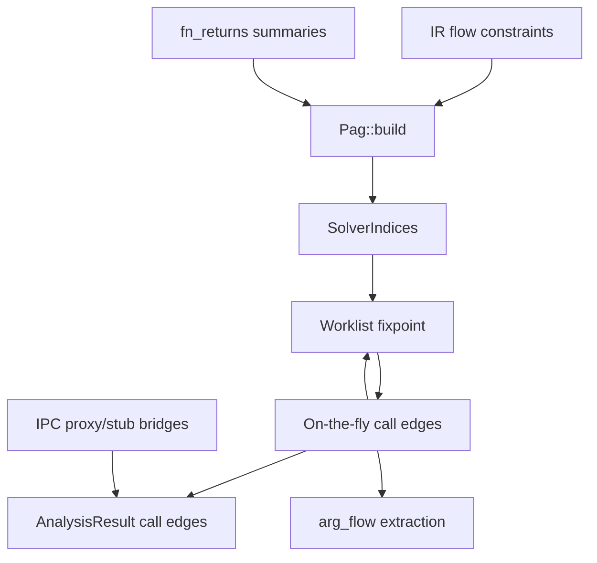

# Pointer analysis

trace uses inclusion-based (Andersen-style) pointer analysis to resolve indirect calls and wire interprocedural argument flow.

## Properties

| Property | Value |
|----------|-------|
| Scope | Whole-program C/C++; independent link-target scopes when build metadata is available |
| Flow sensitivity | **None** (control-flow insensitive) |
| Field handling | Field-sensitive with **instance-insensitive field summaries** |
| Pointer analysis kind | **May-analysis** (sound over-approximation) |
| Context sensitivity | **None** |

## Workflow



1. **`Pag::build(program)`** — materialize PAG nodes/constraints from `program.flow`, expand `CallReturn` using `program.fn_returns`, attach indirect-call `Load`/`Copy` constraints.
2. **`solve`** — worklist propagation until fixpoint; discover indirect callees when call-target points-to gains function locations.
3. **`extract_arg_flow`** — emit `arg_flow_edges` for wired parameter copies at resolved calls.

## Call source locations

A call token written in a source macro replacement list uses the token's
spelling location in the macro definition as `CallSite::span`. Its optional
`CallSite::expansion_span` identifies the outermost invocation that emitted the
token. This makes the spelling location usable as a source request while still
distinguishing repeated expansions of the same macro body. Calls spelled as
macro arguments keep the argument's own source position and have no macro-body
expansion span. For a member call whose called member is spelled in a
replacement list, lowering displays that member token rather than the
receiver's first token; therefore `ARG->member()` still points to `member` when
`ARG` came from a macro argument.

Displayed coordinates are not the call's merge identity. A receiver or member
argument may expand from another macro, giving several calls the same displayed
spelling and expansion pair. Macro member calls therefore retain a separate
internal occurrence identity from their replacement-list `.` or `->` token.
That identity contains the punctuation spelling, outermost expansion, and the
preprocessor's deterministic expansion-chain fingerprint. The chain preserves
intermediate helper invocations and parameter-substitution positions, so two
expansions of the same helper token inside one outer invocation remain distinct.
Merge and virtual-target deduplication use this occurrence identity; database
export and source requests continue to use `span` and `expansion_span`.

Semantic ownership and visibility use the expansion file when it is present.
Consequently, invoking a macro declared under a dependency root still produces
a call in project code, while a call actually expanded inside a dependency body
remains excluded. Post-merge virtual-target deduplication uses both spelling and
expansion spans, so repeated invocations of one macro-body virtual call each
receive overrides discovered in other translation units. `CallSite::scope_file`
is the shared source of this semantic file for name lookup, internal-overload
argument flow, synthesized-external ownership, and PAG resolution.

The SQLite `call_sites.file_id/line/col` columns export the spelling location;
the nullable `expansion_file_id/expansion_line/expansion_col` columns export the
invocation. These facts come from the preprocessor `LineMap`, including cached
header expansions. Macro definitions remain preprocessing metadata and never
become IR functions or methods. `trace inspect calls --file` matches either the
spelling file or expansion file and orders macro calls by their invocation.

## Shared header functions

This section defines header-function sharing. `SymbolTable` owns visibility
and resolution: call consumers use `Program::callees_of` (or the symbol-table
equivalent), and name-based return facts use
`SymbolTable::call_return_candidates` / `return_flow_candidates`. Merge records
contributing contexts; analysis and export reuse those resolvers rather than
reconstructing the rules.

C++ internal-linkage definitions originating in an included header share one
function entry when their source position, name and exact preprocessed
definition text agree (#116), including lambdas nested in header bodies.
Different macro expansions remain separate. Text identity is the whole
test: a body whose meaning differs per unit through an earlier `typedef`,
`using` alias or `enum` constant is still one entry, and it keeps the first
contributing unit's parameter and return types. That is a known
approximation, not a separator. The comparison uses expanded text, rather
than original source or a hash alone, and does not depend on worker
scheduling. Deduplication is confined
to each link image; source-file definitions retain their TU identity.

The symbol table records the TUs contributing each shared definition, so it
is visible only in those units and their included files. Visibility uses
recorded include relationships, since included files can have arbitrary
extensions. Parameters and
body locals are shared, and merging unions distinct call, flow and return
facts. Base configurations and variants use the same shared-flow index across
TU families within a link image, including facts first introduced by a variant.
Identical call records retain all contributing lookup contexts and are
exported once; records referring to different TU-local callees or mutable
callback objects remain separate.
File-scope static variables (`FileStatic`, with no owning function) still
represent distinct objects per TU. Function-local static variables (`FnStatic`)
share the canonical body's abstract locations alongside its other locals.
C++ gives each TU its own such object; sharing these locations unions their
possible values as a deliberate may-analysis over-approximation.
Name-based return lookup considers every contributing TU with the usual
local-definition precedence: for matching external definitions, a TU that
defines the function selects its own definition; a TU without one considers
all matching definitions in its target. This is a context-insensitive approximation:
a shared helper can propagate values from any of its includers, while no
contributing binding is discarded. Internal definitions without expansion
metadata retain their existing merge behavior.

Expanded definition text travels through `UnitIndex::internal_definitions`.
Cached-header replay retains it in the temporary TU preamble so
`program_into_unit` can transfer it to the unit. The final merge keeps the
header-deduplication index without copying text into a second
`internal_definitions` index. CLI and C API call `Program::release_merge_state`
after indexing and before analysis, releasing these merge-only tables in both
scoped and unscoped runs. Rust callers that will merge more units retain the
state until their final merge is complete.

**Lookup order in name buckets**

Internal-function and file-`static` variable name buckets are kept sorted by
file ID, equal-file function entries staying in registration order. A
first-match lookup therefore never walks a whole bucket: the own-file entries
form one contiguous run, and among the header entries the first accepted one
is already the lowest-numbered — the result the ordering rules call for.
Candidate lists switch to a membership set for deduplication only once they
grow past a threshold, and the ordered vector stays authoritative, so no hash
map or membership set decides result order.

An external that is already bound and is the only entry under its name cannot
resolve to an alternative definition — nothing else can be named — so the
candidate walk is skipped for it, prototype-only bindings included
(`is_sole_binding_of_name`). Resolution policy itself is unchanged: every
lookup still goes through `resolve_function_in_scope_in_target` /
`resolve_function_candidates_in_target` with the caller's target (invariant 5).
The solver resolves and wires call sites sequentially, in call-site order.
`TRACE_SOLVER_STATS` reports resolution separately from worklist time.

## Canonical variable identity

This section is the authoritative description of how a scoped variable is
identified and looked up; other sections link here instead of restating the
rules (see "Link targets and weak symbols" below for how an image unifies and
overrides globals by the external symbol name defined here).

`Variable::name` stays the token written at the declaration site — what
display and export show. `Variable::qualified_name` additionally carries the
canonical scoped spelling (`ns::ptr`, `outer::inner::ptr`, `Holder::member`,
`nest::Box::member`, no leading `::`) when the variable was declared at the
scope of a named C++ namespace — whatever its linkage, so a namespace
`static` is `ns::p` too, while a top-level anonymous namespace adds no
segment and qualifies nothing — or is a class's `static` data member; it is `None` for a local,
a parameter, a temporary, or anything declared at plain global or file scope,
so the ordinary case adds no allocation. `Variable::lookup_name()`
returns the qualified spelling when present, else `name`, and is what every
symbol-table index that identifies a variable by name keys on: `a::ptr`,
`b::ptr` and a bare `ptr` register under three distinct keys in
`global_by_name` / `target_globals` / `file_statics_by_name` instead of
colliding on `"ptr"`. No separate index competes with these three; canonical
identity only changes the key they are stored under.
`Variable::external_symbol_name()` gives that same string, but only for
`StorageClass::Global` — the one storage class that denotes a linker-visible
symbol. Internal-linkage variables are registered `FileStatic`: a file
`static`, a namespace `static`, a variable of an anonymous namespace
(`storage_for` in `trace-parse/src/lower.rs`), and a static data member of a
class declared in one. The exception is a C++ `const`/`constexpr` variable at
file or namespace scope, which has internal linkage but stays `Global` (see
the imprecision under "Link targets and weak symbols" below). So an anonymous
namespace's `hidden` is the file's own
storage in every unit that includes it, never an image's symbol named
`hidden`. `global_by_name`/`target_globals` are keyed by
`external_symbol_name()`, and image unification, weak strength, weak
propagation and `#pragma weak` all compare it (below). `is_namespaced` is
source metadata only, set exactly when `qualified_name` is; no identity
decision reads it.

`SymbolTable::variable_named_in_scope(canonical_name, file)` is the exact
probe over that identity: the file's internal (file-`static`) binding first,
then the unscoped external binding (`global_by_name`). It names no image:
its one caller is lowering, and link targets are assigned after lowering, at
merge time. It performs no fallback stripping: an unresolved `missing::name`
never retries as `name`. `SymbolTable::global_named(target, lookup_name)` is
the external part, for one image or (`None`) the unscoped partition; the PAG's
name fallback for a call through a variable asks it with the caller's image.
An image is indexed by linker symbol. Every declaration of a C-linkage
variable of one name, in any namespace, is the same variable, and the image
keeps one of them under the bare symbol, so `cb` and `ns::cb` both find it;
a qualified spelling falls back to its last segment only for a C-linkage
variable.

Lowering qualifies a namespace-scope global at registration with
`LowerContext::qualify`, the same enclosing-namespace-path helper
`qualify_decl` uses for function names. A variable declared with C language
linkage (`namespace ns { extern "C" CB cb; }`, or anything inside an
`extern "C" { ... }` block) keeps `ns::cb` for lookup but links by its bare
name: `Variable::c_linkage` makes `external_symbol_name` return `cb`, so it is
the same image symbol as a C or `extern "C"` definition of `cb` in another
unit, and `#pragma weak cb` weakens it. A nested `extern "C++"` restores C++
linkage. `extern "C" T x;` without braces declares `x`, as `extern T x;` does.
A later redeclaration or definition of the variable keeps the C linkage its
first declaration gave it (`extern "C" CB cb; CB cb = f;`). A static data
member never has C linkage, even when defined inside `extern "C"`. A
namespace variable whose first declaration this unit sees is qualified
(`extern "C" CB ns::cb;`, `ns` an opened namespace) takes the linkage
around it, as the unqualified declaration would. Lowering spells a C-linkage
variable by its qualified name: in one unit its bare symbol does not answer
lookup (in a linked image it does, above). A written reference that may be
qualified (`inner::ptr` inside `namespace outer`, meaning `outer::inner::ptr`)
resolves through `find_in_scope`'s existing class/namespace traversal, which
tries each enclosing scope's spelling as the canonical-name probe, innermost
first, the same way a type or function name resolves from the current scope;
outside any C++ class or namespace, an unqualified name takes the plain path:
the body's locals, then `variable_named_in_scope` (the file's own `static`
before an external global). That is the scope walk's precedence too, so the
two paths never disagree. Inside a class or namespace, an unqualified name
not bound by a local takes the traversal (`ptr` inside `namespace a`
reads `a::ptr` before `::ptr`; `member` inside `Holder`'s member functions
reads `Holder::member`). `lookup_var` in `trace-parse/src/lower.rs` is that one
lookup, and every expression position reaches it through `lookup_var_node`
for an `identifier` or `qualified_identifier`: values, assignment targets,
arguments (`&a::ptr` passes the cell as `&x` does; see [Argument flow](#argument-flow)), returns
(`return a::ptr` copies, `return &a::ptr` returns the cell), stores through
pointers, call receivers, and indirect callees (`a::cb()` calls through the
variable, `ns::f()` on a callable object calls its `operator()`, and
`H::table[i]()` and `h.table[i]()` load the element). A variable the name resolves to takes
precedence; otherwise a
qualified name falls back to the function it spells (`&a::handler`), and an
unresolved one yields no flow. A scope written with template arguments
(`Box<int>::member`) designates no variable: stripping the arguments could
bind an unrelated one.

`using` brings namespace variables into scope as it does functions.
A `using ns::name;` declaration in a function body counts as a local: it is
asked right after the body's locals and hides everything outside the body,
functions included. Outside the body, `find_in_enclosing_scopes` walks the
enclosing classes and namespaces; a `using ns::name;` written in a namespace
declares the name there, so it is asked next, before the global scope. A
file-scope `using ns::name;` and then a `using namespace ns;` directive are
asked after the global scope (`ImportScope`; functions resolve in the same
order):
`using namespace OHOS;` makes `key` read `OHOS::key` and `Foo::inst_` read
`OHOS::Foo::inst_`. The innermost declaration or directive is asked first
(`LowerContext::directive_namespaces` for directives). Within one
declaration or directive, a relative spelling means the enclosing namespace's
entry before the global one: `using namespace A;` inside `Outer` asks
`Outer::A` before `A`. A globally qualified target (`using ::ns::x;`) means
`ns::x` only. A function of the name declared at file scope hides
what a directive brings in.

In a value (`out = name;`) and a bare call (`name()`), a declared name
shadows a function of the same name: a variable (local, parameter, or one the
lookup above finds), then an instance field read through `this` in a member
body, and only then the function, as a return already asks. `&name` asks
the same way, so `&x` takes a variable's address even where a function `x`
is visible.

A function named as a value resolves the way a call's name does
(`resolve_function_named`): through the enclosing classes (their bases
included) and namespaces, innermost first, then what a `using` brings in,
then the spelling as written. So `cb_t H::cb = Handler;` and
`out = Handler;` in a member body take `H::Handler`, `out = f;` inside
`namespace N` takes `N::f` over a global `f`, and `inner::g` inside `outer`
is `outer::inner::g`. Every value position asks it: initializers, direct
initialization arguments, assignments, `&f`, arguments, returns, and stores
through pointers. A direct call's return flow records the function under
that canonical name (`N::get` for `get()` inside `N`), because it is expanded
after merge, outside the call's scope.

The scope walk runs only when it could find something. `SymbolTable` keeps the
set of last segments of every registered `qualified_name`
(`has_scoped_variable_leaf`). Outside every class and namespace, a name whose
last segment is not in that set takes the plain path with no walk and no
allocation. Inside one, it still takes the walk when a variable outside every
scope holds the name, so a nearer declaration can hide it, whether or not some
unrelated scoped variable shares the name. A qualified spelling whose leaf is
absent can only be `::leaf`, a plain global.

Not modeled:
- A namespace alias does not bring a variable into scope.
- A parenthesized declarator with a typedef'd type (`CB (H::cb) = f;`,
  `CB (x) = f;`) parses as an expression statement at file scope, so it
  defines nothing. That is a parser limitation, not specific to members.
- A qualified name does not search the named class's bases. `Derived::m` for
  a member declared in `Base` resolves to nothing. A member access through an
  object does search bases (below).
- Pointer-to-member objects (`int X::*pm`) and dependent template
  instantiations are out of scope.
- A class defined inside another declaration (`typedef struct T {...} T_t;`,
  `struct S {...} s;`) registers its static members, but neither its member
  function bodies nor its in-class initializers are lowered. That is a
  limitation of member lowering generally.

### Static data member storage

A class's `static` data member (`struct Holder { static int *member; };`,
and a union's, since a C++ union is a class) has
one shared storage for the whole program, not a per-instance slot, so it is
registered as a canonical `Variable` — the same identity mechanism a
namespace-scope global uses — instead of being swept into the class's
instance-field layout (`trace-parse/src/lower.rs`, `lower_struct_specifier`'s
field loop routes a `static` member to `register_static_data_member` and
`continue`s past the `fields.push` an ordinary field takes). Its canonical
name is `{class}::{member}` (`Holder::member`, `nest::Box::member`), keyed the
same way `register_member_prototype` keys a member function; `static` here
means "one shared instance", not the file-scope rule an ordinary `static`
declaration gets from `storage_for` — the member's `StorageClass` is `Global`
unless its class itself has internal linkage (declared in an anonymous
namespace), in which case it is `FileStatic`. Either way it is indexed by its
canonical name, so its bare name never claims a slot in `global_by_name` /
`target_globals`. A class that declares a static data member is C++-only, so a
data-only struct nested in another registers under its nested spelling
(`Outer::Inner`) rather than keeping a C file-scope tag. That keeps its members'
in-class keys equal to their out-of-class definitions' keys.

A member access that names a static data member (`h.m`, `p->m`, `this->m`,
or `d.m` for a member of `d`'s base class) is that member's variable, the
same storage `Holder::m` names. It is not an instance field.
`static_member_access` in `trace-parse/src/lower.rs` types the receiver and
probes `{class}::{member}`, then each base class. The value, store,
address-of and argument positions ask it before they take the field path.
An instance field never pays for receiver typing: the leaf pre-filter
(above) answers first. A call through such an access (`h.cb()`) calls through
the member variable, as `H::cb()` does, rather than a member function of that
name. The access also types a call receiver (`h.m.run()`), and `return h.m;`
returns the member's value. A field path through the member (`h.obj.cb`) is
rooted at the member's variable, as `Holder::obj.cb` is. A class's own
instance field or member function hides a base's static member of the same
name, and so does any such declaration nearer than an outer scope's variable
(a namespace's function hides it whether external or file `static`).
The scope walk stops there (`scoped_variable_unless_hidden`), so `d.cb()`
calls `D::cb`, not base `B`'s static callback. A hidden name reads no
variable, now or in the deferred end-of-unit pass; an instance field it names
is read through `this`, and a bare call through one in a member body
(`cb()`) loads `this->cb`, as `this->cb()` does. A reference member is
recorded as a reference binding, so `&H::ref` and `&h.ref` are the
referent's address. A callable member called through an object (`h.fun()`)
calls its class's `operator()`, as `H::fun()` does. Every declarator of one member declaration
(`inline static CB a = f, b = g;`) is its own member with its own
initializer.

A member declared in-class and defined out-of-class (`int *Holder::member;`
or `int *Holder::member = &object;` at namespace scope) share one `VarId`:
lowering an out-of-class variable definition recognizes a scope-qualified
declarator (any name `parse_declarator_name` resolved through a
`qualified_identifier`, pointer- and function-pointer-wrapped ones included)
and probes `variable_named_in_scope` for the in-class entry instead of
allocating a second variable, the same way an out-of-class member function
definition reunites with its in-class prototype
(`SymbolTable::register_function`). The raw spelling is resolved to that
canonical key with `LowerContext::qualify_decl` — the same relative-to-
enclosing-namespace resolution an out-of-class member function definition's
name gets — so `Box::member` written inside `namespace nest { ... }` and
`nest::Box::member` written outside it key the same entry a nested class's
in-class registration used. On a match, the definition takes precedence for
`is_defined` and `span`, mirroring a function definition superseding its
prototype's span; a miss (no matching in-class declaration in this TU) falls
back to registering fresh storage under the canonical name rather than
dropping the initializer's flow facts. When the enclosing-namespace
spelling names no variable, the owner class is resolved through a
`using namespace` directive (`class_seen_from`), as for an out-of-class member
function definition. `using namespace OHOS; cb_t FooTest::proxy_ = f;` defines
`OHOS::FooTest::proxy_`, also in a unit that only forward-declares the class,
so it links with the member other units declare. The definition can be any
declarator form: initialized, uninitialized with a bare qualified declarator
(`cb_t H::cb;`), or direct-initialized (`cb_t H::direct(f);`) when the name is
a known variable. A known variable is always defined there, never declared
as a function: its arguments are looked up in the member's class, as a copy
initializer's are, and one that does not resolve passes no value. An `extern` qualified redeclaration (`extern CB n::cb;`) defines
nothing. `__attribute__((weak))` on the in-class declaration makes the member
weak, as it does on the out-of-class definition. A pointer-to-member declarator (`int *Foo::*pm`) is none of these
and registers as an ordinary variable. The definition's initializer looks its
names up in the member's class, as an out-of-class member function body does
(`CB I::target = source;` reads `I::source`). A weak definition
(`__attribute__((weak)) CB H::cb = f;`) makes the member weak. An in-class initializer
(`inline static int *member = &object;`) lowers once, in
`lower_class_definitions`'s member-body pass (the field-layout pass that
registers the member's identity has no mutable `LowerContext` to lower an
expression with), and its facts belong to the member's definition, so a strong
definition elsewhere in the image drops a weak one's initializer as it does
any weak global's. An `inline` member is a definition with or without an
initializer (`inline static CB cb;` is zero-initialized). Lowering has no link targets yet, so every probe here is
untargeted (`target: None`); cross-TU reconciliation (image unification and
weak selection) is the merge's job, not lowering's, and keys a member on its
external symbol name like any other global.

## Link targets and weak symbols

`--link-commands PATH` selects a link commands database. Otherwise indexing
checks `link_commands.json` at the analysis root, then `build/`, then the
directory the selected compilation database was read from — an out-of-source
build keeps both databases together, away from the sources — and reads
link-only entries from that compilation database. CMake metadata is read
through the lexically last `index-*.json` File API reply — CMake's timestamped
names sort newest-last — and its referenced `codemodel-v2` objects in those
same three directories. The first candidate build root that supplies targets
is used; additional build roots are not combined, avoiding duplicate target
scopes. Stale, unreferenced target JSON files are ignored.

Compilation object outputs (`output` or `-o`) identify both the source and
its compiler configuration. The same source built with different macros for
two targets therefore keeps those configurations separate. CMake source
membership without object/configuration information conservatively includes
all available commands for that source. Explicit artifact inputs and known
`-L`/`-l` target outputs establish dependencies; library lookup stops at the
first matching search directory. Commands are parsed as data;
no compiler, linker, or shell is executed. Unsupported command features and
unmapped objects produce diagnostics. Response-file expansion is bounded, and
runs after `-Wl,`/`-Xlinker` forwarding is unwrapped, so a file handed to the
linker as `-Wl,@objects.rsp` contributes its objects like a bare `@objects.rsp`.
A backslash before a newline splices the two lines, as in a shell.
Options are distinguished from inputs before extensions are consulted, so an
soname, a Darwin loader path (`@rpath/...`, `@executable_path/...`, which share
`@` with response-file syntax), an `-install_name` operand and MSVC switches
such as `/implib:foo.lib` are not read as link inputs, and `/out:` is matched
case-insensitively.

The IR stores `LinkTarget` records with typed `TargetId` values, direct sources,
and dependencies. CMake edges identified as build-order-only (`add_dependencies`)
do not import symbols; actual link relationships are retained even when an
ordering dependency also exists. Each target gets a separate symbol scope containing its
sources and transitive dependencies. Cycles terminate through a visited set.
Units are lowered once per compiler configuration and reused during merging;
weak body/initializer ownership is collected only when link metadata requires
selection, so ordinary indexing does not allocate those range maps;
a source shared by targets has distinct function and variable instances in
each scope. Unmapped sources remain in an unscoped partition. Without link
metadata, the existing indexing and whole-program merge path remains in use.

GNU `weak`/`__weak__` attributes (including C++ `[[gnu::weak]]` and
`[[gnu::__weak__]]`) and active `#pragma weak name` mark functions
and variables *with external linkage*. The `_Pragma("weak name")` operator
spelling is **not** read — a weak body annotated that way is not suppressed, so
both bodies' facts survive (over-approximate, not wrong). The alias form,
`#pragma weak name = target`, marks `name` weak but does not model the alias:
no flow is emitted from `name` to `target`, so a `name` with no definition in
the unit stays unresolved rather than resolving to `target`'s body. Otherwise: a `static` function, a local, a
parameter and a block-scope variable have no linkage to weaken, and the
annotation is recorded on none of them. An attribute among a declaration's
specifiers reaches every declarator it introduces, while one written inside a
declarator reaches only that declarator
(`void a(void) __attribute__((weak)), b(void);` weakens `a` alone). Within a target, a strong definition replaces a matching weak
definition; strong declarations alone do not suppress a weak body. Selection
uses the IR symbol registration/signature rules, including C++ overloads,
rather than a separate signature comparator. An overridden weak definition is
demoted to a declaration of the same symbol: it keeps its signature, which is
what tells one overload of a name from another, and contributes no local
variables, calls, return flows, or constraints, including writes to globals. Weak global initializers are excluded when a strong global definition
exists. A C tentative definition (`int x;` with no initializer) counts as a
strong definition and overrides a weak one, matching `-fno-common`, the default
since GCC 10 and in Clang. Under `-fcommon` a tentative definition is a common
symbol that a weak definition would outrank instead; the compiler flag is not
modeled, so that configuration resolves the other way here.

Globals unify within a target by their external symbol name
(`Variable::external_symbol_name`, see "Canonical variable identity" above):
the plain name for C, the canonical qualified name for a C++ namespace-scope
global or static data member. One external symbol is one variable per image,
so a caller's `a::cb` and another unit's definition of `a::cb` are one
variable, while `a::counter` and `b::counter` stay two and neither unifies
with a plain `counter`. Weak strength and weak propagation key on the same
name: a strong `a::cb` supersedes a weak `a::cb` in its image, never a weak
`b::cb`. A `#pragma weak` word is compared with that name, so `#pragma weak
cb` weakens `::cb` and never `app::cb`. An internal-linkage variable has no
external symbol name and takes part in none of this: each unit keeps its own
copy, even of one declared in a shared header.
Weak-only targets retain the fallback. Equal-strength weak function definitions from different origins
are selected deterministically in unit order; configurations of the same weak
body retain their union of facts. Weak global alternatives may conservatively
contribute multiple initializer values.

Target identity travels through direct calls, function addresses, transitive
returns, indirect calls, dynamic symbol lookup, and field summaries. Types
and immutable string literals may be shared, while mutable storage summaries
remain within a target. The same target-aware name resolver serves call and
return wiring; a lookup that names no image (the public resolver entry points)
still sees every symbol, which is not the same question as naming the unscoped
partition explicitly.

When separate translation units contribute distinct strong definitions of a
C++ function with the same qualified name and signature (such as multiple
implementations across modules analyzed in whole-program or unscoped mode
without link metadata), each definition is indexed separately in the symbol
table and the exported database.

Call-site resolution respects translation-unit boundaries:
- A translation unit that contains a definition of the function resolves direct
  calls exclusively to its own definition, avoiding duplicate edges from other
  units.
- A translation unit that does not define the function (seeing only declarations
  or prototypes) treats all matching definitions across the program as equal
  candidates and resolves to them.

**IPC bridges are the deliberate exception.** A Binder call crosses a process
boundary, so a proxy and the stub it dispatches to are in *different* images by
construction — a client executable and its service daemon. Proxy/stub pairing
and the synthetic edges it produces are therefore matched across the whole
program and are never filtered by target; they are the one kind of
`call_edges` row whose endpoints may differ in `target_id`. See [SQLite schema](SQLITE_SCHEMA.md) for exported weak flags
and target associations.

Link metadata needs a source for each object: either a compilation database
that names the object (`output`, or `-o` in its arguments), or link lines that
name sources directly. `--link-commands` on its own, against a project with no
compilation database, leaves every target with no sources and reports one
diagnostic per unmapped object.

A `-l` name resolves against known build outputs, including a versioned soname
(`-lfoo` finds `libfoo.so.1.2.3`). MinGW `libfoo.dll.a` and MSVC `foo.lib`
import libraries are not matched, and an unresolved `-l` is silent by design —
it is assumed to be a system library.

One further imprecision appears only under link metadata: a C++ `const` or
`constexpr` variable at file or namespace scope (not `extern`, not `inline`)
has internal linkage but is registered `Global`, so it is unified by its
external symbol name across translation units of one image like any other
global — `KEY` at file scope, `ns::KEY` in a namespace; both values merge, so
nothing is dropped, but the two are not kept apart as they are without link
metadata.

This models declared target membership, not a complete platform linker:
archive members are conservatively included, without demand-driven extraction;
link order, symbol versions, visibility, loader interposition, linker scripts,
and dynamically discovered DSOs are not emulated. A weak alias pragma marks an
existing declaration and synthesizes no body (see `PREPROCESSOR.md`), so the
alias resolves only if something else defines it. A multi-config CMake
reply repeats each target once per configuration, differing only in artifact
path; only the first configuration is read — indexing every one would repeat
the same facts at N times the cost — and a diagnostic names the ignored
configurations. Missing metadata cannot establish which independently built
image a symbol belongs to.

## Type storage

Type tables share immutable `Arc<TypeDesc>` descriptors and typedef alias
payloads across simultaneously live headers and translation units. Interning
order, IDs, layouts, and tag-completion state remain local to each table;
aggregate union replaces a shared descriptor rather than modifying it.
Sharing requires full structural equality, including collision checks, and
weak pool entries do not retain unused descriptor payloads. The public Rust
`TypeInfo.desc` field is an `Arc`; match through `.as_ref()`. Serialized type
values and exported data are unchanged. See [memory measurements](MEMORY_PROFILE.md).

Sharing also makes re-interning cheap: a table answers `intern_arc` for an
allocation it already holds by address, without hashing the descriptor tree,
and a header unit carries the descriptor each of its types merges as
(`UnitIndex::merge_descs`), computed once rather than by every consumer. A
descriptor that tag completion may rewrite (`Ptr(Struct { name, fields: [] })`)
is answered from a small cache keyed by that spelling and validated against
the tag's current id, its descriptor allocation and the aggregate-union count,
so the answer changes exactly when the layout it names does. Internal-linkage
function and file-static lookups are indexed by name and filtered by the
asking file's scope, rather than walking every header of the scope per name.
See the [Clang benchmark](PERFORMANCE_REVIEW.md#clang-source-benchmark-header-import-and-lowering).

**Declarator shapes.** C declarators bind inside-out: in `T D`, a declarator `*D1` gives `D1` the type "pointer to T", `D1[n]` "array of T" and `D1(..)` "function returning T", and the identifier gets what is left after the last layer (`walk_declarator_shape`). So `int *t[4]` is `Array(Ptr(Int))`, `void (*h[4])(int)` is `Array(Ptr(FnPtr))`, `int *(*get)(void)` is `Ptr(FnPtr { ret: Ptr(Int) })`, and a fn-pointer variable `void (*fp)(int)` is `Ptr(FnPtr)`. Before #127 the walker wrapped outside-in: `int *t[4]` was `Ptr(Array(Int))` (exported `int[]*`), `int *(*get)(void)` was `Ptr(Ptr(FnPtr { ret: Int }))` (exported `fn_ptr**`), and `void (*h[4])(int)` was `Ptr(FnPtr { ret: Array(Void) })` — exported `fn_ptr*`, because an exported type name does not spell a function's return type.

## IR flow constraints (`trace-ir`)

Lowered from C during parse. Mapped to PAG in `Pag::build_flow_constraints`.

| Constraint | Meaning | C example |
|------------|---------|-----------|
| `Copy { dst, src }` | pointer assignment | `p = q` |
| `AddrOfVar { dst, src }` | address of variable | `p = &x` |
| `AddrOfFn { dst, callee }` | address of function | `p = handler` (fn ptr) |
| `Load { dst, src }` | load through pointer | `y = *p` |
| `Store { dst, src }` | store through pointer | `*p = y`, `field = val` |
| `GepField { dst, base, field }` | field address | `&obj.field`, `p->field` |
| `ArrayFnMember { array, callee }` | fn-ptr array init member | `{ fn0, fn1 }` |
| `CallReturn { dst, callee_name, caller }` | `dst = callee()` written in `caller` (`None` for a file-scope initializer) | `p = GetOps()`; `void *g = GetOps();` |
| `CallReturnIndirect { dst, callee_var }` | `dst = *callee_var()` | `sbuf->impl->readBuffer(...)` (indirect return) |
| `NewHeap { dst }` | heap allocation | `new T(...)` (C++ ctor result) |
| `StringConst { dst, value }` | `dst` points at a string literal | `p = "target"`; `dlsym(h, "target")` |
| `UnwrapPointer { dst, src }` | cross a smart-pointer wrapper into its pointee; `dst` is the pointee-typed receiver (see [Smart-pointer unwrap](#smart-pointer-unwrap)) | C++ `sp->field`, `(*sp).field` |

### Return-value flow

Functions record abstract return values in `program.fn_returns`:

| `ReturnFlow` | Source |
|--------------|--------|
| `AddrOfVar { src }` | `return &global` / `return &file_static` |
| `AddrOfFn { callee }` | `return &Fn` / `return Fn` |
| `Copy { src }` | `return local` or `return param` |
| `Call { callee_name }` | `return Other()` (transitive; resolved in the returning function's contexts) |

`return &local` is recorded as `AddrOfVar` but is **unsound** for stack locals (may-analysis may report escaped addresses). Prefer treating this as a known imprecision.

At PAG build time, `CallReturn` resolves through
`SymbolTable::call_return_candidates` and transitive `ReturnFlow::Call` through
`SymbolTable::return_flow_candidates`. Both scope the lookup by the function
the call is written in, never by the destination's owner, so a global or
file-static `g = f()` inside `use` sees a `static` `f` exactly as a local
would (#132). The resolver applies target scope and TU-local definition
precedence; header-body contexts follow
[Shared header functions](#shared-header-functions). A `CallReturn` with no
caller (a file-scope initializer, `void *g = f();`) resolves in `g`'s own file
with the same precedence. Callee ids that survived lowering and merge (e.g.
`AddrOfFn`) are used directly.

This models patterns like:

```c
subDev->subDevOps = GetSensorDeviceOps();  // return &g_sensorDeviceOps
subDev.subDevOps->setConfig(subDev);
```

**`CallReturnIndirect`** is the indirect-call analogue of `CallReturn`. The callee is resolved by the solver when indirect call targets are known (via function-pointer analysis). The `callee_var` is a synthetic load variable that holds the resolved function pointer; the solver wires return flows from each resolved target into `dst`.

**`NewHeap`** represents C++ `new T(...)` allocations. The PAG allocates a heap location typed to the allocated struct and adds an `AddrOf` edge from `dst` to the heap location. The solver then propagates into the struct's fields, enabling resolution of function pointers stored by constructors (e.g., `MParcelImplInterfaceAssign` writing into `HdfSBufImpl.readBuffer`).

**`StringConst`** intern a C string literal as an abstract location (`LocKind::StringLit`). Assignments (`const char *n = "foo"`), copies, and call arguments intern the same way, so a later `dlsym(h, n)` still sees `"foo"`. Concatenated literals (`"ta" "rget"`) are folded. No `sprintf` / buffer writes.

### Smart-pointer unwrap

`UnwrapPointer { dst, src }` is the step through a smart pointer's overloaded `operator->` or `operator*`. `src` holds the wrapper value (`sp`, or the loaded `h.item`); `dst` is the pointee-typed receiver temporary (`_recv`) that field accesses continue from. The receiver's type is the pointee class, and it is the only type the constraint consults, so merge remaps nothing but the two variables.

The wrapper and its pointee are separate objects. A plain `Copy` would let the wrapper's own storage reach GEPs typed for the pointee, and the GEP field-name guard cannot tell two classes apart when they share a field name at the same position. The PAG kind therefore filters: `pts(dst) ⊇ { o ∈ pts(src) | o is compatible with dst's pointee type P }`, where a location is judged by its recorded type:

| Location type | Decision |
|---|---|
| Struct/union whose declaration (`tag_identity`) is `P`, or a class deriving from `P` | admitted |
| Any other struct/union, wrapper storage included | rejected, unless the receiver's pointee type is itself unresolved: then every struct/union is admitted |
| `Unknown` or `void` (untyped storage, e.g. a modeled `ReturnHeap` location) | admitted conservatively |
| Array whose element type is admitted (`&pool[i]` is the array's location, index-insensitively) | admitted |
| Pointer or scalar (the storage of a pointer variable), or an array of one | rejected: not a pointee object |
| Function or string literal | rejected: not a pointee object |

A field location is judged by its own type, which is the field's type, so `&h.item` (a wrapper-typed field) is rejected.

The unwrap adds no fallback of its own. The receiver's GEPs already fall back to the pointee type's field summary when the receiver has no pointees or none of them yields a field cell (see [Propagation highlights](#propagation-highlights)), so `sp->cb` and `raw->cb` still share `summary:Payload.cb` when `pts(sp)` is empty, which is the common case for parameters and for standard wrappers whose headers are not in the tree. In those cases the unwrap's value is the traversable `unwrap` edge in the exported flow graph; it carries concrete locations only when the wrapper value has some.

A wrapper variable is a pointer to its pointee as far as the solver is concerned: after merging, `mark_wrapper_values` (`lower.rs`) sets `is_pointer` on every variable whose type `operator->` steps through. Its value and its storage are therefore kept in step ([Variable cells](#propagation-highlights)), so an object stored through `&sp` (`Fill(&sp)` writing `*out = &obj`) reaches `sp->f`, and `(*w)->f` sees `sp = x` copies; and a wrapper argument is wired to its parameter by a persistent copy, as a raw pointer is.

A field path may also start at a call's result when it crosses a wrapper at its root (`GetSp()->cb()`, `GetSp()->value`): the path validates first, then the call's result is lowered into a temporary (`CallReturn`) that the unwrap reads. Only a direct call by plain name has a return flow to read; a qualified or member call (`Foo::GetInstance()->f`) is not decomposed, and a call returning a raw pointer keeps its previous handling. Evaluating any root expression as a value, which would lift both restrictions, is the direction [#151](https://github.com/Last-Humans-Coding-Under-White-Nights/pathologist/issues/151) proposes.

Limits. Each leaves the receiver on the pointee's field summary, which is what every smart-pointer field access resolved through before `UnwrapPointer` existed:

- **Subclasses are those the inheritance graph records.** A class deriving from the pointee through a template parameter (`class Foo : public IRemoteStub<IFoo>` with `template<class I> class IRemoteStub : public I`) is not known to derive from `IFoo`, so its objects are rejected, as virtual dispatch through the same graph would not see them either ([#150](https://github.com/Last-Humans-Coding-Under-White-Nights/pathologist/issues/150)).

### Weak-pointer promotion

`wp.lock()` on a `weak_ptr<T>` and `wp.promote()` on a `wptr<T>` whose body is not in the tree lower to `Copy { dst: result, src: receiver value }`: the strong result may alias the weak pointer's value. One recognizer (`weak_promotion` in `lower.rs`) decides both this and the result's type ([C++ support](#c-support-first-step), `auto` locals), so the rules match:

- a `.` call with no arguments, named `lock`/`promote` as `WEAK_PTR_UPGRADES` pairs them with the receiver's weak pointer class;
- the receiver's class has no body in the tree. A declared wrapper's own `promote()` is an ordinary member call, and another class's `lock()` (`Mutex::lock`) is never a promotion.

The result's type additionally needs a held class the call site can name; the value flow does not, so a promotion whose type stays unknown still carries its receiver's value.

The receiver value is the variable for a plain name, and the object it names for a reference (`const wptr<T> &weak` is loaded through). Otherwise it is a temporary filled by ordinary expression lowering: `msg->weak.lock()` copies the loaded `weak` field, not `msg`; `get_weak().lock()` copies the call's return; `(*h->weak).lock()` loads through the `weak` member's value. The copy is emitted wherever a call result lands: an initializer or assignment to a local, and, as a direct store of the receiver value, a store into a field (`s->strong = wp.lock()`) or through a pointer (`*out = wp.lock()`, parenthesized or not). The call site itself is recorded as before, so the call edge to the external `lock`/`promote` remains.

This is a may-alias relation. Expiry, a null result, and ownership counts are not modeled. `return wp.lock();` records no return flow: `ReturnFlow` has no receiver form.

### `dlsym` / `GetProcAddress`

Built-in models treat `dlsym` / `dlvsym` / `GetProcAddress` as **symbol lookup**: the return destination of a call (the `CallSite.return_dst` of `f = dlsym(...)`, including `return dlsym(...)` via a temp) may point to every **in-tree** function whose exact name matches a string constant in the name argument (parameter 1). Out-of-tree names add no pointees (true external). The handle / DSO path is ignored. Lookup searches the caller’s link target and its incorporated dependencies when link metadata exists, otherwise the whole program. Dynamically loaded targets absent from that dependency closure are not modeled. Non-literal names that never receive a string constant stay unresolved — they do **not** fan out to every exported function.

## Program Assignment Graph (PAG)

### Node kinds

| `PagNodeKind` | Role |
|---------------|------|
| `Var(VarId)` | IR variable (local, param, global, synthetic temps) |
| `Loc(LocId)` | Abstract memory / function location |
| `CallTarget(CallSiteId)` | Synthetic node for indirect call resolution |

Every local, parameter and temporary gets a `Var` node. A global or static
gets its `Var` node and its location only when some flow constraint, return
flow or call site (callee variable, return destination or argument) names it
(`Pag::build_variables`). A header's declaration repeated into every
including unit, with no use in that unit, would otherwise be an isolated node
holding only its own address. Nodes are still created in variable order.
Anything that reaches such a global later, such as the by-name callee
fallback or an `&x` address, creates both on demand (`Pag::ensure_var_loc`).
Such globals get no `flow_nodes` row and no self points-to fact, and they
leave the minimal export's `variables` table, which lists what the flow
graph names; `--full-export` still lists every variable.

### PAG constraint kinds

| Kind | Semantics |
|------|-----------|
| `Copy` | `pts(dst) ⊇ pts(src)` |
| `AddrOf` | `pts(dst) ⊇ { loc }` |
| `Load` | for each `o ∈ pts(src)`: merge `memory_pts(o)` into `pts(dst)`; function locs copied directly |
| `Store` | for each `o ∈ pts(dst)`: merge `pts(src)` into `memory_pts(o)` and field summaries |
| `Gep` | field projection from base object locations (+ summary fallback) |
| `UnwrapPointer` | `pts(dst) ⊇ { o ∈ pts(src) \| o compatible with dst's pointee type }` (see [Smart-pointer unwrap](#smart-pointer-unwrap)) |

### Abstract location kinds

| `LocKind` | Description |
|-----------|-------------|
| `Global` | External/global variable |
| `FileStatic` | File-scope `static` |
| `FnStatic` | Function-local `static` |
| `Local` | Parameter or stack local storage |
| `Heap` | Reserved for allocator summaries (stub) |
| `Field` | Specific field at a known parent object location |
| `FieldSummary` | Instance-insensitive merge of struct field `T.f` across instances in the same link target |
| `ArraySummary` | Unknown-index array element summary |
| `Function` | Function entry address for indirect call targets |

### Lazy locations

**Global**, **file-scope `static`**, and **function-local `static`** variables receive `Loc` nodes eagerly at PAG build. Ordinary **locals** and **parameters** get locations **on demand** when referenced by `AddrOf`/`ensure_var_loc`.

## Solver

Worklist algorithm with **constraint adjacency index** (`SolverIndices`) for O(1) lookup of affected constraints per node.

### Work budget

Solving runs under a **deterministic pop budget** and optionally a **wall-clock budget**. The pop budget converts a divergent solve on a huge corpus into a partial result plus a visible warning instead of an hours-long hang; normal corpora converge far below it.

- **Derived default**: `800 000 + 6 × (PAG constraint count)` pops (`default_pops_budget`). The flat 800 000 floor is the historical default and covers the eval corpora (the largest, HDF, needs ~42k pops). The linear term lets mid-size and large trees finish their normal convergence instead of stopping under the flat cap at a partial result; the corpus measurements that sized it are in the [Solver work budget](EVAL_REPORT.md#solver-work-budget--2026-09-21-119) section of the evaluation report.
- **`--solve-budget-pops <N>`**: explicit budget; `N=0` means unlimited. Beats the derived default.
- **`TRACE_SOLVE_BUDGET_POPS=<n>`**: environment override (highest precedence; `=0` = unlimited); unparseable values fall back to the CLI/derived value. The eval harness pins this to `800_000` so eval corpora keep their exact exported databases.
- **`--solve-budget-secs <N>`**: optional wall-clock budget (`N=0` = no time limit). Checked every 10 000 pops, so a run can overshoot by the checkpoint interval plus the time of the one pop in flight; a run that converges in under 10 000 pops never checks the clock. A time cap is inherently **non-deterministic**: the stop point depends on machine load, so two runs of the same inputs may stop at different points.

**Partial results are recorded, never silent.** When a budget stops the solve before the worklist drains:

- the stderr progress line says the solve is partial, with the budget that stopped it;
- `analysis_run.options_json` gets `solver_partial: true`, `solver_pops`, `solve_budget_pops`, `solve_budget_secs`;
- an `analyze`-stage `warning` diagnostic (NULL `file_id`, line 0) is exported;
- `trace inspect` warns on opening such a database.

Points-to sets always grow monotonically, so a partial result is a monotone **prefix** of
the fixpoint: every recorded edge and flow is real, but flows that had not propagated yet
when the budget hit are absent. That cuts against may-analysis — a query asked "can this
pointer reach the sink?" can answer "no" when the true fixpoint would say yes, so do not
treat a truncated database as a sound may-answer. The truncation is always visible
(`solver_partial` + diagnostics), and the conservative response to a `partial` database is
to re-run with a higher budget rather than trust a "no".

### State

| Map | Role |
|-----|------|
| `pts` | PAG node → set of abstract locations |
| `memory_pts` | Object location → set of stored pointer values |
| `loc_nodes` | Reverse index: location → PAG nodes that must be requeued on store |

### Propagation highlights

**`Gep` with empty base points-to**

When `pts(base)` is empty (typical for pointer parameters with no incoming flow), fall back to **`FieldSummary`** for `(struct_type(base), field)` via `ensure_field_summary_for_var`. The summary is keyed by the struct's declaration identity (see "Field sensitivity"). This connects field stores through parameters to later field loads on unrelated instances (may-analysis). When link-target metadata is available, the summary also includes the target identity: separate link images cannot exchange field contents. Concrete field locations, heap locations, and nested summaries preserve that identity. Without target metadata the existing type-and-field summary cache is used.

The same fallback also fires when the base *has* pointees but none of them yielded a field cell — e.g. `void *` heap allocations or opaque summaries, where per-pointee `ensure_field_loc` synthesizes nothing. Without this, ops fields assigned through freshly-allocated objects starve every load site that reads them (observed as missing indirect-call edges for shared-obj style code).

**Stores to field summaries**

`apply_store` propagates into both concrete field locs and their `FieldSummary`, keeping summary memory in sync with instance stores.

A store is difference-propagated on both sides. A pointer that gains
targets writes the value's whole set into those new targets only. A value
that gains locations writes only those into every existing target, because
each target already holds the rest (`StoreSource::New`). The new locations
are taken in the value set's own iteration order, so each memory cell
receives them in the same order a whole-set write would insert them. The
cell iteration order that later loads follow is unchanged. Guards cannot
make the two writes differ: a slot guard is set once and never loosened,
and function arities are fixed before solving. A store a function
model adds mid-solve (`content_store`) never saw the values its sides
already held, and a side that has settled pops with an empty delta, which
fires nothing. Wiring therefore fires it once with both whole sets
(`apply_fn_model`); from then on it is difference-propagated like any
other store.

**Signature-guarded function-value propagation**

Wrong-type pointer casts put unrelated objects into a pointer's points-to; a store through such a pointer would otherwise write callback addresses into alien layouts, where later field loads surface them as bogus indirect-call targets. The solver therefore filters **function values only** (all non-function flow stays unfiltered, preserving soundness):

- A fn value may enter `memory_pts[cell]` / a summary cell only when the cell's declared type accepts it (`slot_guard_for`): `FnPtr` slots — a fn-pointer field (`FnPtr`) or variable (`Ptr(FnPtr)`) — require the same parameter count; a table of fn pointers or of untyped pointers (`void *ops[]`) takes its element's guard, a multi-dimensional one its leaf element's; other concrete non-fn-pointer cells (`struct`, array, scalar-pointer, union) reject all fn values; unknown/untyped cells, `void *` included, stay writable (a dlsym-style `GetSymbol(name, void **out)` stores a function there).
- The same guard applies when `merge_memory_into` lifts cell contents into points-to sets — to **function values only**, exactly as on the store path: a load through a `NotFnPtr` cell (declared pointer, `struct`, `union`, array) returns every non-function value stored there. (Before #127 the load applied the guard to every value, so such cells yielded nothing — e.g. `viaload = *pp` with `int **pp` lost `&g`.) The guard also applies when a `Gep` passes fn values from the base node's set into the field node — except registered `array_fn_members` table members, which always pass (see "Arrays and function-pointer tables").

Consequence: callbacks stored through correctly-typed ops assignments resolve exactly as before, while cross-signature leaks (e.g. a 2-param `AddService` callback surfacing at 4-param `Dispatch` sites) are cut. Documented imprecision: old-style casts that stash fn pointers in `void *`-typed cells then call them through typed loads still work (unknown cells accept everything), but calls through cells whose declared type is structurally wrong for the stored fn are no longer reported.

**Variable cells: a variable's value and its memory cell are one object**

A variable whose address is taken (`&v`, or `return &v`) has two representations in the solver: its PAG node (`pts[Var(v)]`, read and written by `Copy` — `x = v`, `v = y`) and its memory cell (`memory_pts[loc(v)]`, read by `Load` and written by `Store` through any pointer to `v`). The solver keeps them in step, in both directions, for every pointer-like variable (`var_is_pointer_like`: `is_pointer`, or a declared `Ptr`/`FnPtr` type, never an array) whose cell is the source of an `AddrOf` constraint. It is deliberately wider than `var_may_hold_pointee`, which parameter wiring uses and which leaves out `int *` / `void *`: an out-parameter of buffer type must still reach its direct reads.

- **Registration.** The first time a cell's address is taken (`seed_addr_of`, at solve start or when `expand_return_flows` adds `return &v` mid-solve), the cell gets its slot guard if it has none, and `register_synced_cell` records `node ↔ cell` and syncs what each side already holds — the address may be taken long after the variable got its value.
- **Node → cell.** When `pts[Var(v)]` gains locations, they are written into `memory_pts[loc(v)]`, filtered by the cell's slot guard exactly like a store (`FnFilter::admits`). The cell's loaders are requeued so pending loads see the growth.
- **Cell → node.** When a store grows `memory_pts[loc(v)]`, the cell is merged into `pts[Var(v)]` through the load path (`merge_memory_into_if_grown`, same guard).

Only a real address may reach a synced cell, so a name that denotes a *value* never stands for its own address. One rule, `seeds_own_location` / `var_is_pointer_like`, decides both places the solver used to assume it did:

- **The static-storage seed.** `solve` starts a global/static's node holding its own location only when its name denotes its storage (an aggregate, an array). A pointer static's name denotes only its value: seeding it would make `p = G; *p = &k;` write `k` into `G`'s cell, and syncing would turn that into `G = &k`. (The flow graph's `points_to` edges are a different thing — storage connectivity, drawn for every variable with a location; see `docs/SQLITE_SCHEMA.md`.)
- **The store's `self_loc`.** A store `*p = v` also writes `v`'s own location only when `v`'s name denotes its storage (`*p = arr`, an array decaying). For a pointer `v` it stores the value alone; `*out = &G` lowers to an explicit `AddrOfVar` temp (see "Argument flow"), so the address is a real, address-taken one.

Consequences: `get_buf(&q); x = q;` sees what `get_buf` stored (the out-parameter idiom), `v = &h; x = *(&v);` sees `h`, and `cb_t cb; get_cb(&cb); cb();` resolves the callback `get_cb` stored with `*out = handler`, `*out = &handler`, `*out = (cb_t)handler` or a qualified `*out = &ns::handler`. A function designator stored through a pointer lowers like a field store of one (`AddrOfFn` temp + `Store`; `fn_designator` for both paths), and a function-pointer variable's own cell gets the fn-pointer slot guard (see "Signature-guarded function-value propagation"). Aggregate variables (`struct`/`union`/array objects) are not pointer-like and are not synced: their contents live in field cells and summaries; a table's elements are its cell, so `table[i]()` lowers as a load from `table` (which also passes through the functions its initializer placed), and a field array's elements are its field's cell: `s.ops[i] = fn` stores into the field, and every read of an element — a call `s.ops[i]()` / `p->ops[i]()`, an initializer or assignment `f = s.ops[i]`, an argument, or the source of `t.a[i] = s.b[j]` — loads from it (`field_table`, which also peels `s.m[i][j]`; `matrix[i][j]()` likewise loads from `matrix`).

Lazily created *field* cells get no slot guard: their recorded type can be another same-named field's (HDF's `UartDriverData` has a fn-pointer `config` and a nested `params.config` struct), and guarding them by it dropped real edges.

Before #127 the two representations were disjoint, and both idioms lost all flow. The pointer seed had also hidden a missed field-summary join, keyed by declaration since (see "Field sensitivity"); what that cost on the corpora and how it was recovered is in [EVAL_REPORT.md](EVAL_REPORT.md), "Pointer cells and `&x` arguments".

**Propagation without per-step allocation**

Every propagation step used to allocate. A fresh vector of newly-added
locations per propagate/merge call; a clone of a location's entire holder set
on every store; and — by far the largest — one signature-filtered copy of a
store's source points-to set per *target location it writes*. A profile of the
analyze phase on the biggest corpus attributed more time to the allocator than
to the set logic itself.

Three changes remove that overhead without changing a single propagated fact:

- Propagation steps take the buffer they need (`Scratch`) as an argument
  instead of allocating one, so a step that used to allocate now refills a
  buffer that already has capacity. The buffers live beside the solver state
  rather than in it, which is what lets the borrow checker reject two steps
  sharing one.
- A store filters its source set at most once per distinct slot guard
  (`StoreViews`), not once per target: which locations a guard admits depends
  only on the guard, and a source set carrying no function values at all needs
  no filtering for any target.
- Within one store, a shared `FieldSummary` cell is written once. Many of a
  store's targets are field cells of the same struct type and field, and they
  all write that one summary; since cell memory only grows, every write of it
  after the first inserts nothing. The `SUMMARY_MEM_CAP` check those writes
  would still perform is kept, and so is the requeue they would still trigger.
  A location is likewise requeued once per store — repeats are no-ops that
  still re-walk its holder set.

All three are order-preserving by construction: the buffers are filled in the
same sequence as the vectors they replace, filtering only ever drops elements,
and the skipped writes are provably empty. Memory cells, delta vectors and the
worklist therefore see the identical sequence of operations and the exported
database is byte-identical. Measurements are in the
[evaluation report](EVAL_REPORT.md#analyze-phase-performance--2026-09-21-117).

What is *not* done here: propagating only a store's newly-gained source
locations instead of its whole source set, and bitset points-to sets. Both
would cut more, and both change the order locations enter cell memory, which
changes the partial result the default pop budget stops at. That is a
deliberate trade-off to make explicitly, not a free win.

**Indirect calls**

1. Each indirect call site gets a `CallTarget` node.
2. For field-path callees (`p->ops->fn`), lowering emits `Load`/`Copy` chain into a temp var; PAG connects `CallTarget` via `Copy` or `Load`.
3. When `pts(CallTarget)` gains a `Function` location, emit `CallGraphEdge` (resolution `indirect`), wire parameter `Copy` constraints, call `apply_call_summary`.

**Direct calls**

Direct-call consumers use `Program::callees_of`, which delegates to the
symbol table's target-aware resolver. It uses the lowering binding when
available and otherwise resolves by name in the calling TU. A file-`static`
definition shadows a same-name external definition in that scope. Internal
declarations also participate, so an initializer can bind a callback before
its definition is lowered. Header identity, visibility, and coalesced lookup
contexts follow [Shared header functions](#shared-header-functions).

**Cross-TU direct-call recovery**

A plain call whose callee symbol is not visible in its TU is lowered with
`is_direct = false`. `CallSite::resolves_by_name` identifies recoverable calls
with no `callee_var` and a bare callee name. The same `Program::callees_of`
entry point resolves these through target-scoped candidate lookup. Lowering
also registers pointer-returning prototypes (e.g. `T *f(void);`) as functions,
so those declarations participate in lookup instead of creating phantom variables.

### Analyze options

```rust
pub struct AnalyzeOptions {
    pub retain_points_to: bool,  // CLI: --debug-points-to
    pub enable_ipc: bool,        // CLI: enabled unless --no-ipc
    // function models and solve budget omitted
}
```

When `retain_points_to` is false (default), points-to sets are discarded after solving to reduce memory.

### OpenHarmony IPC bridges

For an in-tree OpenHarmony proxy/stub pair, analysis adds a synthetic call
edge from a proxy method that calls `SendRequest` to the corresponding stub
handler. Classes are paired by their qualified `*Proxy`/`*Client` and `*Stub`
names; methods match exactly, with `HandleX` and `XStub` handler fallbacks.
For a stub with interface-only declarations, defined overrides in classes
deriving from that stub are preferred; otherwise matching methods on the
stub's transitive interface bases are retained, including default method
bodies and bodyless declarations. Interface bases are recovered from both
ordinary inheritance and the interface argument of an exact
`IRemoteStub<IFoo>` base. An unqualified interface argument is resolved in the
stub declaration namespace, independently of a qualified wrapper namespace;
a relative qualified argument such as `api::IFoo` searches the declaration
namespace and its enclosing namespaces, while only `::api::IFoo` forces global
lookup. Bodyless methods are intentionally leaf targets when no implementation
is indexed.
The edge has resolution `ipc` and no source call site, and can be disabled
with `--no-ipc`.
Because v1 has no opcode or parcel-type information, overloaded handlers at
the selected naming tier are all retained as a may-analysis result. With `m`
proxy overloads and `n` handler overloads this deliberately emits the full
`m × n` cross-product, so IPC edge counts can grow for overloaded interfaces.

This is deliberately name-based and does not interpret transaction opcodes or
control flow in `OnRemoteRequest`. Synthetic IPC edges are appended after the
points-to fixpoint and do not feed the solver worklist. The analysis also does
not model parcel argument or return-value flow. See
[IPC_ROADMAP.md](IPC_ROADMAP.md) for the pattern study, validation targets, and
limitations.

## Field sensitivity

- Struct fields have distinct `FieldId` entries in `TypeTable`.
- `GepField` in IR becomes PAG `Gep` with field id.
- **`FieldSummary`** locations unify all instances of `struct T.field` for sound may-analysis (e.g. vtable writes through a parameter pointer visible at unrelated call sites).
- Unknown or non-struct base → GEP may no-op.
- **Struct identity is per-TypeDesc**: types intern by full `(tag, fields)` equality, so layouts of divergent copies diverge, and lowering must produce *identical* descs for the same logical struct in every TU. In particular, a typedef'd anonymous struct (`typedef struct { .. } Alias;`) takes `Alias` as its tag — per-unit `anon_N` counters would otherwise split one shared-header type into several TypeIds after merge.
- **Field summaries are keyed by declaration, not by desc**: nested aggregates are recorded structurally, so one declaration can still intern under several ids that differ only in how completely a nested member's tag was known — `IDriverLoader` reached through `HdfDriverLoader.super` vs named directly. `TypeTable::tag_identity` (from a descriptor: `tag_declaration`) maps a named, non-anonymous struct/union to its tag's richest id; the pointer lookups (`struct_type_for_loc`, `struct_type_from_type_id`) and `ensure_field_summary_loc` all use it, the latter remapping the field **by name** into that declaration, so a store through one snapshot meets a load through the other (#127 review: HDF's `driverLoader->GetDriver` / `->ReclaimDriver`), including a snapshot that lacks a member another configuration compiled in. A member the declaration's richest layout lacks keeps the snapshot's own summary; an anonymous aggregate (`anon_N`, a per-unit counter) is its own identity. The mapping is memoized per `(type, field)` (`Pag::declared_member`).
- **A location's struct type** (`struct_type_for_loc`) is the type its field positions refer to: a variable's own snapshot, or the tag's definition when the variable was declared with a forward-declared (empty) tag, as lowering numbers such fields (`struct_type_for_var`); through pointers and arrays, the pointee or element; for a non-variable location (heap, field, table element) the same through its recorded type. A scalar has none. Variable-based summary lookup uses the same type resolver, including forward-declared tags, so it selects the same member as concrete field lookup.
- **The GEP field-name guard** rejects a pointee whose struct type lacks the GEP's named field at that position, and a pointee with no struct type at all, so a wrong-type pointer cannot pull fields out of an unrelated layout. Function values are not judged by it: a table's initializer places its functions directly in the table's points-to (`ArrayFnMember`), and they reach `table[i].func` through the table-member and arity rules instead (HDF's local `dispatchFunc[i].func(..)` tables).

## Arrays and function-pointer tables

- **Constant index**: treated conservatively (element refinement is future work).
- **Unknown subscript**: `ArraySummary` — all elements merged.
- **`ArrayFnMember`**: each initializer function is merged into the array var's points-to; any subscript call may target **any** listed function.
- **Nested initializer lists** (`{ {TYPE, Fn}, ... }`): element expressions are visited recursively, so arrays of structs with fn-ptr members feed `ArrayFnMember` facts into the table var. Element fn values flow through field loads on the array itself *and* through pointers to elements (`m = &arr[i]; m->fn()`), regardless of worklist order.
- **Field-designated members** (`[i] = { .fn = Fn }`): lowered as precise
  `GepField`+`Store` chains against the array var (index-insensitive, like
  runtime element stores), so a member only feeds loads of the field it was
  written to. Purely positional nested lists still use the merged
  `ArrayFnMember` blob. Mixed forms where positional and designated members
  coexist in one element list keep the designated precision; bare positional
  members of such lists are not separately parked (rare; sound direction).
- **Initializer-less array declarations** (tentative definitions such as
  `static struct Ops g_tbl[4];`) register the variable like any other global;
  runtime stores into elements then resolve normally.
- **Positional struct initializers** (`static struct Ops o = { Fn, ... };`):
  each bare value is mapped to its declared field by position and lowered as
  the same precise `GepField`+`Store` chain designated members use — function
  addresses included. Position counting treats designated and bare members
  uniformly (C's reset-after-designator subtlety is not modeled; rare).

## Member subobject addressing

`&outer.member` lowers to a gep-temp chain targeting the member's own abstract
location, typed by the member's declared struct — not to a flattened address of
the outer instance. Field loads through such pointers resolve fields against
the member's type (`dev->service = &inst.service; ... service->Dispatch`
resolves `Dispatch`, not same-index members of the outer struct). Arrays of
structs peel to their element type for field resolution (`arr[i].field`).

## Indirect call resolution patterns

Supported lowering patterns include:

| Pattern | Example |
|---------|---------|
| Direct fn ptr var | `fp()` |
| Single field | `obj.handler()` |
| Multi-hop field | `p->ops->setIpAddr()` |
| Mixed `.` / `->` | `subDev.subDevOps->setConfig()` |
| Designated init | `.handler = &Fn` |

### External callees

Plain-identifier calls that resolve to no definition under the analyzed root
are classified as `external`, not left as unresolved indirect sites. Two
sources feed this class: prototype-only declarations (the callee resolves
statically but has no body here), and synthesized entries for names that are
never declared in the tree at all (libc without tree headers, logging
backends referenced only inside macros — `finalize_extern_callees`). Edges to
bodyless functions never carry param wiring unless the prototype declares
formals; unresolved fn-pointer sites (`ptr_expr` shapes) remain the only
occupants of the "no target" indirect bucket.
| Static ops struct | `g_ops = { .fn = Fn }` + `memcpy`-style assign via `SbufInterfaceAssign` (field store from global init) |
| Call return | `p->field = Getter()` |

## Argument flow

When a call edge is created (direct or indirect), actuals are connected to callee formals:

- **Pointer variables** → PAG `Copy` from actual var node to formal var node, persistent for pointers whose pointees can hold callbacks (`var_may_hold_pointee`: fn pointers, pointers to fn-pointer slots such as `cb_t *out` or a table row, and pointers to aggregates or unknown types)
- **Function identifiers** passed as fn-ptr args → `add_pts(formal, fn_loc)`
- **Address of a plain variable** (`f(&x)`, through parentheses and casts — C `(T)` and C++ `static_cast` / `reinterpret_cast` / `const_cast` / `dynamic_cast`, one peeling rule, `peel_casts`, at every value entry point: stored values, assignments and initializers, return values, arguments and callback arguments) → lowering materializes a temp with `AddrOfVar { dst: temp, src: x }` (`addr_of_temp`) and records the temp as the actual, so the formal points to `x` (the out-parameter idiom: `get_buf(&q)` gives `out -> q`). Before #127 the actual was `x` itself, which handed the callee `x`'s *pointees* instead of its address. The same temp carries a stored `&x` (`*p = &x`, `.f = &x`). `&base.member` / `&arr[i]` keep their base-variable handling (see "Documented imprecision" under function models; a stored `(void *)&s.f` is the member's field address, and a cast `memcpy((void *)&s.f, ..)` argument is still flagged as a member address), and so does `&r` for any C++ reference binding `r`, `auto &r` included (`reference_bindings`): the reference already holds its referent's address, so `&r` — as an argument, a stored value, `p = &r` or `return &r` — is `r`'s value (`names_reference_binding`). A qualified name (`&ns::var`, `&(ns::var)`) takes the same path once it resolves (see [Canonical variable identity](#canonical-variable-identity)), a qualified reference binding included. The position is recorded in `CallSite::addr_of_args`: consumers that report the argument's *object* rather than its value — arg-flow rows (`actual_var`), `clears` terminators, and the `alias` / `mem_copy` models (`model_copy_side`) — name `x` through `Pag::argument_var` / `Pag::addressed_var`, so `memcpy_s(&dst, .., &src, ..)` still copies between the objects.

After fixpoint, `extract_arg_flow` records:

```
(call_site, arg_index, actual_var?, actual_fn?, formal_var)
```

Exactly one of `actual_var` or `actual_fn` is set per row. Only arguments that resolve to IR variables or function refs at the call site participate. `arg_index` is the callee's parameter position: for a C++ member function position 0 is the implicit `this`, and the first explicit argument is at 1.

Return-value flow affects **points-to** (what a call expression assigns), not arg-flow formals.

### Flow-graph export

`export_flow_graph` (`trace-db/src/export.rs`) serializes the post-solve PAG
as `flow_nodes` / `flow_edges` for the `inspect dataflow` command:

- Constraint kinds map 1:1 to edge kinds `copy` / `addr_of` / `load` /
  `store` / `gep`.
- `points_to` edges are derived from the final var→location map.
- `call_arg` edges come from `extract_arg_flow` and are exported only when
  no stronger constraint already connects the actual/formal pair — this
  covers scalar (non-pointer) arguments that the solver does not persist as
  PAG constraints.

## Function models (configurable summaries)

Bodyless functions (libc, `_s`-family secure variants, vendor externs) contribute no
IR: calls to them produce call edges but no data flow. **Function models** close this
gap with declarative per-function summaries that relate parameters to each other.

Models are matched by function name at every resolved call site — direct, recovered
cross-TU, indirect, and external. A model applies regardless of whether the callee is
defined in-tree, so project-specific wrappers can be described too.

### Effect kinds

| Effect | Semantics (may) | PAG realization |
|--------|-----------------|-----------------|
| `alias { dst, src }` | `pts(param[dst]) ⊇ pts(param[src])` after the call | persistent `Copy(actual[dst] ← actual[src])` |
| `mem_copy { dst, src }` | contents of `*src` copied into `*dst` (memcpy family) | modeled as `alias` (see imprecision note) |
| `content_store { ptr, value }` | `*param[ptr] = param[value]` | persistent `Store(actual[ptr] ← actual[value])` |
| `return_alias { param }` | returned pointer may be `param[param]` | addr/copy edges into the `CallReturn` destination |
| `return_heap` | returns a fresh storage location | fresh `Heap` loc per call site into the destination |
| `clears { param }` | **terminator**: memory reachable via `param[param]` is zeroed by this call | no value introduction; terminator event exported |
| `dlsym { param }` | return value may be the address of the in-tree function named by string constants in `param[param]` | `Dlsym` PAG constraint; unknown names add nothing |
| `invoke { param }` | may invoke a zero-argument callback passed in `param[param]` | adds an indirect edge from the submitting caller at the submission site after points-to convergence; callback return values and scheduling are ignored. Unlike the value-introducing effects this is not restricted to a bodyless callee — a callback API is routinely a template whose body the index holds once, uninstantiated — and an edge the callee's own body already yields is not added twice |

Effects attach to parameter positions (0-based) of the *actual arguments* recorded at
the call site. Arguments that are not IR variables or functions (literals like
`sizeof(...)` or `0`) simply do not participate.

### Terminators (`clears`)

A terminator states that the call **writes zeros** through a pointer parameter
(`memset(p, 0, n)` family). Semantics under may-analysis:

- The call introduces **no pointer values** through any modeled argument; data never
  flows *out of* the terminator's parameters into memory or return values.
- Kills are **not** modeled: the solver is flow-insensitive and inclusion-based
  (monotone); values stored before a memset still reach later loads. This mirrors the
  documented no-path-sensitivity stance — adding kills would be flow-sensitive
  refinement requiring explicit design approval.
- Every applied `clears` event is exported as a `terminator` flow node with a
  `terminates` edge from the cleared argument, so `trace inspect dataflow` shows where
  value chains are zeroed instead of silently stopping.

### Built-in models

Shipped in `trace-analysis/src/summaries.rs`; user configuration overrides same-name
entries:

| Function(s) | Effects |
|-------------|---------|
| `memcpy`, `memmove`, `strcpy`, `strncpy` | `mem_copy dst=0 src=1` |
| `memcpy_s`, `memmove_s`, `strcpy_s`, `strncpy_s` | `mem_copy dst=0 src=2` |
| `memset`, `memset_s` | `clears param=0` |
| `malloc`, `calloc`, `zalloc`, `kmalloc` | `return_heap` |
| `realloc` | `return_alias param=0`, `return_heap` |
| `dlsym`, `dlvsym`, `GetProcAddress` | `dlsym param=1` (symbol-name argument) |
| `ffrt::queue::submit` | `invoke param=0` (explicit callback argument, excluding implicit `this`) |

### Configuration format

TOML, one `[model]` table per function; loaded via `--models <FILE>` (repeatable;
later files override earlier entries and built-ins):

```toml
version = 1

[[model]]
name = "SbufImplAssign"
effects = [
    { kind = "mem_copy", dst = 0, src = 1 },
]

[[model]]
name = "MyInit"
effects = [
    { kind = "content_store", ptr = 0, value = 1 },
]

[[model]]
name = "MyPoolAlloc"
effects = [ { kind = "return_heap" } ]

[[model]]
name = "MyDlsym"
effects = [ { kind = "dlsym", param = 1 } ]

# An explicitly empty effect list overrides (disables) a same-name built-in.
[[model]]
name = "memcpy"
effects = []
```

### Documented imprecision

- **`mem_copy` as aliasing**: true memcpy makes contents equal; modeling it as
  `pts(dst) ⊇ pts(src)` reproduces every field/value read through the destination
  (field cells and summaries of the source objects become visible), but stores through
  the destination may also land in source-side field cells (over-approximation, sound
  for may-analysis).
- **Member-address arguments are skipped**: lowering resolves `&base.member` to the
  base variable, so alias effects (`mem_copy`, `alias`) refuse to fire when either
  side is a member/array-element address — copying the whole container would pollute
  unrelated fields with the source's pointees. Such copies contribute no flow.
- `return_alias`/`return_heap` fire only when the callee has **no body** under the
  analyzed root; defined functions keep their exact return flow.
- Terminators kill nothing (see above).

## Noise macro filtering (`--ignore-macro`, `--ignore-logging`, `[noise]`)

Repetitive diagnostic and logging macros (such as OpenHarmony `HILOG_*`, `TAG_LOG*`, or vendor logging frameworks) expand into boilerplate call sites, intermediate temporary strings, and helper invocations (`__builtin_strrchr`, `std::string::c_str`, format string conversions) that can dominate call-graph edges and points-to sets without contributing meaningful domain logic.

To suppress this noise during analysis, trace provides opt-in macro filtering during AST lowering:

- **CLI `--ignore-macro <NAME>`**: Ignore expansions of the named macro (repeatable). Glob wildcards (`*`) are supported (e.g. `--ignore-macro 'LOG*'`).
- **CLI `--ignore-logging`**: Pre-configured preset targeting common OpenHarmony and standard logging macros (`HILOG_*`, `TAG_LOG*`, `HIVIEW_LOG*`, `MEDIA_*_LOG`, `LOGD`, `LOGI`, `LOGW`, `LOGE`, `LOGF`).
- **Models TOML `[noise]` section**: In any file passed to `--models <FILE>`, a `[noise]` table can specify macros to ignore:
  ```toml
  [noise]
  macros = ["LOG", "HILOG_*", "TAG_LOG*"]
  ```
- **C API**: Configured via `trace_index_options.ignore_macros` and `trace_index_options.n_ignore_macros`.

### Mechanism

1. **Preprocessing & LineMap attribution**: During preprocessing, emitted tokens carry the name of their outermost macro invocation. When token slices are committed to the `LineMap`, macro identifiers are interned and preserved across AST lowering and disk-spill caching (`IndexCache`). See [Macro expansion provenance and attribution](PREPROCESSOR.md#macro-expansion-provenance-and-attribution) in the preprocessor specification for the exact provenance contract (outermost attribution, argument forwarding, builtin/CLI fallback definitions, and cache replay).
2. **Lowering filter**: During AST lowering (`walk_function_body`), statements, declarations, call expressions, return statements, and local variables whose source tokens expand from an ignored macro are discarded:
   - No call sites or call-graph edges are emitted.
   - No local variables or storage locations are allocated.
   - No flow constraints or return flows are generated.
   - Call sites and variable line numbers in surrounding code are preserved exactly.
3. **Auditability**: Configured ignored macro patterns are stored in `Program.ignored_macros` and exported into the SQLite database under `analysis_run.options_json` in the `"ignored_macros"` array.

## C++ support (first step)

`.cpp/.cc/.cxx/C++` files are indexed as TUs and parsed with tree-sitter-cpp
(`SourceLang` per TU; headers inherit the including TU's grammar). Lowering is
C++-aware only where it must be — everything else reuses the C machinery.

- **Namespaces**: `ns_stack` qualifies declarations (`ns::f`). Anonymous
  namespaces get internal linkage. A C++17 `namespace A::B {` opens one
  scope per segment (tree-sitter spells it as a single
  `nested_namespace_specifier`; it used to read as an anonymous namespace),
  and a C++20 `namespace A::inline B {` names the inner scope `B`.
  Unqualified C++ calls resolve through
  **namespace-aware ordinary lookup**: the global namespace, enclosing
  namespaces (innermost to outermost), plus every namespace brought in by
  `using namespace X;`. **ADL** (argument-dependent / Koenig lookup):
  namespaces are derived from the qualified tag of each argument's
  `Struct`/`Union` type (pointer/array layers peeled) and merged into the
  candidate set, so `swap(a, b)` where `a` is `kit::Widget*` finds
  `kit::swap`. **`using X::f;`** imports the exact qualified function name
  into the candidate set of the bare base name. Relative `using`
  targets are expanded against the enclosing namespace stack:
  `using namespace detail;` inside `namespace a` records `a::detail`
  **and** the literal `detail` (`expand_using_target`), matching C++'s
  first-segment resolution; exact global lookups still win when the
  enclosing spelling does not exist. Header prototypes
  (`lower_function_decl`) are now namespace-qualified like definitions
  so they register under their correct `ns::f` spelling. `using`
  directives are **block-scoped**: file-scope directives apply TU-wide,
  but a directive written inside a function body, a namespace block, or a
  nested statement block (`if`/`for`/`while` body — itself a
  `compound_statement`) applies only to that block
  (length-snapshot/restore in `lower_function`, `lower_namespace`, and
  around each `compound_statement` in `walk_function_body`). Leaking them
  block-wide could let the overload ranking collapse away the correct
  in-scope edge, and is avoided.
- **Type names** are looked up the way C++ looks them up, by one shared
  walk (`find_in_scope`, #90): the class whose body or member is being
  lowered, its bases (a nested `Node` of `struct D : Base` is `Base::Node`),
  and each class around it (a class local to a member function
  also sees that function's class), then each enclosing namespace
  innermost first, then the global scope. Locals, parameters, fields,
  return types, template heads and arguments, bases, `new` and casts all
  go through it (a C-style cast by the type it names, without its `*`), a
  bare and a partially qualified spelling alike; a leading `::` asks the
  global scope only, typedefs included; the innermost declaration shadows
  an outer one. A typedef is found under its qualified name at
  each level before the flat table of bare names is read, so two
  namespaces declaring the same typedef name keep their own. Where nothing
  is declared, the spelling qualifies to the innermost namespace as
  before. The walk sees what the unit has declared so far; member function
  bodies are lowered after the whole class body, so they see member types,
  aliases and prototypes declared later in it, as C++'s complete-class
  context does. Every in-class definition's signature is registered, with
  its parameters, before any body is lowered, so a body also sees a member
  function *defined* further down the class (#96). `using namespace`
  directives are not searched (see the arrow section below).
- **Type aliases**: `using Alias = T;` (#91) registers like
  `typedef T Alias;`, pointer, array and function shapes included. An alias
  template (`template<class T> using V = ...`) is not lowered. A typedef
  or alias declared in a class body is a member of the class: it is
  registered only as `Cls::Alias`, since classes routinely reuse alias
  names (`Ptr`, `iterator`), and a class template's member alias is
  reached through an instantiation (`Holder<int>::Ptr`), a template that
  declares `operator->` included. A typedef or alias
  declared in a function body is scoped to its block and never reaches the
  unit's alias table; one declared in a class local to a function stays in
  that class.
- **Member classes** (#92): a class defined in another class's body is
  `Outer::Inner`, with a layout of its own, and its members are lowered
  under that tag rather than leaking into the outer class (a member walk
  used to read `class It { int x; int Next(); };` as a function member of
  the outer class named after its first field). Member class templates
  are included. A struct C would also accept, nested only in such
  structs (no `class` keyword, template, base, or member other than data
  fields), keeps its namespace tag instead, because C gives a nested
  struct file scope and a header shared by C and C++ units must name it
  alike in both; its `Outer::Inner` spelling is registered as an alias of
  that tag; a class nested in it still spells the whole path
  (`Outer::Inner::Deep`). A body-less specifier follows the same rules: a
  forward declaration in a class body (`struct Impl;`) declares the member
  class, a reference inside another declaration (`struct Node *next;`,
  `void f(struct Fwd *p)`) finds the class through the scope lookup and only
  declares a new one in the innermost namespace when nothing is found, and an
  out-of-line definition (`class Outer::Inner { ... }`) defines the class
  its outer class declared (for a member a C-compatible struct declared,
  the qualified spelling of its own, as before, so its methods stay with
  their definitions). `T(args)` or `ns::T(args)` where `T` names a
  class with a declared constructor, directly or through a function-local
  alias, is a constructor call, its arguments
  bound past the implicit `this`; inside a member class the outer class is
  not the implicit `this`, and the name of a class whose body is still
  being lowered constructs it even when its constructor is defined below
  the call (the site resolves by name). A function of that name declared at
  the same or a nearer scope hides the class, as in C++, and the call stays
  a function call. Every constructor path binds all its arguments past
  `this`, functions passed by name included — member initializer lists
  too (see **Methods** below).
- **Overloads**: same-name entries are kept apart when **both** sides are C++
  and arity (or same-arity param types) differ (`add_function`;
  `externals_by_name` bucket). Signature comparison uses real types: at TU
  merge the incoming params are remapped into global `TypeId` space by
  `merge_unit_index` and passed via `add_function_with_param_types`, so a
  cross-TU prototype + definition of the same function collapse into one
  record instead of duplicating (two `functions` rows / two callgraph edges),
  while distinct same-arity overloads still separate across TUs. The merge
  gate resolves the surviving entry's types through `Function::param_type_ids`
  (remapped into global type space at merge; unit-local VarIds are not
  queryable mid-merge). A C `.c`
  body still merges with a C++-parsed `.h` prototype of the same arity —
  otherwise callers bind to the undefined prototype (HDF `GpioSetIrq` /
  `gpio->func`). Calls resolve over the candidate set filtered by argument
  count; an empty arity-filtered set falls back to all candidates (varargs).
  The count a call must fit is a range: every declaration records its
  **explicit arity** (`Function::explicit_arity`, parameters without `this`)
  and how many parameters carry a default (`default_args`), and a call
  passing `n` arguments fits `arity - defaults <= n <= arity`, or any
  `n >= arity - defaults` when the list ends in `...` or a parameter pack
  (`Function::variadic`). As in C++, a variadic candidate ranks below any fixed
  candidate that can take the arguments, so it is dropped only when a fixed one
  confidently can: every argument's type is known, no pointer binds an
  arithmetic parameter and no floating-point value binds a pointer.
  `Log(p, p)` reaches `Log(void*, ...)` beside `Log(int, int)`, `Show(2.5)`
  reaches `Show(double, ...)` beside `Show(const char*)`, and
  `Notify("ready", 1)` keeps `Notify(const char*, int)` over
  `Notify(const char*, ...)`; an argument of unknown type keeps both. A variadic and a fixed declaration of
  one explicit arity are two overloads and never merge (`Next(T&)` beside
  `Next(T&, Args&...)`). C++ writes
  defaults on the declaration, so a candidate also takes the defaults of a
  same-arity candidate of loosely the same signature (parameter types equal up
  to class qualification, an unresolved type name lowering as `int` matching
  a class): a definition the index could not reunite with its prototype
  (`string` beside `std::string`) still accepts `TrimStr(s)`, while
  `Format(cb, cb)` does not borrow `Format(int, int = 0)`'s default.
  An in-class prototype lowers no parameter variables, and a parameterless
  entry used to merge with a definition of any arity; between two C++
  entries the explicit arities must now agree, so `Get()` and `Get(Mode&)`
  stay two entries wherever only their class header is seen, and neither
  merges into an unrelated same-named body of another arity. Explicit arity
  excludes `this`, so a body lowered without its class in view (its header
  not found) still merges with its prototype.
  A member function reached by its qualified name (`Base::m(a)`,
  `Cls::Static(a)`) is counted and ranked without its implicit `this`, so
  `Base::m(cb, 1)` picks `m(Callback, int)` rather than `m(int)`.
  Ties emit one direct site per candidate. Same-arity C++ overloads
  additionally rank by **static argument type**: `CallArgs.arg_desc`
  carries each argument's `TypeDesc` (casts unwrapped, numeric literal
  width, `char`, `true`/`false`, string, `nullptr`, plus var/field/subscript
  declared types); a unique exact param-type match wins, otherwise the
  full arity set is kept (may-approx).
- **Template member calls**: `obj.GetNumber<int>()` parses its method slot
  as `template_method`; both it and `template_type` route to the primary
  name, so `fv.GetNumber<int>()` / `b.read<short>()` resolve directly.
  In-class template methods (`template_declaration` members in a class
  body) register as prototypes and lower their inner `function_definition`.
- **Classes**: layouts intern under the fully qualified tag
  (`gfx::Shape`). Inheritance facts (`Program.inheritance`) drive member
  resolution: a call walks upward to the nearest declaring base. **Non-virtual**
  methods resolve exactly to that declaring function; **`virtual` methods and
  destructors** additionally expand downward through the subclass closure
  (one site per target — delete-through-base is the dominant dtor pattern).
  Expansion runs again **after TU merge** so overrides declared later in the
  same file or in other TUs are included. Downward expansion is rooted at the
  **static receiver type**. Targets are filtered by **explicit arity**
  (`params` minus implicit `this`, or the arity a parameterless prototype
  declared, within its default arguments; an entry recording neither stays,
  and an empty filtered set falls back to all candidates so varargs still
  resolve). A
  `final` class, or a method declared `final`,
  cuts off further subclasses (devirtualization). C++ `struct` inheritance
  and **virtual bases** (`class D : virtual B`) are recorded the same way as
  ordinary bases for CHA (diamond override sets include the most-derived
  override). When no ancestor declares the member, the call falls back to
  the receiver's static-type subclass closure.
- **Implicit `this->method()`**: a bare identifier call inside a method
  (`OnEvent()` from `OnEventProxy`) is rewritten as a member call on the
  enclosing class when that class (or a base) declares the method. This
  runs before free-function name lookup so it does not synthesize an
  unqualified external stub. A body can call a member its class defines
  further down (#96), so a class body registers every in-class definition's
  entry, parameters included, before it lowers any body. A call to a member of
  the class (implicit `this`, `this->m`, another object of the class, or a
  construction of it) then sees every overload, wherever it is defined, and
  resolves like any member call (arity filter, arguments past `this`). It wins
  over a base member or a global function of the same name, as C++
  class-scope lookup does.
- **Classes in an anonymous namespace**: their members have internal linkage,
  indexed per file like a `static` function so a same-named class in another
  file stays a different class. Member lookup names a member by its class
  (`Cls::m`) without a file, so internal members declared in their class are
  also indexed by qualified name (`SymbolTable::functions_named`): calls,
  constructions and virtual dispatch reach them like any member. Overloads of
  a C++ function with internal linkage, a member or a free `static` /
  anonymous-namespace function, stay separate entries, told apart by
  signature (parameter types, not only arity) as external overloads are:
  `fn_by_scope` keeps the first per file and name, and
  `SymbolTable::scope_overloads` the rest, which `resolve_function_candidates`
  returns with it (`resolve_function_in_scope` still answers the first). A
  declaration no definition joined when it was registered is defined where
  registration could not see it: under another spelling of a parameter type
  (`static void f(ns::Obj *);` and `static void f(Obj *) {}` under `using
  namespace ns`, since a type name lowering could not resolve reads as
  `int`), or in another file of the unit. A called but undefined `static`
  function does not link, so the unit merge (`respelled_declarations`) joins
  such a declaration to the one definition of its name and arity with exactly
  its parameter types, else the one whose parameter types may name them
  (`may_name_same_type`: a qualified name beside its unqualified suffix,
  `ns::Obj` and `Obj` though not `ns1::Config` and `ns2::Config`, a type read
  as `int` beside a named one, function pointers whose parameter lists agree
  where both are known); a later exact definition therefore keeps its
  declaration, and `f(int)` beside `f(double)` stays two. A
  function's address taken by name (`void (*p)(double) = cb;`, `f(cb)`, a
  function table, `return cb;`) resolves to the first entry; after the merge
  it is widened to every overload, since a function pointer's type does not
  carry the parameter types that would pick one. A C++ internal-linkage
  function finds its declaration and overloads in its own file, else in a
  header that file includes, since both are one translation unit: a header's
  `static void Log(int)` and the `.cpp`'s `Log(double)` are one overload set,
  and a header's anonymous-namespace class member defined in the `.cpp`
  merges with its in-class prototype, `virtual` included. A header's entry is
  every including unit's, so an overload one unit's `.cpp` adds is used only
  where that file is seen (`internal_overloads_seen_from`), and a free
  function found through a header is never folded into the entry it matches
  there, whether the header's declaration or another unit's
  `static void f(double)`: it stays its own unit's function, and the unit
  merge joins that unit's calls to it. Only the same header text lowered once
  more for the unit (same file and line) is that entry. A member of a
  class in an anonymous namespace is internal wherever its definition is
  written, after the namespace closes or in the `.cpp`, and an overload of a
  member defined outside the class is still found by member lookup. C keeps
  one entry per file and name.
  The qualified index does not say which file's class a member belongs to, so
  `Program::anonymous_classes` records the files that define each class in an
  anonymous namespace, and `Program::anonymous_final_classes` those declaring
  it `final` (an external `final` class stays in `final_classes`, by name).
  After the merge, virtual-call expansion ignores a class or member that
  neither the call's file nor, for a callee bound to an internal member, that
  member's file can see (the file itself or a header it includes): it does not
  make the callee virtual, never stops dispatch as `final`, and is no target
  when its class is the receiver's. `Program::anonymous_bases` records each
  anonymous class's bases with the file deriving it, since `inheritance`
  joins every class of a name: a member the call cannot see, reached through
  a same-named class of the receiver's hierarchy, is a target only when its
  own file derives its class from a class of that hierarchy. A walk toward the
  bases of such a class seen from the call's files follows those bases too,
  not every file's class of its name. When the receiver is a class in an
  anonymous namespace that
  file sees, its whole hierarchy is there too, since a subclass has to name
  it, so a member of a class in that hierarchy is a target only where the
  call sees it: a same-named external class and its subclasses are not. A
  call through a base declared outside an anonymous namespace still reaches
  the overrides in every file.
- **Constructors are never dispatched**: when no constructor of a class is in
  view, a construction (`: Base(a)`, `new Base(a)`, `Base b(a)`) keeps an
  unresolved site that resolves by name after the merge. Member lookup's
  fallback to the subclass closure is for virtual calls only; applied to a
  constructor it reached the derived constructor the initializer is written in
  and every sibling's.
- **Field receivers**: a bare identifier used as a member-call receiver
  (`plugin_->OnEvent()` inside a method) is looked up as a data member of
  the enclosing class (and bases) when it is not a local/param, so
  `shared_ptr<Plugin>` fields unwrap like parameters.
- **Smart pointers / `operator->`**: a wrapper is recognised by the
  `operator->` it declares, not by its name (#64). Its instantiation interns
  as `Struct{sptr<T>}` — the wrapper stays the variable's class, so `sp.Get()`
  is the wrapper's member — and `p->m()` looks `m` up on what the arrow
  returns: for a class template, the argument at the declared parameter's
  position (`Handle<Meta, T>` returning `T *` takes the second); for a named
  class, that class, followed on through a chain of up to eight links with
  cycles cut; for a raw pointer, its pointee, which ends the chain. `*sp` is
  the same pointee. A raw pointer receiver, `this` included, is the built-in
  arrow. What each `operator->` returns is recorded as an `ArrowReturn` fact
  merged with a header's types, so a wrapper-typed field declared in a
  different header from the wrapper resolves too. Where the chain names no
  class — overloads that disagree, a dependent return the index cannot name
  (`sptr<T>`, or a parameter of a base template), a cycle — the site is left
  unresolved: a member invented on the wrapper would be indistinguishable
  from a real call out of tree. `shared_ptr` / `unique_ptr` / `weak_ptr` keep
  a name-based fallback to their first argument for the common case that
  their header is outside the tree and there is no declaration to ask; a
  guess from a name, not a resolution. A wrapper whose class **body** is not
  in the tree — absent, or only forward-declared — is guessed the same way
  from its arguments (#86): with exactly one argument that names a declared
  class, `->` looks the member up on that class; `sptr<T>` / `wptr<T>` and
  namespace-qualified spellings resolve without their header, on locals,
  parameters and fields. Two or more arguments, a scalar, pointer or
  reference argument or an unknown class leave the site unresolved. The
  argument is looked up through the enclosing namespaces innermost first
  and then the global scope, on bare and partially qualified spellings,
  through a typedef and past a trailing `const`, and a leading `::` names
  the global class with no enclosing namespace searched; `using namespace`
  directives are not searched, since an out-of-line member defined under
  one is indexed under the bare class name and only the bare spelling
  reaches that body. `(*sp).m()` on such a wrapper is the same guess as
  `sp->m()`, so the two spellings agree. A nested type of an out-of-tree
  template (`Outer<A>::Inner`, `std::vector<T>::iterator`) keeps its tail
  on the tag: it is a type of its own, not a wrapper around `A`, and an
  arrow on it stays unresolved rather than guessing `A` or inventing a
  member on the nested type. In a template spelling a keyword scalar, a
  fixed-width integer name or a function type (`void(int, char)`, split on
  its own commas correctly) is kept as written; only class names are
  qualified. The wrapper's own name goes through the same enclosing-scope
  lookup as its arguments, so a wrapper declared in an outer namespace and
  spelled bare in a nested one keeps its declared `operator->` and its `.`
  members, and a defined class template spelled with its arguments takes
  the class that lookup found as its tag. A typedef is registered under its qualified name as well as its
  bare one and matched whole, never by its last segment alone. An
  out-of-line `operator->` seen without its class header records its
  return under the class its name spells and defines that wrapper. A field
  step follows its operator: `sp->f` on any of these wrappers steps to the
  pointee's layout, on the wrapper variable itself as well as along a field
  chain, so field reads and writes through a smart pointer carry the same
  load and store constraints as through a raw pointer, while `w.f` stays
  the wrapper's own field. Parentheses inside the chain do not end it:
  `(a->b)->c` is decomposed as `a->b->c`, not as `c` on `a`'s layout.
  One rule decides what a wrapper is whether or not
  the spelling carries arguments, so a concrete class that inherits
  `operator->` from a base steps through it as an instantiation does.
  A raw `Wrapper<T>*` uses the built-in arrow:
  `p->f` stays on the wrapper's own layout, including callback fields and
  raw-pointer fields reached along a chain; it does not invoke `operator->`.
  References to wrapper values and explicitly dereferenced wrapper pointers
  still use the overloaded arrow. `(*sp).f` uses the same pointee field
  summary under the existing assumption that a wrapper's `operator*`
  yields the pointee of its `operator->`; dereferencing a raw pointer to
  a wrapper keeps the wrapper's own fields. At an overloaded arrow, field
  lowering starts the remaining path on a synthetic receiver typed as the
  pointee.
  Its GEP resolves to the pointee's instance-insensitive `FieldSummary`, shared
  with raw-pointer reads and writes. Wrapper storage is not treated as an
  inline pointee subobject; wrapper identity is intentionally not tracked by
  this summary model. A member type keeps its `::` and its own name
  when it carries arguments (`Outer<A>::Inner<B>`); a member type of a
  defined template keeps the class the lookup found as its prefix; `::W<T>`
  is the global `W`, tagged without the prefix, wherever a template head
  is looked up; `nullptr_t`, `intmax_t`, `uintmax_t`, `auto` and a literal
  (`4`, `true`) are never qualified; `T*const` is the pointer argument
  `T*`, and a pointer level survives a qualifier between levels
  (`T * const *` is `T**`). An argument spelled through a C++11
  `using Alias = T;` resolves as a typedef does. Class declarations and definitions are tracked in the
  type table (`declare_struct` / `define_struct`), travel with a header's
  types, and are what tells a forward-declared wrapper from a defined one.
  Only the terminal member call is
  emitted — the implicit calls to each `operator->` are not represented —
  and a reference member holding a wrapper lowers as a pointer and is read
  as one.
- **Callables**: only `std::function<Sig>` / `::std::function<Sig>` intern
  as `FnPtr` so assignment and field stores of function addresses
  participate in indirect-call resolution. Other types whose last segment
  is `function` stay ordinary classes. Lambdas lower to synthetic
  `$lambda` functions with `AddrOfFn` on init/assign/arg (captures
  unmodeled). Functors (`operator()`) are member calls, including `obj()`
  and `h->field()` when `field`'s type declares `operator()`. Callable
  data members that are not methods fall through to the C fn-ptr
  field-load path.
- **Methods**: out-of-class definitions (`Ret Cls::m()`) merge with their
  in-class prototypes. An implicit `this` parameter (`Ptr(Struct{Cls})`,
  param index 0) is prepended to every member definition, static members
  included; in-class prototypes carry no parameters, only their declared
  arity, and take their definition's list at merge. `static` on a member
  defined in its class body makes a static member with external linkage,
  not an internal function: read as internal, a static member template's
  body never merged with its prototype on the same line and was dropped. `virtual` flags survive merges. A call site's
  argument positions are the callee's parameter positions, so every call to
  a member function binds its explicit arguments from position 1, past
  `this` (#93, #94): `recv.m(a)`, `p->m(a)`, implicit `m(a)` and
  `this->m(a)`, `Base::m(a)` and `Cls::Static(a)`, functors (`obj(a)`,
  `h.field(a)`), constructions (`new T(a)`, `T x(a, b)`, `T(a)`) and
  member initializer lists (`Base(a)`, `m_(a)`, `Base{a}`, `m_{a}`). Only a
  construction binds anything to `this` — the object it constructs (a
  declared local or the `new` allocation); a method call's receiver is not
  bound. Every site records whether its positions count `this`
  (`CallSite::args_bound_past_this`). A unit that never saw a class cannot
  tell its members from free functions, so two cases are finished after the
  merge, in order:
  - A member *defined* in such a unit (its header include unresolved) lowers
    without `this` yet merges with the in-class prototype, whose explicit
    arity agrees; a parameterless one (`void Remote::Reset() {}`) too. The
    prototype is known to be a member by where it was declared
    (`Function::declared_in_class`), which is also what makes a parameterless
    entry a member for `is_member_function`, so a namespace function defined
    out of line (`void util::Init() {}`) never takes `this`. A body qualifies only when it was written under a qualifier
    its unit did not know (`Function::owner_unresolved`: out-of-line
    `void Remote::Shared(Callback cb) {}`); a function defined inside a
    `namespace` block never does, so an unrelated program's namespace of the
    same name as a class (hiview's `TimeUtil`), even one declaring the same
    member, is left alone. The merge records the pairing
    (`SymbolTable::members_missing_this`) and `add_missing_this_params`
    prepends `this`, taking the class from the prototype's name.
  - `bind_calls_past_this` then binds every site whose callee takes `this`
    but whose arguments were not bound: a qualified call whose unit never
    saw the class, resolved by name (`SymbolTable::callees_of`, the solver's
    own rule), and a call beside a definition that has just gained its
    `this`.

  Before this, the first argument of a method call landed on `this`,
  so a callback or pointer handed to a method never reached its parameter.
- **Conversion operators**: `operator T()` is a member named
  `Cls::operator T`, spelled from its `operator_cast` declarator: the name
  runs to the declarator's own parameter list, so the target type keeps its
  pointer and reference layers (`operator const char*`, `operator T*`,
  `operator void(*)`) and its template arguments (`operator Vec<int>`) while
  the `()` and cv-qualifiers are dropped. Of the target's own scopes, only
  those the *member itself* sits in are dropped — any contiguous run of the
  enclosing segments, so `T`, `H::T`, `b::H::T` and `a::b::H::T` are one
  member for a class `a::b::H`, and each qualified name in the target takes
  the longest run that applies to it, a template argument's differing from
  the head's: `ns::Handle::operator ns::S`
  and the in-class `operator S` written inside `namespace ns` are one member,
  since how far the author had to qualify the type is an accident of where
  the declaration sits — but a scope the member does not sit in could not
  have been elided at either spelling, so it is kept and
  `C::operator a::S` stays distinct from `C::operator b::S`. A leading `::`
  follows the same rule: dropped when what follows re-spells a scope the
  member sits in (`operator ::ns::S` for a member of `ns`), kept otherwise,
  since it is all that separates a global type from one the member's own
  namespace shadows (`operator ::S` beside `operator S` inside a
  `namespace n` that declares its own `S`). That question is settled by the
  top-level target alone — a template argument shedding its own scope says
  nothing about whether the `::` in front was redundant. A `::` in the
  target therefore never qualifies the member out of its class either.
  Declaration, in-class definition and out-of-class definition
  (`Cls::operator T()`) all merge, and a definition returns the type it
  converts to — a function-pointer target lowering to `Ptr(FnPtr{..})`, the
  same descriptor the `typedef`ed spelling of it produces — though see the
  prototype note below for when that survives the merge. One limit follows
  from naming the member after the *spelling* of its target type: two
  spellings of one type are two members (`operator const char*` from the
  declaration and `operator char const*` from an out-of-class definition do
  not merge). The recorded *type* is the coarser of the two in one place: a
  function-pointer target's `FnPtr` carries no parameters, so
  `operator int(*)(char)` and `operator int(*)(long)` — neither valid C++
  without a typedef — are two members by name, since the name runs to the
  *member's* own parameter list and so keeps the target's, but both record
  `Ptr(FnPtr{Int, params: []})`. A conversion to a reference to an
  array (`operator int (&())[3]`) is the one target the name cannot spell: it
  is the only one whose declarator wraps *around* the parameter list rather
  than ending at it, so the name is cut mid-spelling as
  `operator int(&`. Self-consistent, so declaration and definition still
  merge, but not a spelling anyone would recognise.
- **Attribute macros around a conversion operator**: an unknown macro
  (no `#define` in the include path) takes the `type` field and leaves the
  `operator` keyword stranded in an `ERROR`, so the target type stands where
  the declared name belongs. Both shapes are read back to the ordinary
  spelling: in a class body `MACRO operator ns::S() const;` is
  `Cls::operator ns::S`, not the member `Cls::S` it used to be; out of one,
  `EXPORT Cls::operator int() {}` keeps its `Cls::` instead of losing it to
  the fabricated-qualification repair below and escaping to global scope.
  The target is read from the *source text*, not by walking the declarator
  the `ERROR` parks it in: a declarator yields the one identifier it is named
  by, which is a target's last segment only, and every other part of the
  spelling — `ns::`, `<int>`, `(*)` — decides which member it is. The
  spelling runs from the keyword to the end of the declarator the member's
  own parameter list hangs off, which is contiguous with whatever scope the
  `ERROR` swallowed however it split the two. So `MACRO operator Vec<int>()
  const GUARDED_BY(m);` is `Cls::operator Vec<int>` and
  `MACRO operator int (*)() const;` is `Cls::operator int(*)`, each meeting
  the unannotated declaration and the out-of-class definition of the same
  member; every target kind spells the same under a leading macro, a trailing
  one, or both.
  A pointer or reference target recovers differently from the rest — the
  operator keeps a whole `function_declarator`, the member's `;` goes
  *missing*, and a trailing macro is parked after it as a `declaration` of its
  own. A class-body `declaration` following a member closed by a missing `;`
  is the tail of that member (the author wrote no `;` between them), so it
  declares nothing; registering it gave the class an undefined
  `Cls::GUARDED_BY` that call sites on any annotated member resolved to. A
  genuinely separate member after a missing `;` recovers as a
  `field_declaration`, not a `declaration`, so the rule does not reach it; the
  one shape it does swallow is a *ctor* declaration after a member whose `;` the
  author actually forgot (`void f()` then `C(int);`), which is not valid C++
  either way.
  What tells the two repairs apart is where the `ERROR` sits relative to the
  `::`: before it for a fabricated qualification (the leftover type is the
  scope), after it for a real one. Both are looked for at every level of the
  `qualified_identifier` chain, not just the top: a qualified name nests one
  level per scope it carries, so each scope either half spells pushes the
  recovery's mark one level deeper (`FFI_EXPORT n::q::S A::B::M()` parks its
  `A` three levels down).
- **Ctors / dtors**: emitted for `new Cls(...)`, destructor calls on
  `delete p`, explicit qualified dtor calls, constructor-declarations with
  an argument list, ctor-initializer lists (base + member targets, with
  parentheses or braces). `Cls o{a};` is a constructor call when the class
  declares a user-provided constructor; without one the braces initialize an
  aggregate's fields. A constructor declared `= default` or `= delete` in its
  class body is not user-provided (`Function::defaulted_in_class`), so
  `struct A { A() = default; Callback cb; }; A a{f};` still initializes `cb`
  (C++17). `Cls o(a, b);` whose parenthesized names are all variables or
  functions in scope defines an object even though tree-sitter parses it as
  a function declaration, as C++ does when the names are not types (a data
  member of the enclosing class is a value too: `std::lock_guard<std::mutex>
  lock(mutex_);` constructs, its member argument recorded without an actual,
  as a literal's is; so does a pointer, `T *p(buf);`); it
  used to register a phantom function `o`, so `o.m()` became an indirect
  call to it. Inside a function body such a declaration lowers as the local
  and its constructor call, or for a non-class type as `o` initialized
  from its one argument. `Cls o();` and `Cls f(Type);` stay declarations, and
  so does `Cls f(Name);` when `Name` is a type nearer than a variable of that
  name: a function-local alias, or a class or typedef of an enclosing class or
  namespace (`using Value = int;` hides a global `int Value`). A local
  variable is nearest. At file scope the same declaration defines a global
  when every name is a global or file `static` variable, or a function
  (#95): `Callback g(OnReady);` initializes the pointer, and `Worker w(OnReady);` defines the
  object without a constructor call, as `Worker w{OnReady};` does, since no
  function runs it. A function name in extra parentheses, `Worker
  w((OnReady));`, is an argument like the bare name.
  A reference spelled the same way, `T &r(a);`, binds `r` to `a` and
  constructs nothing; lowering records neither a constructor call nor `r`.
  Inside a body, a parenthesized name that resolves to nothing and names no
  type in scope (an enumerator such as `Json::arrayValue`, a macro constant)
  is a value too, so `Json::Value log(Json::arrayValue);` defines `log`.
  C++ reads the line as a declaration only when the name is a type, and a
  block-scope function declaration is rare. One whose name is a function in
  scope (`Widget make(Config);` with `make` declared or defined in the unit)
  redeclares it. When the unit knows neither the function nor the parameter
  type (both in an unindexed header or another unit), the line reads as a
  local object: a documented imprecision. At file scope such a name still
  makes the line a declaration.
- **References** lower as pointers (aliasing stores land on caller memory).
- **C++ locals** live until the end of their block, or of the `if`, `for`,
  `while`, `switch` or `catch` whose condition or init-statement declares
  them (`if (auto p = f())`); a variable of the same name they hid is
  visible again afterwards. C lowering keeps one name per function.
- **`auto` local types (#87, C1)**: a call initializer copies the declared
  return type of the function it resolves to. Free, qualified, explicit and
  implicit member calls use the call-site lookup and arity filter; ranking
  narrows overloads when the argument types are known. The candidates left
  must all take the arguments and agree on one return type (`T *get()` and
  `T *get() const` do); otherwise the local stays unknown. `T(args)` is a
  construction when the call site reads it as one, and gives `T`. Pointer
  layers on definitions and member prototypes, and declaration-only
  reference-return factories, are preserved for this lookup. A non-call
  initializer takes the receiver type the member-call path already reads:
  copies from typed variables and fields (`auto p = q.a`), `*pp` and `&w`; a
  C-style cast and `new T` give the type they spell, pointer layers
  included. Only a class, union or function-pointer type, under any pointer
  layers, is copied: a scalar may be the stand-in for a type name lowering
  could not resolve. `auto&` and `const auto&` take the type of the value
  they name, as an explicit `T&` local does, so an argument ranks overloads
  the same either way. `auto *p` and `auto **p` need an
  initializer with at least as many pointer layers, and deduce nothing from
  one with fewer. Both `if (auto p = f())` and `if (auto p = f(); p)` are
  covered.
  `lock()` on a `weak_ptr<T>` and `promote()` on a `wptr<T>` whose body is
  not in the tree produce `shared_ptr<T>` / `sptr<T>` in the weak pointer's
  own scope (`OHOS::CameraStandard::wptr` promotes to
  `OHOS::CameraStandard::sptr`); a declared wrapper's own members are looked
  up instead. `std::make_shared<T>` / `std::make_unique<T>` produce the
  corresponding wrapper type, spelled bare too where `using namespace std;`
  or `using std::make_shared;` is in scope, with cv-qualifiers dropped and
  template arguments kept (`make_shared<const Box<int>>`). These models
  require a class the call site can name, through its scopes or a `using`
  directive. Factories infer types only: they do not synthesize allocation
  or additional value flows. A promotion also carries its receiver's value
  into the result (see [Weak-pointer promotion](#weak-pointer-promotion)).
  A standard smart pointer copied from a declared return type whose
  argument names no class as written, while the scopes name one by it
  (`std::shared_ptr<TraceStrategy>` declared under
  `using namespace OHOS::HiviewDFX`), is left untyped rather than guessed.
  Unresolved callees and template-dependent types remain unknown. A type is
  dependent when it names a parameter of an enclosing template, directly or
  through a member alias of an enclosing class
  (`using Ptr = std::shared_ptr<T>; Ptr Get();`): a type parameter by its
  identifier, a value parameter (`template<int N>`) by its declarator, never
  by its type. A source spelling qualified by `::` (`OHOS::Event`) is never
  the parameter; a name lowering qualified (`ns::T` for a parameter `T` it
  could not find) still can be. A call whose callee belongs to a parameter
  (`t->make()` for `T *t`, `T::create()`, a member of a base `Base` in
  `struct M : Base`) is dependent too. Existing pointer-flow and
  virtual-dispatch handling then uses the inferred receiver exactly as an
  explicitly typed receiver.
- **Qualified names**: a leading `::` (`::f()`, `::ns::f()`,
  `::std::make_shared<T>()`) is looked up from the global scope; an
  unresolved call keeps its `::` spelling as the external callee, so
  `::operator new` stays that external. The parameters and body of a
  definition spelled `N::f` look type names up in `N`, class or namespace;
  when `N` is a namespace the unit or a header it includes opens, the body
  looks function names up in it too. A scope neither opens as a namespace is
  a class the unit cannot see (`Ast::Lookup` under
  `using namespace OHOS::Hardware`).
  Relative qualified calls (`Service::Write()` inside `namespace app`)
  use the same enclosing-scope lookup as type names, and fall back to the
  `using namespace` directives in scope, as a bare name already did.
- **`using namespace` and class names**: a base clause, and the owner of an
  out-of-line member definition (`void AstObject::IsNode()` written under
  `using namespace OHOS::Hardware`), resolve through the directives in scope
  as the compiler does, so the definition is indexed as
  `OHOS::Hardware::AstObject::IsNode` and merges with the header's prototype.
  A *type* spelling that names a class only through a directive is still
  left untyped rather than guessed: it is ambiguous with the spelling the
  index holds (`std::shared_ptr<Strategy>` under `using namespace hdfx`).
- **Call-result receivers**: `S::GetInstance().Open()` and pointer-returning
  chains reuse declared return-type inference. Ambiguous return types stay
  unknown; receiver probes do not mutate the index.
- **Templates**: lowered once per primary name. Class-template members
  returning a bare type parameter (`T Get()`, `T *Get()`) preserve its
  parameter position and pointer depth as type metadata across header merges.
  A concrete receiver substitutes its arguments before member lookup and
  virtual dispatch, through its pointer layers and through an instantiated
  class-template base it inherits the member from (`struct D : Holder<T *>`).
  The argument is resolved from the scope it is spelled in, keeping its own
  template arguments so a nested `Holder<Holder<T>>` substitutes again. Inherited arguments
  resolve in the base declaration's lexical scope, not the caller's; dependent base spellings
  are recorded at lowering and excluded from concrete return substitution. Compound dependent
  returns and function templates remain unknown; no template bodies are instantiated.
- **Lambda captures**: explicit (`[var]`, `[&var]`, `[this]`, `[*this]`), default (`[&]`, `[=]`), and init-captures (`[x = expr]`, `[&x = expr]`) bind the enclosing scope's variables, members, and `this` into the lowered lambda body.

Known C++ imprecision (in addition to the general list below):

- Lambda captures are instance- and flow-insensitive (by-value object captures do not invoke copy constructors; captured mutations share variable points-to sets across call sites).
- `auto` inference needs a declaration visible in the translation unit;
  it does not infer returns from bodies, substitute general templates, or
  infer function-pointer call results. Trailing `auto` return declarations
  remain unknown. Named casts (`auto p = static_cast<T *>(v)`) parse as calls
  to the cast and stay unknown until C2, as do conditional expressions
  (`auto p = c ? a : b`). Cast arguments in a call-result receiver probe are
  conservatively unknown for overload ranking. `shared_ptr::get` and
  `unique_ptr::release` are not unwrapped to the held class.
- In-class prototypes carry no parameter types, so same-arity overloads of a
  member (`Worker *find(int)`, `Other *find(const char *)`) share one entry,
  which keeps the first declaration's return type; an `auto` local takes it
  whichever overload the call means.
- A reference parameter is typed one pointer layer deeper than an explicit
  `T&` local, so overload ranking can prefer `take(T*)` over `take(T)` for
  it.
- An out-of-line member definition under `using namespace N;` at global
  scope registers under the bare class name, apart from `N::`'s in-class
  prototypes; a call reaching the prototype stays external.
- `std::bind` / generic functors without a visible `operator()` stay
  unresolved-indirect unless a function address flows into them.
- Default construction without parens (`Cls o;`) emits no ctor site.
- **No call site resolves to a conversion operator**: `Cls::operator T` is
  indexed, but neither the compiler-inserted call of an implicit conversion
  nor an explicit `h.operator T()` reaches it — the explicit spelling parses
  as a field access whose `operator` keyword lands in an `ERROR` node, so it
  interns a phantom `Cls::T` instead. Conversion operators therefore have no
  incoming edges.
- **A prototype's return type wins the merge**: a member declared in a class
  and defined out of line records the prototype's placeholder `void`, not the
  definition's real type. This is general to all member functions (`int
  Cls::f()` defined out of line records `void` too), so a conversion
  operator's target type survives as its return type only when the class has
  no separate declaration.
- **A data member annotated by a macro that takes arguments is indexed as a
  function**: `int a_ GUARDED_BY(mu_);` parses as a member named `a_` in an
  `ERROR` beside a `function_declarator` spelling `GUARDED_BY(mu_)`, and only
  the latter looks like a declarator, so the class gains one undefined
  `Cls::GUARDED_BY` and the fields themselves are not indexed. A class that
  annotates several fields alike contributes one such phantom, not one per
  field, and a real method of that name would merge into it. Not separable
  from a *function* behind a leading macro (`MACRO int Plain() const;`), which
  is the same shape — type field, `ERROR`, `function_declarator` — with the
  halves meaning the opposite things; suppressing one drops the other, and
  dropping real methods is the worse trade.
- **A globally-qualified conversion target behind a leading macro escapes the
  repair**: `MACRO operator ::ns::S() const;` is the one shape whose `ERROR`
  lands at *class-body* level rather than inside the member — the macro and the
  `operator` keyword go into it together and the target becomes a
  `declaration` beside it — so the member walk, which runs per member, never
  sees the keyword. The declaration is indexed as `C::S`, and with a trailing
  macro as well the `ERROR` swallows the whole operator and the macro is left
  as the only `declaration`, giving the phantom `C::GUARDED_BY`. Every other
  target kind spells the same under a leading macro, a trailing one, both, or
  none; this one needs a repair at the class-body level, where nothing today
  reads recovery marks. Pinned as the one exclusion in
  `every_conversion_target_kind_spells_one_member_under_any_macro`.
- **A target type shadowed by an inner scope collapses onto the outer one**:
  the target drops the scopes the member sits in, which is right until two
  types of that name exist at different depths of those scopes. `operator S`
  and `operator N::S` in a class in `N` that also contains an inner `N::N::S`,
  or `operator ns::S` beside `operator ns::Handle::S`, come out one member.
  Telling them apart needs real name lookup, not a spelling rule.
- **A pointer-returning member behind a leading macro is still named after
  its return type**: `MACRO int (*Get(long))(int);` leaves a declarator-shaped
  leftover type in the `ERROR`, so the rule that reads only the `ERROR`'s
  declarators picks it rather than `Get`. The plain
  `MACRO int Get(long);` shape is handled.
- **A definition wearing a macro on both sides is lost**:
  `EXPORT void C::M() GUARDED_BY(m) { }` splits at the top level into a
  `declaration` holding `C::M` and a *separate* `function_definition` whose
  declarator is the trailing macro and which owns the body. `C::M` is
  therefore indexed undefined and its body attributed to a defined global
  `GUARDED_BY`. Either macro alone is handled; only the pair defeats it,
  because the repair the two need lives in different nodes.
- Objects at namespace scope emit no ctor/dtor sites (no enclosing function).
- A file-scope initializer written in a header (`static Cb cb = OnReady;`,
  `static void *p = f();`) is lowered for the header's own unit only; the
  copies the including units see carry no initializer flow, so a call
  through that pointer from a file including the header has no target.
- **ADL namespace derivation is spelling-based**: only arguments whose
  `Struct`/`Union` tag carries an explicit `::` in the source contribute
  their namespace; enum-typed arguments and types referenced by a *bare*
  spelling (`using kit::Widget;` then `Widget a`) contribute nothing, so a
  call that relies purely on such types' ADL can degrade to an external
  stub (sound — never a wrong binding). A leading global-scope `::` in a
  tag (`::kit::Widget`) is stripped before deriving the namespace, matching
  how `functions_in_namespace` treats `kit` and `::kit` as interchangeable.
- Relative `using`/`using namespace` targets expand to every enclosing
  namespace the spelling could denote (over-approximation); genuine C++
  picks the innermost *declared* namespace only.
- Namespace **hiding/ordering is not modeled** for overload ranking:
  `rank_overloads` collapses a same-arity set to the best static-type
  match without preferring a candidate from the innermost enclosing
  namespace over an exact global match. May-analysis keeps all *tied*
  candidates (one direct edge per candidate), but a strictly-better-
  ranking leaked candidate would be preferred even where C++ scoping
  would hide it.
- Overload resolution is arity + static-type ranked; a non-exact argument
  (conversion, `auto`, unknown type) still keeps the whole arity set, and
  0-arg member-call overloads resolve through the primary-name entry only.
- Scalar type identity is coarse: `unsigned`/`signed` collapse to `Int`,
  `signed long long`→`LongLong`, `long double`→`Double`; distinct
  same-arity overloads relying on those distinctions collapse.
  Unnamed parameters (`void foo(int)`) still occupy a slot so
  `foo(int)` and `foo(int, int)` stay distinct; `void f(void)` does not.
- Template specializations collapse into the primary entry; no
  dependent-type modeling.
- Virtual expansion is CHA from the static receiver type (not points-to).
  Multiple bases resolve; nearest declarer wins when walking up.
  `override` implies virtual. `final` on a class or method stops further
  subclass targets. Virtual inheritance is recorded as a normal base edge.
- Headers shared between `.c` and `.cpp` TUs parse under whichever
  grammar reaches them first at merge time.
- **`using namespace` in headers**: ANALYSIS.md says file-scope directives
  apply TU-wide, but with header IR merged symbols-only, a `using namespace
  std;` written in a header is never seen while lowering the TU that includes
  it, so unqualified calls in the TU that depend on it degrade to external
  stubs. Sound but imprecise.
- **`using namespace` across namespace reopenings**: a using-directive at
  namespace scope stays in effect in later reopenings of the same namespace
  (`namespace A { using namespace B; }` then `namespace A { … }` finds
  `B::f`). Lowering truncates directives at namespace block exit, so
  reopenings lose the candidate. OHOS code reopens `OHOS::X` blocks often;
  this is an under-approximation. Sound for may-analysis (candidates may be
  missed but never wrongly added).

Next slices (hiview-grounded): [docs/CPP_ROADMAP.md](CPP_ROADMAP.md).

## Dependency roots

A repeatable `--dep <root>` names a tree the target builds against but that is
not the code under analysis: a vendored SDK, a framework checkout, a sibling
repository. The distinction it draws is between what a tree **declares** and
what it **defines**. A dependency's declarations are needed — without the
class definition behind `sptr<T>`, a receiver spelled `sptr<CaptureSession>`
has no members to look up — while its definitions are noise: indexing them
inflates the call graph with edges inside code nobody asked about, and costs
the time to parse it.

### What is discovered

- **Headers** under a dependency root are discovered and preprocessed like
  project headers. Each header's own directory joins the include path, as does
  the root itself, so a rooted spelling (`<subdir/foo.h>`) resolves.
- **Sources** (`.c`, `.cpp`, `.cc`, `.cxx`) under a dependency root are never
  translation units, even when the root sits inside the analyzed tree.
- **Unreached headers** under a dependency root are not indexed as standalone
  orphan units. A dependency contributes what the target actually includes.

A dependency root nested *inside* the analysis root is supported, as the second
bullet says. One that contains or equals the analysis root is rejected at
startup: it would classify every discovered source as a dependency and leave no
translation units, so `--dep` must name a subtree that excludes the code under
analysis.

### What a dependency contributes

Types, typedefs, struct/class definitions, inheritance edges, `final` markers,
prototypes, parameter and return types, and declared `operator->` returns —
everything a call site needs to type its receiver and name its callee.

A body written in a dependency header contributes nothing beyond its signature.
Whatever the mode a unit merges under, a function whose span lies in a
dependency file is stored as a declaration: `is_defined = false`, no body line
range, no locals (including function-local statics), no call sites, no value-flow
constraints and no return flows. Lowering stops after the signature, before
walking the body or constructor-initializer list. Dependency variable declarations
retain their types but their initializers are not lowered. This prevents assignments
to parameters or globals from leaking through the merge and avoids allocating body
IR that would only be discarded. A header's own unit merges as a preamble for the
same reason. Classification uses the original LineMap file, including cached
expansions; target headers reached through dependencies retain their bodies.

### Receiver typing through a wrapper

This is what the declarations buy. Given `sptr<T>` declared in a dependency
header with `T *operator->() const`, the recorded arrow return says the class
returns a pointer to the template parameter in position 0, so a call site can
substitute from the instantiation's arguments. `infer_static_class` unwraps
`sptr<CaptureSession>` to `CaptureSession`, and
`session->AddOutput(...)` resolves to `CaptureSession::AddOutput` instead of
falling back to an external edge named after the wrapper (`sptr::AddOutput`),
which corresponds to no function at all.

### Attribution

`FileInfo::is_dep` is decided once, when a path is interned, and every later
question is an O(1) file lookup. Export carries it through to `files.is_dep`
and `functions.is_dep` (schema v4), `analysis_run.options_json` records
`dep_roots`, and `trace inspect calls --exclude-deps` drops the edges whose
caller or callee is a dependency function.

## Compilation databases (#62)

Indexing opportunistically reads `compile_commands.json` at the analysis root,
then `build/compile_commands.json`. `--compile-commands PATH` selects another file;
the library equivalent is `PreprocessOptions::compilation_database`. The first
discovered database wins. A `--compile-commands PATH` naming no file is a
mistyped flag and fails the run; everything else degrades. Invalid JSON, invalid
entries and unreadable databases produce `compile_commands` diagnostics and fall
back to inferred configuration for sources with no usable entry. A database is
never required.

The reader accepts `arguments` or a shell-quoted `command`, preferring `arguments`
when both exist. Leading compiler launchers (`ccache`, `sccache`, `distcc`,
`distcc-pump`, `gomacc`, `icecc`, `icerun`, `buildcache`), including chains of
them, are skipped so the real driver decides the default language. Launcher and
driver names are matched on the executable stem, case-insensitively and with any
`.exe` suffix removed, so a database produced on Windows resolves the same way. A
launcher also matches with a version suffix (`ccache-4.10`); a wrapper merely
named after one (`ccache-clang++`) is the driver itself and is not skipped.
Command strings use POSIX quoting with one departure: outside quotes a backslash
escapes only a quote or a space, so the separators in a Windows path survive
while `\"` in a define still works. Inside double quotes it also pairs with a
following backslash, so a value ending in `\\` keeps its backslash instead of
swallowing the closing quote. No shell, compiler or build command is executed.
Entry paths are resolved against `directory`; a relative `directory` is resolved
against the database's directory. Existing sources inside
the analysis root are eligible, including nonstandard extensions selected by `-x`.
Sources outside that root or below `--dep` roots are excluded.

Each command contributes ordered `-D`/`-U` operations and `-include` headers.
For `cl` and `clang-cl` drivers (also `--driver-mode=cl`), the corresponding
case-sensitive MSVC switches `/I`, `/external:I`, `/D`, `/U`, `/FI`, `/TC`, `/TP`,
`/Tc`, `/Tp`, and `/std:` are recognized, including attached and separate operands
where applicable and their `-` spellings. `/TC` and `/TP` apply globally; `/Tc`
and `/Tp` select the named source. `/link` ends compiler-option parsing. Known
output-file operands are skipped. C++ standards set `_MSVC_LANG`; `cl` keeps
`__cplusplus=199711L` unless `/Zc:__cplusplus` enables the standard value.
MSVC standard options do not introduce `__STRICT_ANSI__`. Compiler-version and
platform predefines and implicit SDK include paths are not inferred; supply
needed defines and directories explicitly. This is preprocessing-option support,
not full compiler emulation. `compile_flags.txt` is not read.

Include directories are canonicalized and deduplicated within each search class
without changing their order. Source-cache-only headers participate in the same
search as filesystem headers.
Quoted includes search the including file's directory, then ordered `-iquote`
directories, ordered `-I` directories, ordered `-isystem` directories and finally
the `-idirafter` chain. Angle includes skip the first two classes. A directory
also marked `-isystem` keeps its system position. Explicit CLI include paths precede database `-I` paths; CLI
defines override command macros. Configured units do not use inferred include
directories or basename guessing. Forced includes first search the command's
working directory and preserve their own source locations; a header they cannot
find is reported against the source, never against the synthetic search path.

For GCC-style commands, `-std` applies to the whole command, including when it follows the source. MSVC `/std:` does not change the source language; a standard for the other language is ignored.
`-x` remains positional: only following input files use that language. Target
flags such as `-xhost` and `-x86-asm-syntax=intel` are ignored as non-language flags.
Both single- and double-dash `imacros`/`include-pch` spellings are diagnosed as
unsupported. Attached output flags (`-oFILE`, `-MFFILE`, `-MTTARGET`, `-MQTARGET`)
are ignored without consuming the next argument.

`-x` at the source argument selects both lexer and tree-sitter grammar; otherwise
the file extension applies (a `++` driver selects C++). `-std` supports C90 through
C23 and C++98 through C++26, with GNU dialects and common historical aliases.
It sets `__STDC_VERSION__` or `__cplusplus`, and `__STRICT_ANSI__` for strict
dialects. A standard outside that set costs only those macros: the entry keeps
its include paths and macro operations, since the list ages out as compilers
gain standards and discarding the command would leave the source with no
configuration at all. A standard that contradicts the source language still
skips the entry. Syntax recovery remains the existing parser/preprocessor subset; this
is not full compiler dialect emulation. Vendor/target builtins, sysroot rewriting,
response files, PCH files and `-imacros` are not modeled. Response files, PCH,
`-imacros`, unsupported languages and obsolete `-I-` cause an entry to
be skipped with a diagnostic; unrelated compilation/output flags are ignored.
`-idirafter` and `-iwithprefix` append to that last chain, which is searched after
every `-isystem` directory whatever their argument position; `-iwithprefixbefore`
joins the `-I` chain instead. `-iprefix` supplies the prefix the two `-iwithprefix`
forms concatenate, textually and without inserting a separator.
`arguments` is recommended for databases produced on Windows.

All commands for each source are indexed in database order, independently of
`--explore` and its budget. Sources without entries use inferred options. When a
database contributes commands, each configuration expands headers inline with a
separate source cache and macro environment; raw file contents may be shared.
The shared header warm-up path remains in use when no usable database commands
exist. This trades some header parsing time for isolation between explicit
include configurations. Unreached project headers retain standalone indexing;
dependency headers contribute declarations only.

Function sharing follows [Shared header functions](#shared-header-functions).
The complete set of configured units uses the variant-preserving merge, so a
shared header's differing bodies survive across both commands for one source and
commands for different sources. Source IDs, locals, call facts, flow constraints
and returns are remapped and unioned. Variable identity is scoped to the source
a unit came from: a file-scope `static` in a shared header is a distinct object
in every translation unit that includes it, and the configurations of one source
dedup against each other only. `variants_merged` counts configurations
beyond the first for each source, including exploratory variants when enabled.
No SQLite schema change is needed. Global `defines` metadata continues to describe
user overrides; include paths are the union of observed configuration paths,
not a replacement for per-command search order.

Regression coverage: `crates/trace-cli/tests/compile_commands_tests.rs` and
`tests/fixtures/compile_commands/`. Format and search semantics follow the
[Clang database specification](https://clang.llvm.org/docs/JSONCompilationDatabase.html)
and [GCC directory options](https://gcc.gnu.org/onlinedocs/gcc/Directory-Options.html).

## Bounded conditional-variant exploration (`--explore`)

A single build-free configuration necessarily omits implementations hidden behind
conditional compilation arms (`#if`, `#ifdef`, `#elif`) that are excluded by default
options (#57, #59). Concatenating alternate arms into a single stream would produce
syntactically and semantically invalid code (redefined variables, mutually exclusive
headers, broken scopes).

`--explore` (bounded by `--explore-budget <N>`, default 4) recovers excluded platform
and feature implementations by exploring feasible configuration variants independently:

1. **Candidate define discovery**: In-tree GN files (`BUILD.gn`, `*.gni`, `*.gn`) are
   scanned for candidate macro definitions (`defines = [...]`, `defines += [...]`)
   along with their values and confidence ranking (#58).
   The scan walks the tree in sorted order and breaks equal-confidence ties on the
   candidate's source path, so the winning value never depends on `read_dir` order.
   Hidden entries and `target` are excluded using filename bytes; a non-UTF-8
   directory name does not suppress candidate discovery.
2. **Semantic feasibility evaluation**: Rather than naive textual inclusion, each
   conditional chain arm that was skipped during base preprocessing is checked for
   activation against candidate defines. Expressions like `#if MODE == 1` vs
   `#elif MODE == 2` or `#ifdef BINDER_CATCHER_ENABLE` are evaluated semantically using
   `trace_preproc::preprocess_string`, seeded with the run's base defines so a condition
   such as `#if FOO && !BAR` is judged against the configuration the variant builds on.
   Synthetic predicate runs disable LineMap tracking; actual indexing retains it.
   Repeated macro reads in the chain prefix and already-discovered goals are skipped
   before activation lookup. Base bindings are cloned directly into the options
   without constructing a temporary map.
   `#elif` activation also requires every preceding arm in its chain to be false.
   A macro the base configuration already fixes is never a candidate: a different value
   conflicts, and the same value would re-lower the base as a "variant".
3. **Greedy compatibility grouping**: Compatible activation goals are clustered into
   variants (subsets of candidate defines that can hold simultaneously) up to the
   configured explore budget. Chains are identified by `(file, line)` — a translation
   unit spans every header it expands, so the line alone collides. Different arms of one
   chain are mutually exclusive and force separate variants; two defines that open the
   *same* arm (`#if defined(A) || defined(B)`) are not in conflict and share one variant,
   provided their combined definitions keep every targeted condition true. The combined
   predicates are checked in one preprocessor run per proposed grouping, including macro
   aliases in base definitions. This separates `A && !B` from `B` even across unrelated
   chains. An arm inside a
   region an enclosing chain excluded (`Unevaluated`, C11 6.10.1p6) cannot be opened by
   its own macro alone, so it is ranked behind every arm a define really does open and
   claims only budget nothing else wanted. Goals that cannot fit within the budget
   are counted in a diagnostic with `stage: "explore"` and `severity: Warning`.
   The count describes omitted candidate activation goals, not distinct feasible
   configurations or proven reachable arms.
4. **Independent preprocessing and lowering**: Each feasible variant is preprocessed and
   lowered into an isolated `UnitIndex`. Translation unit variants use a frozen header
   expansion cache, and header variants that depend on newly activated defines miss the
   cache cleanly and expand locally without polluting the shared cache.
5. **Variant-aware merge (`merge_unit_variants`)**: a unit and its variants are merged
   together, so duplicate flow constraints are dropped against a set scoped to that one
   unit's contribution rather than to the whole program. When merging variant units into
   the global `Program`:
   - Function bodies sharing `(file, name, line)` with previously merged variants are
     **preserved rather than discarded**: parameter and local variable IDs are remapped
     and extended, call sites are deduplicated and merged, and IR flow constraints and
     return flows are unioned. Calls at the same source location retain separate records
     when their remapped arguments, callee, receiver, or return destination differ; only
     identical call facts are deduplicated. This preserves macro-selected callbacks.
   - A variant body the base spells on a **different line** — the `#ifdef X / #else`
     alternative-implementation shape — extends the base entry, found by file and name.
     Registering it as a second definition would make the symbol table treat it as a
     redeclaration and overwrite the surviving definition's span and parameters with the
     variant's, dropping the call sites bound to them. Every defined overload remains
     a candidate; a unique matching signature selects the corresponding base body.
     Ambiguous matches retain the ordinary merge path. The base entry must agree on **signature** --
     parameter count and types: a configuration that *adds* an overload (`pick(int)`
     always, `pick(double)` under a define) likewise lands on a line the base never had,
     and folding it into the base would conflate two functions' parameters and call
     targets, with the result depending on which source enabled the overload. Parameter
     types are compared by *shape* rather than by id — two configurations intern their
     own copy of a type, so an id comparison would split a function from itself — with
     tags compared by name (the configurations may legitimately carry different field
     sets, which is what the layout union reconciles) and an unresolved type never
     splitting anything. The check applies to C++ only: C has no overloading, so arms that
     differ in arity because the directive wraps the whole declaration are still one
     function. Alternative arms of one function agree on their signature; a
     variant that widens a signature in place keeps the function's own line and matches
     before this fallback is reached.
   - Locals are recorded on their function by the merge, since lowering tracks scope in
     its own map and leaves the field empty. Synthesized temporaries are paired by
     position — the k-th temporary of a kind at a source position — because lowering
     names them after the unit-local id it just allocated, so two configurations of the
     same expression never agree on the name. The count is kept per incoming body: one
     unit can carry the same shared header body twice (a cached header expansion and its
     own copy), and the second copy's k-th temporary is the first copy's k-th, or each call
     in the body is recorded twice (#127 review).
   - Parameters are paired with the base signature **by name, never by position**. A
     variant routinely inserts a parameter ahead of the ones the base has (`#ifdef
     DEBUG_LOG` file/line pairs); positional pairing would map the variant's first
     parameter onto an unrelated one and hand it every value that parameter holds.
   - A parameter that exists only in a variant is recorded as a **local**. The canonical
     arity belongs to the base configuration, and the solver reads `params.len()` as the
     arity of an indirect-call target: growing it would stop base call edges from
     resolving, making variant data cost baseline precision.
   - File-scope variables (`FileStatic` and `Global`) sharing origin location and name are
     paired with the base configuration's variables, unifying initializers, stores, and
     reads across variants rather than duplicating them into disconnected entities.
   - Aggregate layouts (`struct` and `union`) are unioned across configurations: fields
     are matched by name; variant-specific fields not present in the base layout are
     appended with unique `FieldId`s (`union_struct_layout`, `union_union_layout`).
     Anonymous members, which share the empty name, are matched on their type as well,
     so a variant's second unnamed member is not swallowed by its first.
6. **GEP field resolution by name**: Because unioning aggregate layouts across variants
   may shift positional field indices across configurations, the pointer-analysis solver
   guards GEP field resolution: when a positional `field` does not match the GEP's
   `expected_name`, it resolves the field via
   `program.types.field_id_by_name(parent_type, expected)` instead of rejecting the
   pointee. The gate is `Program::layouts_unioned` — set whenever a unit merges as a
   variant, and so whenever a layout could have been unioned — and not the `--explore`
   flag: a run that asks for exploration and generates no variant unioned no layout, and
   relaxing the cross-struct `FieldId` guard there would only let unrelated structs
   through as indirect-call targets. So baseline solver behavior is preserved exactly
   whenever no unit merges as a variant, `--explore` or not. It is deliberately *not*
   `variants_merged > 0`: that field counts exploration variants per source and is 0 for
   an ordinary compilation database, where every unit past the first still merges as a
   variant and unions its layouts — so keying on it left the recovery off exactly where
   commands disagree about a struct.

### Limits of `--explore`

- **Conditional function signatures are not modeled separately.** The base signature
  remains canonical. A variant-only parameter is retained as a local, but calls still
  wire arguments by the canonical positions and arity. Added or reordered parameters
  can therefore lose variant argument flows or route them to a different parameter.
  Analyze explicit configurations separately when these signatures matter.
- **Search is bounded and heuristic.** Goals start from individually activating GN
  candidates. Conditions needing several new defines together and nested parent/child
  activation are not exhaustively searched; a lack of budget warnings does not imply
  complete configuration coverage.
- **Overloaded definitions in one file keep line-keyed variant merging.** When several
  defined functions in a file share a name, the file/name pair does not identify one of
  them, so a variant body on a different line is not recognized as that function's other
  implementation and is merged as its own definition.

- **A unioned layout may match no single configuration.** Fields a variant adds are
  appended, so when a configuration inserts a member in the *middle* of a struct, the
  merged layout holds every field but reproduces neither configuration's offsets. Field
  identity (and therefore the analysis) is unaffected; the offsets and sizes exported to
  SQLite are the approximation.
- **Aggregates that embed a unioned struct by value keep stale offsets.** `TypeDesc`
  nests member descriptions by value, so growing `struct Inner` does not reach a
  `struct Outer { struct Inner i; int x; }` interned earlier: `x`'s exported offset and
  `Outer`'s size still describe the smaller `Inner`. Again `FieldId`s, and the analysis,
  are unaffected.
- **Feasibility is an over-approximation.** An arm's condition is evaluated against the
  command-line defines plus the candidate, not the full macro environment its headers
  build up. A variant that turns out infeasible costs a budget slot but cannot invent
  facts: the real preprocessor run still decides what that variant's text is.
- **Declaration-only rows move.** A function the index only ever sees called is
  anchored at the call site that first references it. Exploring variants opens earlier
  code, so that first reference moves and the row is re-anchored: on `drivers_hdf_core`
  29 such rows sit at a different line, or in a different file, than in the baseline.
  All of them carry `is_defined = 0` and all are still present. No *defined* function
  the baseline records is lost on hdf or hiview; on camera three shift between two
  files that define the same symbol, which is the pre-existing twin-definition dedup
  rather than anything exploration does.

## Known imprecision

- All paths merged; no null-check refinement.
- `free` does not invalidate pointers.
- `FieldSummary` may connect unrelated struct instances.
- **Lazily created field cells carry no slot guard** (see "Variable cells"): their recorded type is not reliable enough to guard by.
- Multiple vtable/ops targets reported for one indirect site (may-analysis).
- **Casts of struct instances to another ops type** (`svc = (IOps *)&inst`):
  the whole instance flows into the target-typed slot, so field loads on it
  resolve against the *outer* layout plus its type-matched summary — sibling
  fields at colliding positional indexes can cross into such loads (observed
  as ~2% of Dispatch-site edges on HDF test drivers).
- **Signature-guarded propagation drops cross-signature fn values** (see
  "Signature-guarded function-value propagation"): calls through cells whose
  declared fn-pointer arity mismatches the stored function are not reported.
  Sites whose only reachable "targets" arrived via such wrong-type flow now
  report none (e.g. stub-side `super->X` calls behind an opaque IPC
  boundary in HDF — their baseline targets were cross-object pollution, not
  real resolutions).
- **IPC / process boundaries are only partly modeled**: OpenHarmony
  `SendRequest` proxy methods connect to same-tree, conventionally named stub
  handlers through synthetic `ipc` call edges. Opcode dispatch, parcel flow,
  cross-repository services, and `HdfRemoteServiceObtain`-style registrations
  remain unmodeled.
- **`memcpy` / `memmove`**: modeled through function models (see above);
  unmodeled copier names remain invisible.
- Macro-generated identifiers may be skipped when classified as macro-like callees.
- Function pointer resolution is name/linkage based. **`dlsym` / `GetProcAddress`**: a string constant in the name argument (literal or a variable that receives one) is looked up among indexed functions of that exact name; missing symbols stay unresolved. `dlopen` that only runs `REGISTER` static constructors is the C3 factory path, not modeled here. The DSO handle is not used to restrict candidates. `sprintf` into a name buffer is unmodeled.

## Performance notes

Whole-program HDF-scale runs (~600 TUs, ~11k functions) target roughly:

| Phase | Typical |
|-------|---------|
| Index | ~25s (parallel preprocess + parse) |
| Analyze | ~0.3s |
| Export (minimal) | ~0.1s |

Key optimizations: solver adjacency index, `loc_nodes` reverse index, worklist dedup, lazy abstract locations, minimal SQLite export, skipped redundant header indexing.
