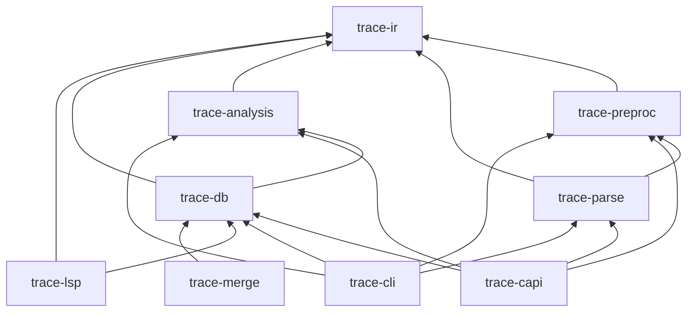
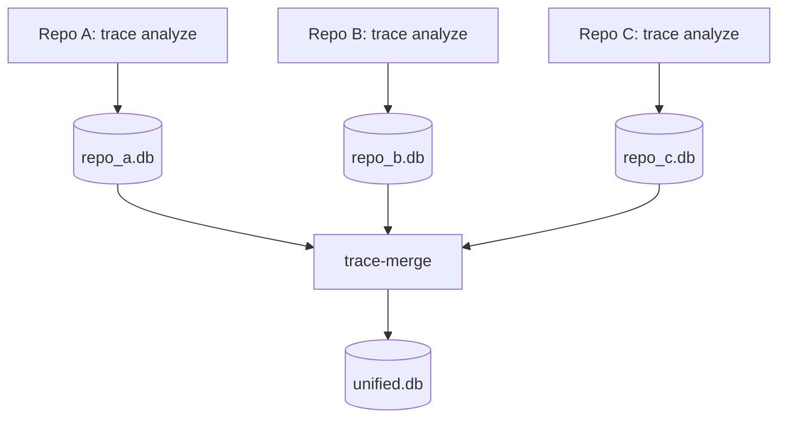

# Architecture

## Overview

trace analyzes a directory of C/C++ translation units (`.c` / `.cpp` files), builds a merged whole-program IR, runs Andersen-style pointer analysis, and exports call graphs and argument-flow edges to SQLite.

The pipeline is **strictly phased**: each stage has a narrow input/output contract and can be tested independently.

## End-to-end pipeline

### Stage summary

| Stage | Crate | Input | Output |
|-------|-------|-------|--------|
| Discover | `trace-parse` | Root directory | Lists of `.c`/`.cpp` and header paths |
| Include graph | `trace-parse` | File lists | `IncludeGraph` (deps, include dirs, preprocess set) |
| Preprocess | `trace-preproc` | Source file + options | Expanded source string + `LineMap` |
| Parse + lower | `trace-parse` | Preprocessed TU | `UnitIndex` (symbols, types, flow, call sites) |
| Merge | `trace-parse` | Per-TU indices | Single `Program` |
| Analyze | `trace-analysis` | `Program` | `Pag` + `AnalysisResult` |
| Export | `trace-db` | Program + analysis | SQLite v7 |

The pipeline is also exposed programmatically via `trace-capi` (`libtrace_capi`), providing a C ABI (`crates/trace-capi/include/trace.h`) for indexing and database inspection.

## Translation units and headers

- **Indexed TUs**: `*.c` and `*.cpp`-family files under `<TARGET>`. Each TU selects the tree-sitter C or C++ grammar by extension.
- **Headers**: discovered for the include graph and lowered into cached header units for expansion variants consumed by TUs. Their declarations are merged into each receiving TU before its own source is lowered.
- **Types-only header imports**: cached headers preserve reference-member metadata,
  each class's own constructor signatures (including cv/reference distinctions)
  and eligibility, explicit constructor imports, constant array bounds and scoped
  default member initializers with its types. Visible integer constants survive
  types-only imports; conflicting definitions retain an unknown value.
  Preprocessed units and header variants retain their C++ language version.
  Implicit construction expands nontrivial subobjects. Recursive
  member lowering records it for nested classes and member class templates
  too; see [member-initializer construction](ANALYSIS.md#c-support-first-step).
- **Orphan headers** (not reached by a project TU) are lowered separately and merged into the program.
- **Cross-TU linking**: `merge_unit_index` merges compatible declarations and definitions, preserving distinct strong C++ definitions from different TUs. Build metadata assigns link images in `merge_linked_units`. Analysis uses the shared image-aware, scope-first resolver for internal and external functions. File-scope `static` variables use `SymbolTable::file_static_named`. See [Shared header functions](ANALYSIS.md#shared-header-functions) and [Link targets and weak symbols](ANALYSIS.md#link-targets-and-weak-symbols) for identity, ownership, and resolution precedence.

## Crate dependencies

| Crate | Responsibility |
|-------|----------------|
| `trace-ir` | IDs, types, symbol table, `FlowConstraint`, `ReturnFlow`, `Program` |
| `trace-preproc` | Lexer, directives, macro expansion, `LineMap` |
| `trace-parse` | Discovery, include graph, tree-sitter parse, IR lowering, TU merge, compilation commands |
| `trace-analysis` | PAG build, Andersen solver, on-the-fly call graph, arg-flow extraction, IPC bridges |
| `trace-db` | SQLite schema, minimal/full export |
| `trace-capi` | C ABI library (`libtrace_capi`), C header (`trace.h`), indexing and inspect FFI |
| `trace-cli` | `analyze`, `inspect`, reporting examples |
| `trace-merge` | Cross-repository database merger & callgraph reconstruction (`trace-merge`) |
| `trace-lsp` | Read-only LSP call hierarchy over an existing database |

## Program IR (`trace-ir`)

After merge, `Program` contains:

| Field | Description |
|-------|-------------|
| `symbols` | Files, functions, variables, call sites |
| `types` | Struct/union layouts, pointer types, reference-member and constructor declaration metadata |
| `flow` | Lowered assignment facts (`Copy`, `Store`, `GepField`, …) |
| `fn_returns` | Per-function return-value summaries (`ReturnFlow`) |
| `diagnostics` | Preprocess and parse diagnostics (stage, severity, file, line) |
| `include_deps` | `#include` edges for debugging |
| `inheritance` | Qualified C++ `(derived, base)` facts used by CHA |
| `template_bases` | Templated base spellings plus the derived class declaration scope, preserved for consumers that interpret template arguments |
| `arrow_returns` | Declared C++ `operator->` return types for smart-pointer wrappers, preserved across translation units |
| `final_classes` | Classes marked `final` to prune CHA hierarchy traversal |
| `namespaces` | Qualified names of the C++ namespaces opened, merged from headers so a unit knows the namespaces they open |

Lowering (`trace-parse/src/lower.rs`) walks tree-sitter ASTs and emits **flow constraints** — not a full statement-level CFG.

## Analysis artifacts

| Artifact | Description |
|----------|-------------|
| `Pag` | Pointer assignment graph: nodes, constraints, abstract locations, solver adjacency index |
| `AnalysisResult.points_to` | Optional PAG-node → location sets (`--debug-points-to` only) |
| `AnalysisResult.call_edges` | Resolved direct, indirect, and synthetic IPC call graph edges; IPC edges use `SYNTHETIC_CALL_SITE`, which must not be indexed into `Program.symbols.call_sites` |
| `AnalysisResult.arg_flow_edges` | Actual → formal mapping per call site (`actual_var` or `actual_fn` + `formal`) |
| SQLite | Persisted subset of the above (see export modes below) |

## Export modes

| CLI flag | Effect |
|----------|--------|
| *(default)* | Minimal export: functions, filtered call sites, call edges, arg-flow, required variables, and the PAG flow graph |
| `--full-export` | All types, all variables, PAG `locations` |
| `--debug-points-to` | Retain points-to in memory; export `points_to` table |

Indirect call sites **without** resolved edges are still exported in `call_sites` when `is_direct = 0`.

## Threading model

| Phase | Parallelism |
|-------|-------------|
| Preprocess: discovery | `--jobs N` workers; cache journals publish in deterministic TU order, independent of worker completion order ([details](PREPROCESSOR.md#parallel-discovery-88)) |
| Preprocess: settle | `--jobs N` (rayon) against the frozen cache; re-runs only the units that expanded something |
| Parse + lower | Parallel header waves and `--jobs N` per-TU indexing; deterministic merge order |
| Analysis + export | Single-threaded whole-program |

Default job count: logical CPU count.

## Source locations

Spans are resolved through the preprocessor `LineMap` to original file/line/column.
Most macro-expanded entities use the invocation position. Calls spelled in a
macro replacement list retain the macro-body position and store the outermost
invocation in `expansion_span`; semantic ownership uses the invocation. See
[Call source locations](ANALYSIS.md#call-source-locations).

Header entities merge according to their shared identity and receiving-unit
ownership. See [Shared header functions](ANALYSIS.md#shared-header-functions)
for the authoritative rules.

## Error handling

- Diagnostics collected per stage → `diagnostics` SQLite table.
- A failed TU is recorded; the run continues if other TUs succeed.
- A preprocessor stop inside a file keeps the output produced so far (no raw-source fallback); every preprocessor diagnostic is forwarded to the export as a `stage = 'preprocess'` row, attributed to the file it occurred in and deduplicated across translation units.

## Cross-repository merging (`trace-merge`)

When analyzing multi-repository architectures, each repository is first analyzed independently via `trace analyze`, producing individual SQLite databases. `trace-merge` then combines these databases:

- **Callgraph reconstruction without analysis**: Andersen pointer analysis and PAG dataflow are intentionally not executed during the merge stage; value-flow graphs stay intra-repository within individual databases. The merger's focus is re-linking unresolved external calls across repositories.
- **Linker semantics & signature matching**: Re-links external call edges against matching exported definitions using concrete function signatures (`name(param_types)`), respecting internal linkage (`static` functions stay local) and weak symbol overrides (`is_weak = 0` wins over `is_weak = 1`).
- **Conflict detection**: Flags multiple strong definitions with identical signatures across repositories, detects unresolvable externals, and exports merge-stage diagnostics into the output database.

## Extension points

| Change | Where |
|--------|-------|
| Preprocessor directive/macro | `trace-preproc` |
| New C/C++ construct / flow fact | `trace-parse/src/lower.rs`, `trace-ir/src/flow.rs` |
| New PAG constraint | `ConstraintKind` in `trace-analysis`, handler in `pag.rs` + `solver.rs` |
| Return / call semantics | `ReturnFlow`, `CallReturn`, `pag.expand_return_flows` |
| Libc summary / function model | `trace-analysis/src/summaries.rs` |
| SQLite column/table | `trace-db/src/schema.rs`, `export.rs`, `docs/SQLITE_SCHEMA.md` |
| C API functions / FFI exports | `crates/trace-capi/src/`, `crates/trace-capi/include/trace.h`, `docs/CAPI.md` |
| Cross-repository callgraph merge | `crates/trace-merge/src/lib.rs`, `trace-merge` |
| Compilation database support | `trace-parse/src/compile_commands.rs`, `configured.rs` |
| Dependency root handling | `trace-parse/src/lib.rs`, `configured.rs`, `merge.rs`, `trace-db/src/inspect.rs` |

See [ANALYSIS.md](ANALYSIS.md) for algorithm details and [AGENTS.md](../AGENTS.md) for contributor invariants.
