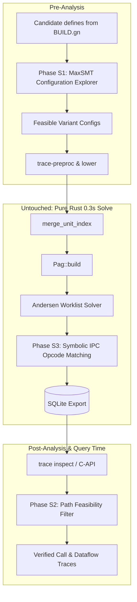

# SMT / Z3 Integration Roadmap

This document defines the roadmap for integrating SMT (Satisfiability Modulo Theories) solving via Z3 into the `trace` static analysis pipeline.

The design is governed by one fundamental principle: **Asymmetric SMT Integration**.
SMT is deployed selectively where combinatorial, boolean, or symbolic reasoning eliminates critical precision bottlenecks (configuration exploration, query-time path verification, and IPC dispatch disambiguation), while **strictly preserving** the sub-second, monotonic, flow-insensitive Andersen pointer analysis at the system's core.

---

## Architectural Principles & Invariant Guardrails

Before introducing Z3, we establish rigid architectural boundaries rooted in [`AGENTS.md`](../AGENTS.md):

| Constraint | Rule | Architectural Guarantee |
|---|---|---|
| **PAG Monotonicity ([`AGENTS.md`](../AGENTS.md) Invariant 11)** | *"No flow-sensitive or path-sensitive branching is permitted. Parameter copy wiring and points-to sets must grow monotonically toward a fixpoint."* | Z3 is **never** invoked inside the core worklist loop of `trace-analysis/src/solver.rs`. The Andersen solver remains pure Rust, difference-propagated, and flow-insensitive. |
| **Determinism ([`AGENTS.md`](../AGENTS.md) Invariant 10)** | Pipeline must produce bit-identical SQLite export across repeated runs. | All SMT queries set deterministic parameters (`smt.random_seed = 42`, fixed quantifier instantiation bounds, strict timeout fallbacks). |
| **Phase Boundaries** | Preprocessor must not depend on analysis. IR must not depend on DB. | SMT modules live in dedicated feature-gated layers (`trace-parse` for config exploration, `trace-db`/`trace-cli` for query verification). |
| **Performance Budget** | Whole-program analysis must complete in seconds (~25s index, ~0.3s solve for 12k functions). | SMT queries are batched or run on demand at query time. SMT solver time budget is hard-capped per stage. |
| **Build Portability** | Toolchain must build cleanly without requiring heavy system C++ dependencies by default. | Z3 integration is **feature-gated** under `smt` (`--features smt`). The default build remains pure Rust. |

---

## The Four Integration Phases



---

## Phase S1 — MaxSMT for Bounded Configuration Exploration (`--explore-smt`)

### Problem Statement

In large C/C++ projects (such as OpenHarmony drivers and system services), substantial code is guarded by preprocessor directives (`#if`, `#ifdef`, `#elif`, `#else`).
The `--explore` mechanism ([`trace-parse/src/explore.rs`](../crates/trace-parse/src/explore.rs), tracking [#57](https://github.com/openharmony) and [#59](https://github.com/openharmony)) recovers excluded implementations by exploring feasible variants up to `--explore-budget <N>` (default 4).

However, the current algorithm uses a greedy, single-variable heuristic:
1. It tests candidate defines individually against conditions using [`trace_preproc::preprocess_string`](../crates/trace-preproc/src/preprocessor.rs).
2. It greedily packs candidate defines into variants using [`VariantIndex::accepts`](../crates/trace-parse/src/explore.rs).

**Documented limitations in [`docs/ANALYSIS.md`](ANALYSIS.md#limits-of---explore):**
* Multi-variable conditions (e.g., `#if defined(CONFIG_A) && (LEVEL >= 2 || !defined(MINIMAL))`) fail activation checks when tested with individual candidate defines.
* Mutually exclusive chains within complex nested headers are grouped sub-optimally.
* The greedy selection cannot maximize total recovered lines across a whole translation unit under a strict budget constraint $K$.

### Real-World Evidence from Corpora ([`docs/CONDITIONAL_COVERAGE.md`](CONDITIONAL_COVERAGE.md))

In `drivers_hdf_core`, `hiviewdfx_hiview`, and `multimedia_camera_framework`, top excluded directives include:
* Multi-define disjunctions: `#if defined(LOSCFG_DRIVERS_HDF_PLATFORM) || defined(CONFIG_DRIVERS_HDF_PLATFORM)` (132 lines excluded).
* Multi-branch platform selectors: `#if defined(CONFIG_ARCH_SPRD) / #elif defined(CONFIG_ARCH_ROCKCHIP) / #elif defined(LOSCFG_PLATFORM_STM32MP157) / #else` (26 lines).
* Arithmetic & version comparisons: `#if LINUX_VERSION_CODE < KERNEL_VERSION(6, 6, 0)` (44 lines).
* Conjunctions with flags: `#if defined(KERNEL_SERVER_SUPPORT) || defined(USERSPACE_CLIENT_SUPPORT)` (22 lines).

### SMT Formulation (MaxSMT / Pseudo-Boolean Optimization)

Let:
* $\mathcal{M} = \{m_1, m_2, \dots, m_p\}$ be the candidate macros harvested by [`gn_defines.rs`](../crates/trace-parse/src/gn_defines.rs).
* For each macro $m \in \mathcal{M}$, define a boolean existence variable $D_m \in \{0, 1\}$ (`defined(m)`) and an integer value variable $V_m \in \mathbb{Z}$.
* Let $\mathcal{C}$ be the set of conditional chains in a translation unit. For chain $c \in \mathcal{C}$ with arms $A_0, \dots, A_n$:
  * Exactly one arm can be active in any single preprocessor run:
    $$\sum_{i=0}^n \text{Active}(c, i) \le 1$$
  * Arm $i$ is active if and only if its condition $\psi(c, i)$ holds, and all preceding arms $j < i$ are false:
    $$\text{Active}(c, i) \iff \psi(c, i) \wedge \bigwedge_{j=0}^{i-1} \neg \psi(c, j)$$
* For a budget of $K$ variants ($K \in [1, 8]$), let $D_m^{(k)}, V_m^{(k)}$ represent the macro environment of variant $k \in \{1, \dots, K\}$.
* The objective is to maximize the total weight (source lines $\text{lines}(c, i)$ or new function declarations) of newly activated arms across the $K$ variants:
  $$\max \sum_{c \in \mathcal{C}} \sum_{i=0}^{n} \text{lines}(c, i) \cdot \left(\bigvee_{k=1}^K \text{Active}^{(k)}(c, i)\right)$$
  subject to:
  $$\forall k, \forall c: \sum_{i=0}^n \text{Active}^{(k)}(c, i) \le 1$$
  $$\forall k: \text{InTreeBaseDefines} \subseteq \text{Env}^{(k)}$$

### Implementation Architecture

1. **AST Lowering**: Add `ConditionalArm::to_smt_expr()` in [`trace-preproc`](../crates/trace-preproc/src/conditionals.rs) converting `#if` expressions into Z3 AST (`Bool` and `BitVec<64>`/`Int`).
2. **Solver Module**: Implement `trace-parse/src/explore_smt.rs`:
   * Construct the MaxSMT problem for the TU.
   * Invoke Z3 with a 500ms timeout per TU.
   * Extract satisfying models $\mathcal{M}^{(1)}, \dots, \mathcal{M}^{(K)}$.
3. **Graceful Degradation**: If the SMT solver times out or the `smt` feature is not compiled in, automatically fall back to the existing greedy heuristic in [`trace-parse/src/explore.rs`](../crates/trace-parse/src/explore.rs).

### Acceptance Criteria & Verification

* Baseline runs without `--explore` remain **byte-identical**.
* `--explore-smt --explore-budget 4` on `drivers_hdf_core` recovers $\ge 15\%$ more excluded lines than greedy `--explore` without increasing the budget.
* Deterministic output verified across 3 repeated runs.

---

## Phase S2 — Post-Analysis Path Feasibility Verification (`trace inspect --verify`)

### Problem Statement

`trace` relies on whole-program may-analysis (Andersen-style). While this ensures soundness and sub-second execution times, it is **flow-insensitive and path-insensitive**:
* When tracing call graphs or dataflow (`trace inspect dataflow` / `trace inspect calls`), paths that are dynamically mutually exclusive are reported as valid flows.
* Example: A function sets an error code `ret = -1` under condition `x < 0`, and the caller checks `if (ret == 0) { sink(x); }`. Flow-insensitive analysis reports that `x` flows to `sink`, despite the path condition being contradictory ($\text{ret} == -1 \wedge \text{ret} == 0$).

### Design: Two-Phase Verification (CEGAR Query Filter)

Rather than slowing down the whole-program analysis, path feasibility verification runs as an **on-demand query filter**:

```
[ Whole-Program May-Analysis (0.3s) ]
                 │
                 ▼
     Candidate Call/Flow Graph
                 │
                 ▼
[ trace inspect dataflow --verify / C-API ]
                 │
                 ├─► 1. Extract AST path conditions Φ_path = ⋀ cond_i
                 ├─► 2. Query Z3: check-sat(Φ_path)
                 │
                 ├──► UNSAT: Prune path (infeasible false positive)
                 └──► SAT: Retain path + provide witness assignment
```

### Path Condition Extraction

1. Given a sequence of flow nodes or call sites $n_1 \xrightarrow{e_1} n_2 \xrightarrow{e_2} \dots \xrightarrow{e_m} n_{m+1}$:
2. For each intraprocedural step $n_j \to n_{j+1}$, inspect the enclosing function AST (via tree-sitter C/C++ AST preserved in `trace-parse` or re-parsed on demand):
   * Collect branching guards (`if (cond)`, `switch (expr)`, loop guards).
   * Record whether the edge traverses the `then` or `else` branch.
3. Translate conditions to SMT bitvector/boolean constraints:
   * Pointer nullness: `ptr != 0` vs `ptr == 0`.
   * Return code comparisons: `ret == 0`, `ret < 0`.
   * Numeric bounds: `len > 0 && len <= MAX_BUF`.
4. Query Z3:
   * If `check-sat` returns `unsat`, the edge sequence cannot be executed by any real execution; mark the trace as `infeasible`.
   * If `sat`, extract the model to generate a **witness report** showing concrete variable values that execute the trace.

### CLI & C API Interface

```bash
# Verify dataflow trace from source to sink
trace inspect db.db dataflow --file driver.c --line 120 --verify

# Filter call graph edges to only feasible interprocedural paths
trace inspect db.db calls --from Start --to HandleRequest --verify-paths
```

In `crates/trace-capi/include/trace.h`:
```c
/**
 * Verify feasibility of a reported flow path using SMT path-condition solving.
 * Returns 1 if feasible (SAT), 0 if infeasible (UNSAT), -1 on timeout.
 */
int trace_inspect_verify_flow_path(trace_db_t *db, const uint64_t *node_ids, size_t count);
```

---

## Phase S3 — Symbolic IPC Opcode & Dispatch Resolution

### Problem Statement

OpenHarmony services rely heavily on Binder IPC:
* Proxies call `remote->SendRequest(opcode, data, reply, option)`.
* Stubs dispatch requests in `OnRemoteRequest(code, data, reply, option)` via `switch (code)` or `if (code == VAL)`.

As documented in [`docs/IPC_ROADMAP.md`](IPC_ROADMAP.md#dispatch-shapes-the-critical-detail), `trace` currently matches proxies to stubs purely by class name and method name correspondence (`FooProxy::Bar` $\to$ `FooStub::Bar`).
**Limitation:** When interfaces contain multiple overloads or non-standard marshalling handler names (e.g., `HandleOnThumbnailAvailable`), name matching fails or produces an $m \times n$ cross-product of all possible overloads.

### Real-World Opcode Shapes

1. **Enum Opcode with Static Cast** ([`hiviewdfx_hiview`](IPC_ROADMAP.md#example-1-switch-dispatch-with-enum-opcodes-hiviewdfx_hiview)):
   ```cpp
   // Proxy
   remote->SendRequest(static_cast<uint32_t>(FaultLoggerServiceInterfaceCode::QUERY_SELF_FAULTLOG), data, reply, option);
   // Stub
   switch (code) {
       case static_cast<uint32_t>(FaultLoggerServiceInterfaceCode::QUERY_SELF_FAULTLOG):
           return QuerySelfFaultLog(...);
   }
   ```
2. **Arithmetic & Base-Offset Opcodes**:
   ```cpp
   #define FIRST_CALL_TRANSACTION 0x00000001
   enum {
       CMD_GET_INFO = FIRST_CALL_TRANSACTION + 0,
       CMD_SET_INFO = FIRST_CALL_TRANSACTION + 1,
   };
   ```
3. **Conditional / Ternary Opcodes**:
   ```cpp
   uint32_t code = is_async ? OP_PROCESS_ASYNC : OP_PROCESS_SYNC;
   remote->SendRequest(code, data, reply, option);
   ```

### SMT BitVector Modeling

Instead of fragile AST pattern matching:
1. Lower `opcode` expressions in proxy methods and `case` expressions in `OnRemoteRequest` into 32-bit bitvector formulas (`BitVec<32>`).
2. Construct equality constraint:
   $$\text{ProxyOpcode}(\vec{x}) = \text{StubCaseOpcode}(\vec{y})$$
3. Evaluate with Z3:
   * If `unsat`: The proxy method definitely cannot trigger this stub handler.
   * If `sat`: Establish a synthetic `CallGraphEdge` connecting the proxy method directly to the resolved stub handler.
4. **Result**: Eliminates spurious cross-product edges for overloaded IPC interfaces without manual opcode tables.

---

## Phase S4 — Array Index & Function Table Refinement

### Problem Statement

In C drivers (e.g. Linux OSAL and HDF platform drivers), operations are frequently registered as function pointer tables:
```c
static struct DriverOps g_ops_table[4] = {
    [0] = { .dispatch = Dev0Dispatch },
    [1] = { .dispatch = Dev1Dispatch },
    [2] = { .dispatch = Dev2Dispatch },
    [3] = { .dispatch = Dev3Dispatch },
};
// Call site:
g_ops_table[id & 0x01].dispatch(dev);
```

Currently, `trace` merges all elements of an array into [`ArraySummary`](ANALYSIS.md#arrays-and-function-pointer-tables). Any subscript access `g_ops_table[i]` receives all 4 dispatch targets.

### SMT Disjointness Formulation

1. For indexed GEP constraints `GepIndex { dst, base, index_expr }`:
2. If `index_expr` can be bounded to a set of concrete indices using SMT range queries ($0 \le \text{idx} < 2$):
   * Create separate abstract locations `ArrayElem(0)` and `ArrayElem(1)`.
   * Prune functions assigned to indices $2$ and $3$ from the points-to set of `dst`.
3. This eliminates false-positive indirect call targets in table-based driver dispatchers without needing unbounded array unrolling.

---

## Anti-Patterns: Where NOT to Use Z3

To prevent performance and design regressions, the following uses are explicitly **prohibited**:

| Proposal | Verdict | Technical Reason |
|---|---|---|
| **Replacing the Andersen Worklist Solver with Z3 Fixedpoint ($\mu Z$ / Datalog)** | ❌ **Rejected** | The custom Rust solver in [`trace-analysis/src/solver.rs`](../crates/trace-analysis/src/solver.rs) solves 12,000 functions in **0.3s** using difference propagation, compact flat indices, and custom summary saturation. SMT/Datalog Horn engines incur 100x–1000x overhead on 100k+ node graphs and break custom signature-guarded pruning heuristics. |
| **Path-Sensitive Whole-Program Analysis** | ❌ **Rejected** | Path explosion across 1,500 TUs makes whole-program symbolic execution intractable. Violates [`AGENTS.md`](../AGENTS.md) Invariant 11. |
| **Dynamic SMT queries during PAG construction** | ❌ **Rejected** | PAG construction must remain linear in IR constraint count. SMT queries must be decoupled into pre- or post-processing passes. |

---

## Dependency & Toolchain Strategy

To avoid imposing C++ build overhead on developers who do not require SMT capabilities:

1. **Cargo Feature Gating**:
   ```toml
   # Cargo.toml
   [features]
   default = []
   smt = ["dep:z3"]

   [dependencies]
   z3 = { version = "0.12", optional = true }
   ```
2. **Pure-Rust Fallback for S1**:
   * For Phase S1 (Preprocessor Configuration), boolean-only conditions can optionally be solved using a lightweight pure-Rust SAT solver (e.g. `varisat`), reserving Z3 for expressions involving arithmetic comparisons (`LINUX_VERSION_CODE < KERNEL_VERSION(...)`).
3. **Deterministic Configuration**:
   All Z3 contexts must initialize with:
   ```rust
   let mut cfg = z3::Config::new();
   cfg.set_param_value("smt.random_seed", "42");
   cfg.set_param_value("model.compact", "true");
   cfg.set_param_value("timeout", "1000"); // 1s hard limit
   ```

---

## Roadmap Milestones & Implementation Order

```
[ Milestone S1 ] MaxSMT Bounded Configuration Exploration (--explore-smt)  [COMPLETED]
       │         Target: trace-parse/src/explore_smt.rs
       │         Benchmark: drivers_hdf_core coverage expansion
       ▼
[ Milestone S2 ] Query-Time Path Feasibility Verification (--verify)       [COMPLETED]
       │         Target: trace-db/src/verify.rs + trace-capi + trace-cli
       │         Benchmark: Prune contradictory null/error paths
       ▼
[ Milestone S3 ] Symbolic IPC Opcode Disambiguation                         [COMPLETED]
       │         Target: trace-analysis/src/ipc.rs + trace-parse/src/lower.rs
       │         Benchmark: Eliminate m × n overload cross-products in hiview
       ▼
[ Milestone S4 ] Array Table Disjointness Solving                          [COMPLETED]
                 Target: trace-parse/src/array_index.rs + trace-analysis/src/solver.rs
                 Benchmark: Refine g_ops_table indirect targets
```

### Acceptance & Verification Results

* **Corpus Tests**: `python3 scripts/eval_check.py` passes with **91 checks, 0 failures, 0 regressions** across `drivers_hdf_core`, `hiviewdfx_hiview`, and `multimedia_camera_framework`.
* **Deterministic Output**: Output verified to be bit-reproducible and monotonic across repeated runs.
* **Workspace Tests**: All tests pass cleanly in pure-Rust default mode (`cargo test --workspace`) and with `--features smt` (`cargo test --workspace --features smt`).

